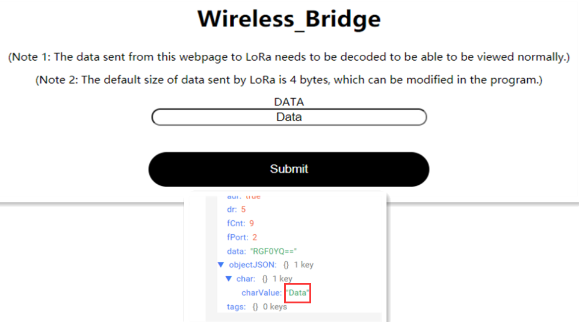

# Wireless Bridge WiFi_LoRa Example User Manual

{ht_translation}`[简体中文]:[English]`

This is an example of communication between a LoRaWAN server and a WiFi device. You can write code that fits your needs based on this example.


## Preparation
### Hardware
- [LoRaWAN Gateway](https://heltec.org/product-category/lora/lora-gateway/) in normal operation on the LoRaWAN server.
- [Wireless Bridge](https://heltec.org/project/wireless-bridge/).
- Micro USB cable.

### Software
- [Arduino IDE](https://www.arduino.cc/)
- **Heltec ESP32 development framework and library**, If you don't know how to install, you can refer to this link:[Heltec ESP32 Series Quickstart](https://docs.heltec.org/en/node/esp32/esp32_general_docs/quick_start.html#)

``` {tip} It also supports the [official Arduino framework](https://github.com/espressif/arduino-esp32) of Espressif.
```

## Uploading code
1. Connect Wireless Bridge to your computer with a USB cable and open the Arduino IDE.
2. Click `Tools`,  select `Wireless Bridge` . To `Region` option based on your needs, both hardware support and the ability to communicate with the gateway.

  

3. Follow the path shown to open the example "LoRaWANWiFi"

  

4. Modify the relevant parameters, mainly those related to WiFi and LoRa. Try not to use the default EUI; it's probably already taken.

  

6. Please note that the 'Channel' is set to be the same as the gateway.

``` {tip} The default frequency band is 0~ 7. If you don't know how to set the frequency band, you can check this link:[LoRaWAN example Sub-Band usage](https://docs.heltec.org/general/sub_band_usage.html)
```

  

7. The payload is located here:

  

8. Uploading code.

  

## Registering devices

### Registering Gateway
Please make sure that your gateway is running correctly on the LoRaWAN server.
Here is the documentation for the common Heltec gateways:
- [HT-M02](https://docs.heltec.org/en/gateway/ht-m02_v2/index.html)
- [HT-M7603](https://docs.heltec.org/en/gateway/ht-m7603/index.html)
- [HT-M01S](https://docs.heltec.org/en/gateway/ht-m01s_v2/index.html)

### Registering Wireless Bidge
According to the information such as EUI in the code, the node is registered at the server.
If you don't know how to register, follow this link:

https://docs.heltec.org/en/node/esp32/esp32_general_docs/lorawan/connect_to_gateway.html

## Usage
After uploading the program to the development board, open the serial port to view the IP address of the web page. Among them, "View page IP address" is the viewing webpage for forwarding LoRa information to WiFi, and "Write page IP address" is the sending webpage for forwarding WiFi information to LoRa. The device that opens the webpage must be in the same local area network as the Wireless_Bridge.


### Uplink
- Send information through LoRa, and the received data will be displayed on the web page through WiFi. The default web page refresh time is 10S, and the web page refresh time can be modified in the "setTimeout" function according to specific needs.


- The information issued by the webpage will be forwarded to LoRa and can be viewed in the node data. The information forwarded to LoRa needs to be decoded accordingly.



- The corresponding decoding of this example is as follows:

```shell
function Decode(fPort, bytes) {
  var charValue1= String.fromCharCode(bytes[0]);
  var charValue2= String.fromCharCode(bytes[1]);
  var charValue3= String.fromCharCode(bytes[2]);
  var charValue4= String.fromCharCode(bytes[3]);
  var charValue= charValue1 + charValue2 + charValue3 + charValue4;
  var result={
    
                                                "char":{
                                                "charValue":charValue,
                                                       }
  }
  return result;
}
```

