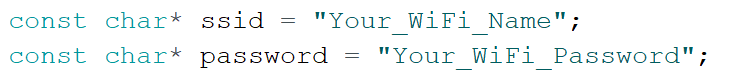
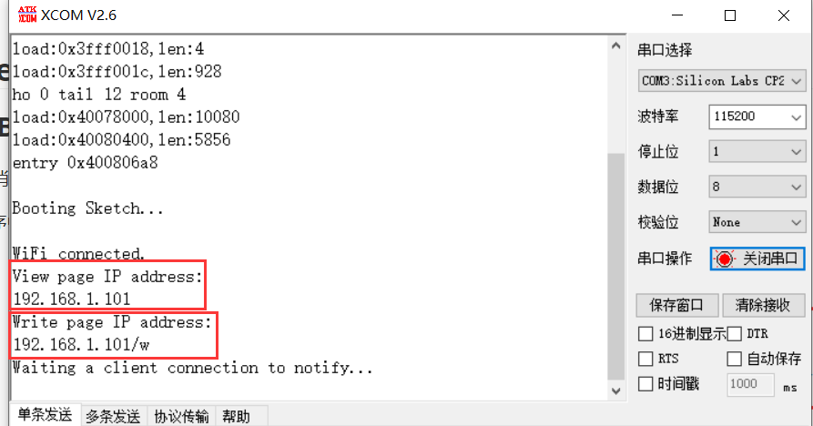

# Wireless Bridge WiFi_LoRa Example User Manual

{ht_translation}`[简体中文]:[English]`

## Preparation

1. **Install the Heltec ESP32 development framework and library**，If you don't know how to install, you can refer to this link：[Heltec ESP32 Series Quickstart](https://docs.heltec.org/en/node/esp32/esp32_general_docs/quick_start.html#)
2. **A LoRaWAN gateway** in normal operation on the LoRaWAN server.

## Uploading code

1. Connect Wireless Bridge to your computer with a USB cable and open the Arduino ID.
2. 

Before starting the test, make sure that Wireless_Bridge can communicate with the gateway normally.

- Configure WiFi information in the program.



- After uploading the program to the development board, open the serial port to view the IP address of the web page. Among them, "View page IP address" is the viewing webpage for forwarding LoRa information to WiFi, and "Write page IP address" is the sending webpage for forwarding WiFi information to LoRa. The device that opens the webpage must be in the same local area network as the Wireless_Bridge.



- Send information through LoRa, and the received data will be displayed on the web page through WiFi. The default web page refresh time is 10S, and the web page refresh time can be modified in the "setTimeout" function according to specific needs.


- The information issued by the webpage will be forwarded to LoRa and can be viewed in the node data. The information forwarded to LoRa needs to be decoded accordingly.


- The corresponding decoding of this example is as follows:

```shell
function Decode(fPort, bytes) {
  var charValue1= String.fromCharCode(bytes[0]);
  var charValue2= String.fromCharCode(bytes[1]);
  var charValue3= String.fromCharCode(bytes[2]);
  var charValue4= String.fromCharCode(bytes[3]);
  var charValue= charValue1 + charValue2 + charValue3 + charValue4;
  var result={
    
                                                "char":{
                                                "charValue":charValue,
                                                       }
  }
  return result;
}
```

