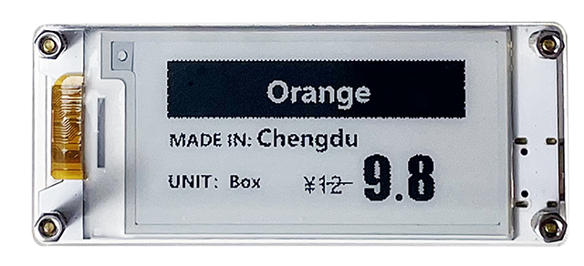
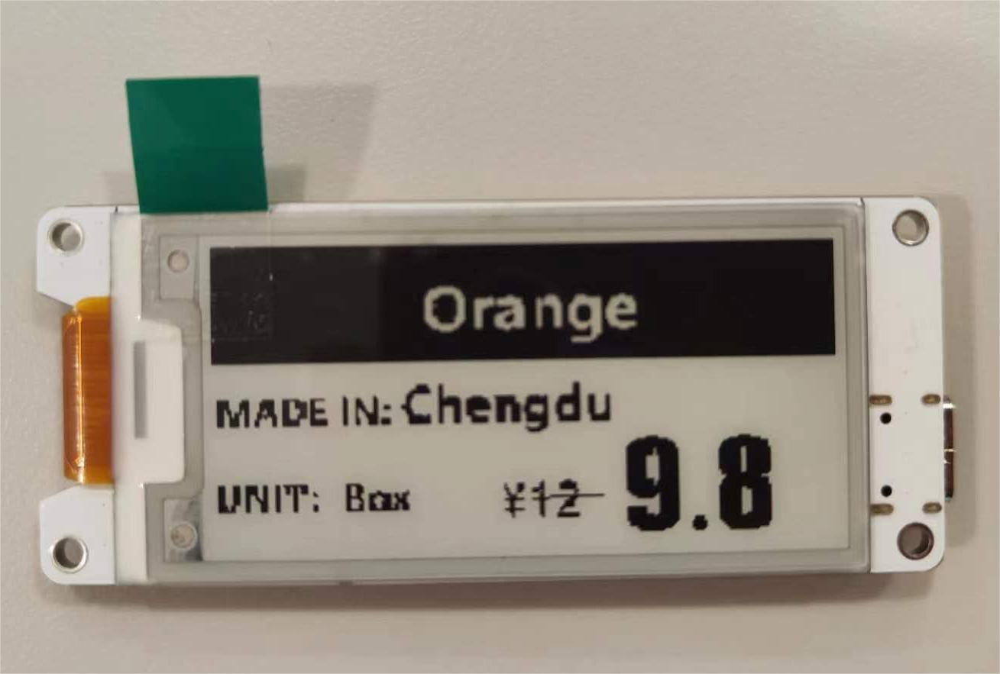

# Hardware Update Logs
{ht_translation}`[简体中文]:[English]`

## Wireless Paper Hardware Update Logs

### V1.0

- First release
- 2023-7-30 public sale
- [Schematic diagram of Paper 1.0](https://resource.heltec.cn/download/Wireless_Paper/Wireless_Paper_V0.4_Schematic_Diagram.pdf)
- [Datasheet of Paper 1.0](https://resource.heltec.cn/download/Wireless_Paper/Wireless-Paper.pdf)
- [Sample code V1.0](https://github.com/Heltec-Aaron-Lee/WiFi_Kit_series/tree/master/esp32/libraries/Heltec-Example/examples/E-INK/HT_lCMEN2R13EFC1)

### V1.1

- Changed the E-ink, If the protective film label on the screen is green, that means the version is 1.1.
- [Sample code V1.1](https://github.com/Heltec-Aaron-Lee/WiFi_Kit_series/tree/master/esp32/libraries/Heltec-Example/examples/E-INK/QYEG0213RWS800_BWR)

### V1.2
**WirelessPaper upgraded to V1.2** (Hardware with partially replaced screens but unchanged PCB versions are labeled as V1.1.1):  
- **E-ink screen model updated**. 
    - For the new driver example, please refer to: [https://github.com/HelTecAutomation/Heltec_ESP32/tree/master/examples/Factory_Test/Wireless_Paper_E0213A367_FactoryTest](https://github.com/HelTecAutomation/Heltec_ESP32/tree/master/examples/Factory_Test/Wireless_Paper_E0213A367_FactoryTest).  
    - [New Eink: E0213A367-BW](https://resource.heltec.cn/download/Wireless_Paper/E-Ink%20Datasheet/V1.2-E0213A367-BW.pdf)
- **Improved crystal oscillator stability**.  