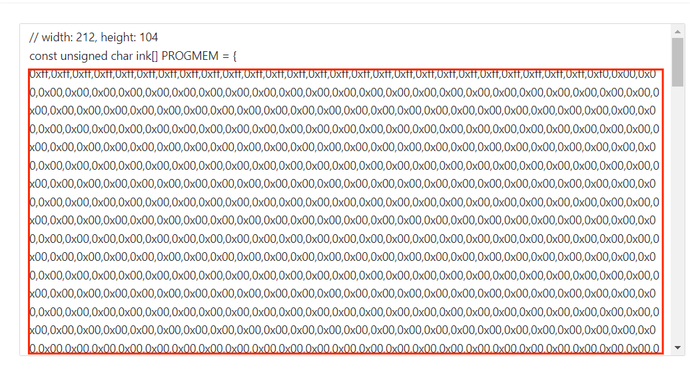
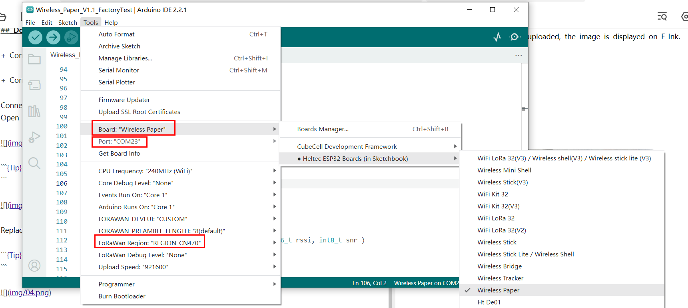
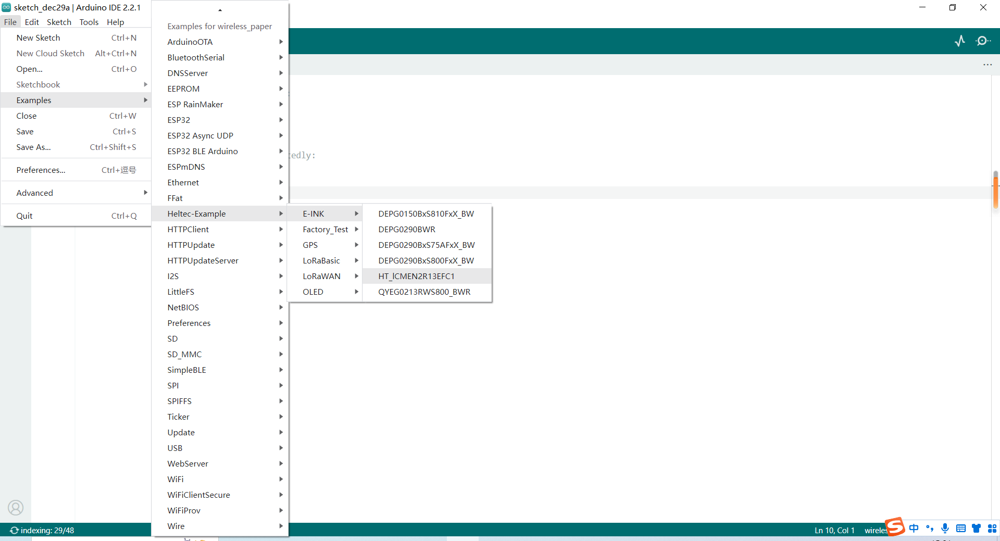
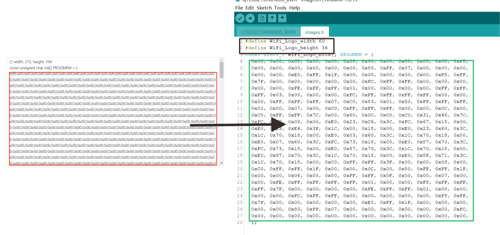
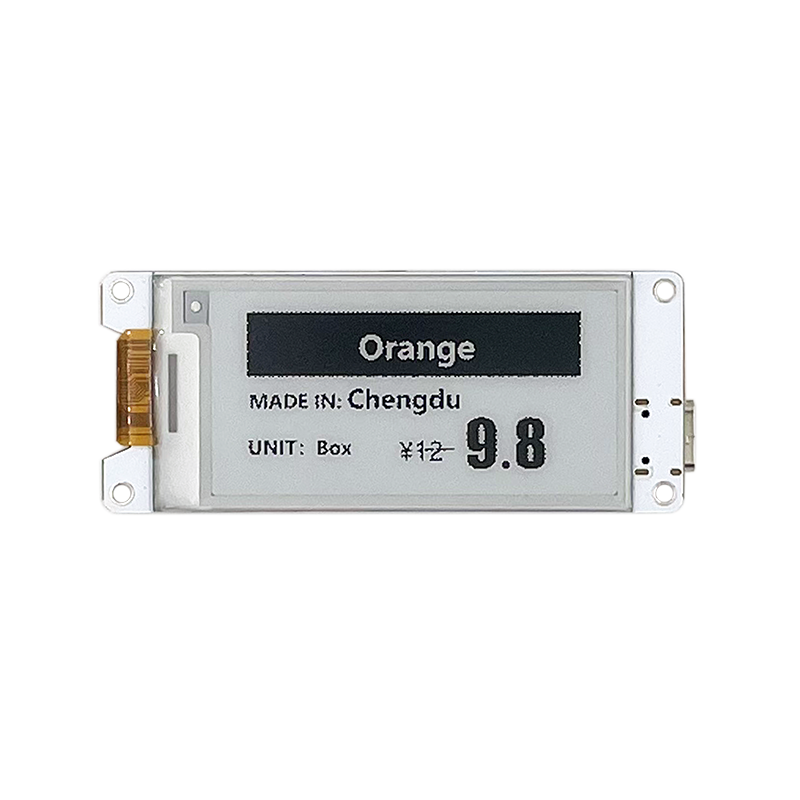

# Via Program Refresh

{ht_translation}`[简体中文]:[English]`

## Summary
This topic aims to describe refreshing the Wireless Paper by downloading the program through the USB interface.
## Image coding
```{Tip} This screen does not support grayscale, so when making the image, you will need to convert it to a pure black and white image smaller than 250X122.
```
First, convert your image to **XBM** format.

Let's use [**Convertio**](https://convertio.co/zh/xbm-converter/) as an example .

 + Open **Convertio**: https://convertio.co/zh/xbm-converter/, and select the image that needs to be taken, Select convert to **XBM** format.

 

 + Open the downloaded file with Notebook, and copy the contents in the red box.

 

## Downloading the program

+ Confirm whether the `USB driver`, `Git` and `Arduino IDE` has been installed correctly. If not, please refer to this two articles [establish serial connection](https://docs.heltec.org/general/establish_serial_connection.html) and [Install Git and Arduino IDE](https://docs.heltec.org/general/how_to_install_git_and_arduino.html).

+ Confirm that The Heltec ESP32 development environment is installed, please refer to[ESP32+LoRa Quick start](https://docs.heltec.org/en/node/esp32/quick_start.html).

Connect the Wireless Paper to the computer using a TYPE-C wire. 
Open Arduino, in `Tools` >  `Board Manager`, select `Wireless Paper`, and select the corresponding `Port`, `LoRaWAN REGION`.



Open the sample code provided by **Heltec**.
```{Tip} There are currently two versions of the diplay, if the protector sticker has a red mark, please select the code 'QYEG0213RWS800_BWR'; For others, select 'HT ICMEN2R13EFC1'. If you are not sure which version you have, please contact us at Support@heltec.cn.
```



Replace the green box in the figure below with the code you obtained earlier.

```{Tip} Be careful to fill in the data of Weight and Hight in the black box part of the figure, rather than copying this part directly.

```



Click upload, when the program is uploaded, the image is displayed on E-Ink.

