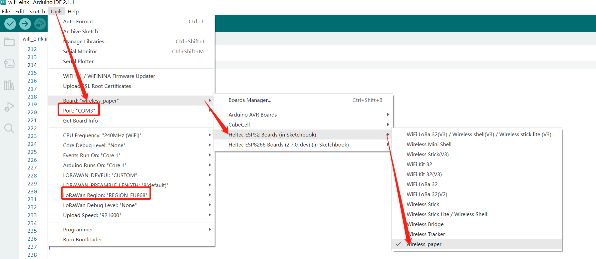
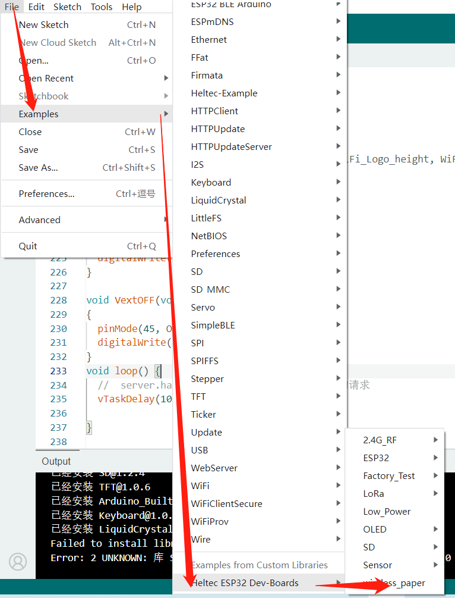
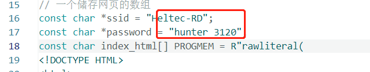
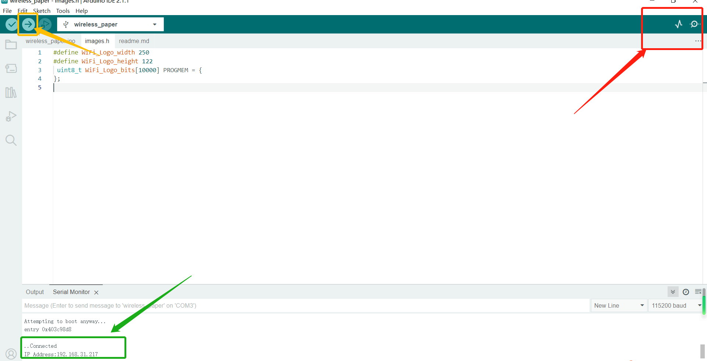
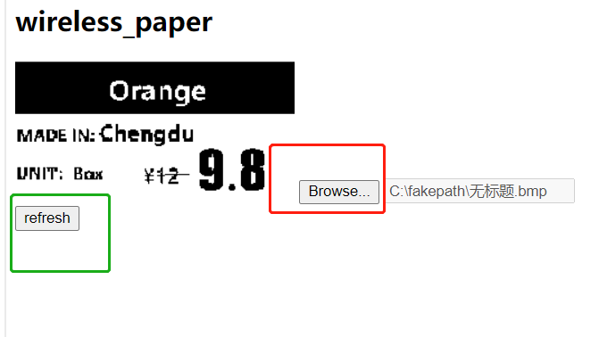

# Via Web Refresh

{ht_translation}`[简体中文]:[English]`

## Summary

This topic aims to describe refreshing the Wireless Paper by Web UI.

+ Confirm whether the `USB driver`, `Git` and `Arduino IDE` has been installed correctly. If not, please refer to this two articles [establish serial connection](https://docs.heltec.org/general/establish_serial_connection.html) and [Install Git and Arduino IDE](https://docs.heltec.org/general/how_to_install_git_and_arduino.html).

+ Confirm that The Heltec ESP32 development environment is installed, please refer to[ESP32+LoRa Quick start](https://docs.heltec.org/en/node/esp32/quick_start.html).

## Downloading the program

+ Connect the Wireless Paper to the PC using a TYPE-C wire. Open Arduino IDE, click `Tool` to select your development board, frequency band, port and other options.

+ Use Arduino IDE to open the example we provided.

+ Enter your WiFi account and password in the red box below and click Upload.

+ After uploads successfully, click the serial port button in the upper right corner, as shown in the red mark below. the serial port will display the Wireless IP address, as shown in the green mark below, save it.

+ Enter the IP address of the above image in your browser and it will bring you to the refresh page.
Click `Browser` to select the image you want to upload. Note that the resolution of the image must be the same as the program, and the resolution must not exceed 250X122. The default value here is 250X122. 

+ Click `Refresh`, and the picture will be refrezed on E-Ink.
At present this program sample program supports XBM,BMP,JPG,PNG four format files, the screen does not support grayscale, so it is best to set your picture to monochrome mode to achieve the best results.