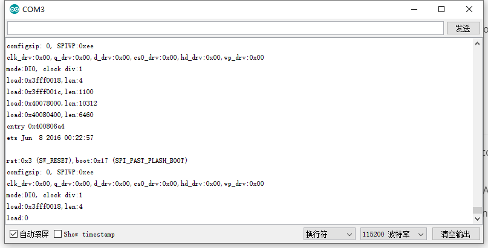

# Frequently Asked Questions
{ht_translation}`[简体中文]:[English]`

This page contains the most frequently questions from user. If this page's detail can't solve your problem, you can also talk in our forum: [community.heltec.cn](http://community.heltec.cn/)

&nbsp;

## Can't Download Firmware

- Use a better USB cable, or change a USB socket;
- Check and make sure the CP210x drive had been correctly installed, users can refer to this document: [Establish Serial Connection](https://heltec-automation-docs.readthedocs.io/en/latest/general/establish_serial_connection.html);
- Press "PRG" button before upload.

&nbsp;

## Another Communication Bus Usage Example

- **[SPI0 / SPI1 / SPI2 / SPI3](https://github.com/Heltec-Aaron-Lee/WiFi_Kit_series/tree/master/esp32/libraries/SPI/examples/SPI_Multiple_Buses)**
- **[I2C0 / I2C1](https://github.com/HelTecAutomation/Heltec_ESP32/blob/master/examples/ESP32/I2C1_Scanner/I2C1_Scanner.ino)**
- **[UART0 / UART1](https://github.com/HelTecAutomation/Heltec_ESP32/blob/master/examples/ESP32/Serial2/Serial2.ino)**

&nbsp;

## System Reset All the Time

According to the situation we have collected so far, the most likely to cause a constant reset problem may have two reasons:

- Power supply problem: please make sure the voltage of USB ≥ 4.7V, 300mA;
- You chose an error board: because each type of board may have a different FLASH size, and they have a different partition map, it will cause the internal logic error.

## Node to node communication

On the premise of no hardware problem, LoRa nodes can communicate with each other node-to-node. The key to success node-to-node communication need make sure the following 7 points the same:

1.  The same sending and listening frequency: `LoRa.setFrequency(frequency);`
2.  The same bandwidth: `LoRa.setSignalBandwidth(signalBandwidth);`
3.  The same coding rate: `LoRa.setCodingRate4(codingRateDenominator);`
4.  The same preamble length: `LoRa.setPreambleLength(preambleLength);`
5.  The same sync word: `LoRa.setSyncWord(syncWord);`
6.  The status of `LORA_IQ_INVERSION` is the same;
7.  the same `SPREADING FACTOR`;

Know more information about LoRa node-to-node communication, please refer to LoRa basic library APIs: `https://github.com/HelTecAutomation/Heltec_ESP32/blob/master/src/lora/API.md`
