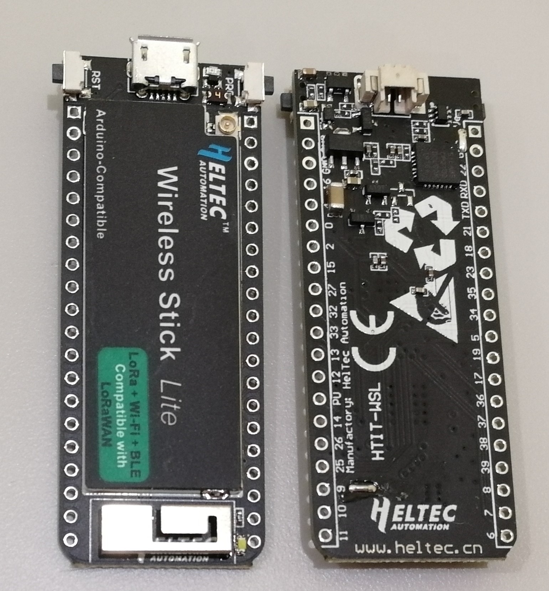
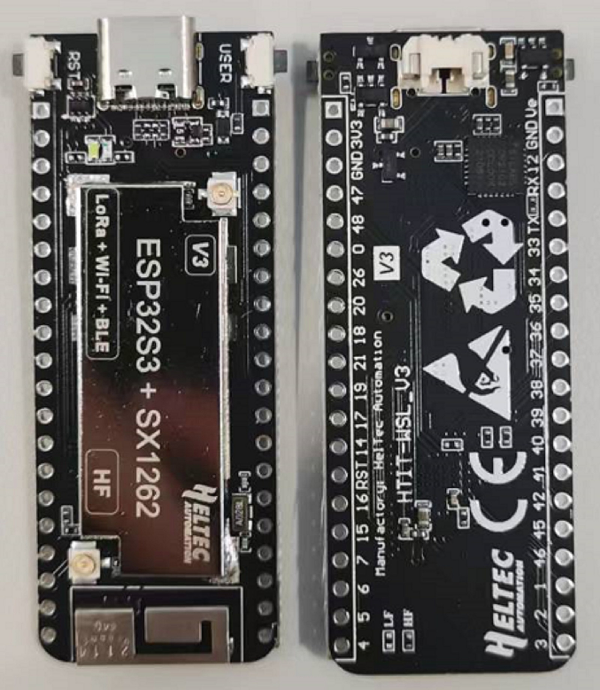

# Hardware Update Logs
{ht_translation}`[简体中文]:[English]`

## Wireless Stick Lite Hardware Update Logs

### V1

- First release
- 2017-6-1 public sale
- [Pinout diagram of V1](http://resource.heltec.cn/download/Wireless_Stick_Lite/Wireless_Stick_Lite.pdf)
- Schematic diagram of V1
- The schematic diagram of Wireless Stick Lite is restricted technical data,it will become downloadable after purchase.Please read this document:[Get Limited Technical Resources](https://heltec-automation-docs.readthedocs.io/en/latest/general/view_limited_technical_data.html) .

### V3

- 2022-09-15  public sale
- MCU is changed from ESP32-PICO-V3 to ESP32-S3FN8. Specific differences of MCU are shown in：[https://products.espressif.com/#/product-comparison](https://products.espressif.com/#/product-comparison).
- USB interface changed from Micro USB to Type-C.
- LoRa chip changed from SX1276 to SX1262.
- The LoRa crystal oscillator is upgraded to temperature compensated crystal oscillator.
- The size, appearance, pin layout and power pins remain unchanged, but the GPIO sequence has changed. Please refer to [Pinout diagram](https://resource.heltec.cn/download/Wireless_Stick_Lite_V3/HTIT-WSL_V3.png).
- [Pinout diagram of V3](https://resource.heltec.cn/download/Wireless_Stick_Lite_V3/HTIT-WSL_V3.png).
- [Schematic diagram of V3](https://resource.heltec.cn/download/Wireless_Stick_Lite_V3/HTIT-WSL_V3_Schematic_Diagram.pdf).

- https://resource.heltec.cn/download/HT-CT62/HT-CT62.png)
