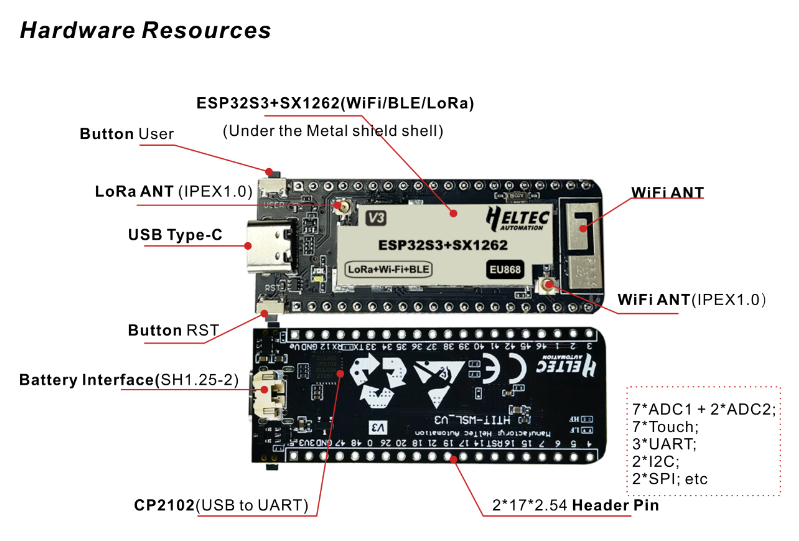

Wireless Stick Lite
===================
:ht_translation:`[简体中文]:[English]`

HTIT-WSL is a development board for Wi-Fi, Bluetooth and LoRa. Because some customers do not need OLED screen when using WiFi Lora32, we launched this product.

The HTIT-WSL is composed up of an MCU (ESP32-S3FN8) and Semtech LoRa Transceivers (SX1262), perfectly support Arduino®. Users can easily carry out secondary development and application.

Related Resources
-----------------

.. toctree::
   :maxdepth: 1

   Datasheet <https://resource.heltec.cn/download/Wireless_Stick_Lite_V3/HTIT-WSL_V3(Rev1.1).pdf>
   Schematic diagram <https://resource.heltec.cn/download/Wireless_Stick_Lite_V3/HTIT-WSL_V3_Schematic_Diagram.pdf>
   Pin Map <https://resource.heltec.cn/download/Wireless_Stick_Lite_V3/HTIT-WSL_V3.png>
   Hardware Update Log <hardware_update_log>

Get Start
---------

.. toctree::
   :maxdepth: 1

   Framework and libraries installation <../quick_start>
   Running example code<example>

Application and Extension
-------------------------

.. toctree::
   :maxdepth: 1

   LoRaWAN Sample Code<../lorawan/index>
   Meshtastic Introduction <../meshtastick>

Frequently Asked Questions
--------------------------

.. toctree::
   :maxdepth: 1

   Frequently Asked Questions <frequently_asked_questions>

Related Links
-------------

.. toctree::
   :maxdepth: 1

   Wireless Stick Lite Related Links <related_links>
   
Heltec General Docs
-------------------
-->[General Docs]<-- <https://docs.heltec.org/general/index.html>
