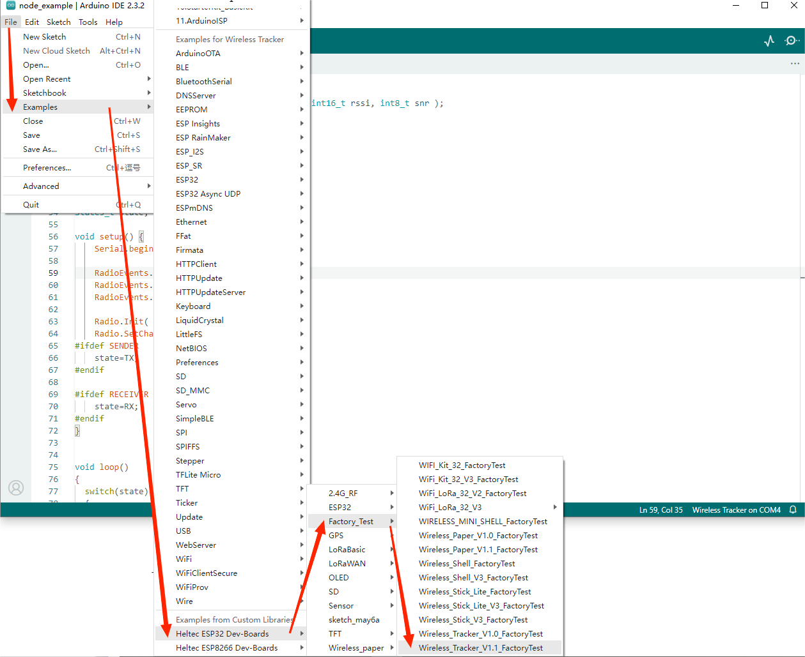

# Example Manual

{ht_translation}`[简体中文]:[English]`

## Precondition

1. Install Heltec ESP32 development framework and library. If you don't have it installed, please refer[ESP32 series QuickStart](https://docs.heltec.org/en/node/esp32/esp32_general_docs/quick_start.html#).

   The Heltec ESP32 development Framework already contains the basic code.

   The library contains the LoRa related code, factory test code, and some corresponding extensions.

## Factory test program

1. Open `Arduino IDE` , click `tool`, selmodel, port, RF parameters, etc. As shown below

2. Follow the path below to find the program and upload it.

3. Enter your WIFI account and password in the red box below.

This is a test program, can test that your board is functioning correctly.

## GPS display on TFT

1. Open `Arduino IDE` , click `tool`, selmodel, port, RF parameters, etc. As shown below

2. Follow the path below to find the program and upload it.

3. This is an example of displaying GPS on a TFT frequency screen. After successful uploading of the code, the GPS address is generally obtained within 1 minute under good outdoor weather.

   