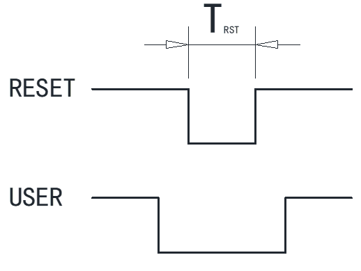

# Heltec Wireless Tracker Frequently Asked Questions
{ht_translation}`[简体中文]:[English]`

This page contains the most frequently questions from user. If this page's detail can't solve your problem, you can also talk in our forum: [community.heltec.cn](http://community.heltec.cn/)

## How to access boot mode manually

The Wireless Tracker use the internal USB on ESP32S3 instead of a USB-UART bridge, in low-power mode or when a special pin is occupied, the device may not be able to enter the boot loader program, causing you to be unable to download firmware properly.

Entering the boot loader mode needs to meet the following timing (TRST≥10 ms):

**Here are two methods access boot mode manually:**

- Wireless Tracker not connect to a computer – Press the `USER` button before plugging it to any USB port of a computer.
- Wireless Tracker already connected to a computer – Keep the `USER` button pressed → Press the `RESET` button → Release the `RESET` button → release the `USER` button.

## Meshtastic firmware on V1.1 hardware

In hardware version V1.1, the control pin of the GNSS chip power supply was changed to GPIO3, so the official firmware of Meshtatic cannot make it work properly now. Users can temporarily use this version until Meshtastic official accept our PR.

Download the [Temporary Pack for Wireless Tracker](https://resource.heltec.cn/download/Meshtastic/firmware-2.2.15.31c4693-temp.zip), flashing with the CLI by following [this document](https://meshtastic.org/docs/getting-started/flashing-firmware/esp32/cli-script).

Connect Wireless Tracker to computer, `cd` into the unzipped temporary firmware package and install firmware via this command: `device-install.bat -f firmware.factory.bin`

*If you already have firmware in your current Wireless Tracker, it may prevent you from downloading the new firmware. Please refer to [this section](#how_to_access_boot_mode_manually) to manually enter Boot mode and try again.*