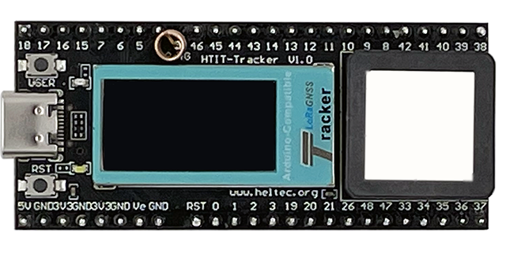

# Hardware Update Logs
{ht_translation}`[简体中文]:[English]`

## Wireless Tracker 

### V1.0

- First release
- 2023-6-30 public sale
- [Schematic diagram of Tracker 1.0](https://resource.heltec.cn/download/Wireless_Tracker/Wireless_Tacker1.0/HTIT-Tracker_V0.3.pdf)
- [Datasheet of Tracker 1.0](https://resource.heltec.cn/download/Wireless_Tracker/Wireless%20tracke.pdf)

### V1.1

- Fixed an issue where the GNSS module loses power when LoRa starts, enhance low power features.
- Added an additional LDO as UC6580 GNSS power source, 
- The GNSS Ctrl pin was removed, set GPIO 3 `HIGH` to enable GNSS power source.
- [Schematic diagram of Tracker 1.1](https://resource.heltec.cn/download/Wireless_Tracker/Wireless_Tacker1.1)
- [Datasheet of Tracker 1.1](https://resource.heltec.cn/download/Wireless_Tracker/Wireless%20Tracker%201.1.pdf)
