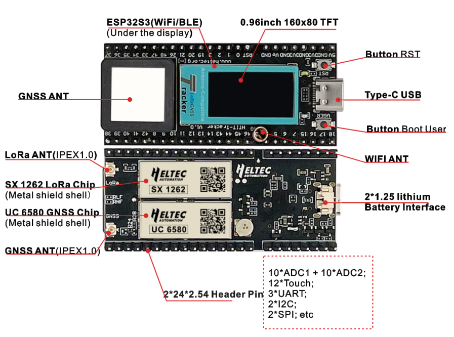

Wireless Tracker
================
:ht_translation:`[简体中文]:[English]`

Wireless Tracker is a development kit based on ESP32-S3FN8. It integrates both
SX1262 and UC6580 to provide fast GNSS solution for IoT. It can track any object and
then upload that data wirelessly by Wi-Fi, Bluetooth, LoRa. Wireless Tracker supports L1 + L5/L2, 
and supports GPS, GLONASS, BDS, Galileo, NAVIC, QZSS multi-system joint positioning.

Related Resources
-----------------

.. toctree::
   :maxdepth: 1

   Datasheet <https://resource.heltec.cn/download/Wireless_Tracker/Wireless%20Tracker%201.1.pdf>
   Schematic diagram <https://resource.heltec.cn/download/Wireless_Tracker/Wireless_Tacker1.1/HTIT-Tracker_V0.5.pdf>
   Pin Map <https://resource.heltec.cn/download/Wireless_Tracker/Wireless%20Tracker%20Pin%20Map.png>
   Hardware Update Log <hardware_update_log>

Get Start
---------

.. toctree::
   :maxdepth: 1

   Framework and libraries installation <https://docs.heltec.org/en/node/esp32/esp32_general_docs/quick_start.html>
   Running example code<example>

Application and Extension
-------------------------

.. toctree::
   :maxdepth: 1

   LoRaWAN Sample Code <https://docs.heltec.org/en/node/esp32/esp32_general_docs/lorawan/index.html>
   Meshtastic Introduction <https://docs.heltec.org/en/node/esp32/esp32_general_docs/meshtastick.html>
   Meshtastic Low Power Setting <meshtastic_tracker>

Frequently Asked Questions
--------------------------

.. toctree::
   :maxdepth: 1
   
   Frequently Asked Questions <frequently_asked_questions>

Related Links
-------------

- `GNSS Module Datasheet <https://resource.heltec.cn/download/Wireless_Tracker/UFirebird_Standard%20Positioning%20Products%20Protocol%20Specification_EN_R4.6(1).pdf>`_
- `Heltec esp32 series framework on Github <https://github.com/Heltec-Aaron-Lee/WiFi_Kit_series>`_
- `Heltec Esp32 library on Github <https://github.com/HelTecAutomation/Heltec_ESP32>`_
- `License Enquiry <https://resource.heltec.cn/search>`_
- `How to use license <https://docs.heltec.org/general/how_to_use_license.html>`_
- `Meshtastic Flasher <https://flasher.meshtastic.org/>`_
- `Meshtastic LoRa 32 Peripherals <https://meshtastic.org/docs/hardware/devices/heltec-automation/lora32/peripherals/>`_
- `LoRaWAN Parameters Instruction <https://docs.heltec.org/general/lorawan_parameters.html>`_
- `LoRaWAN example Sub-Band usage <https://docs.heltec.org/general/sub_band_usage.html>`_
- `LoRaWAN ABP Mode <https://docs.heltec.org/general/lorawan_abp/index.html>`_
- `LoRa Node to Node <https://docs.heltec.org/general/lora_node_to_node.html>`_

-->[Heltec General Docs]<-- <https://docs.heltec.org/general/index.html>
    
