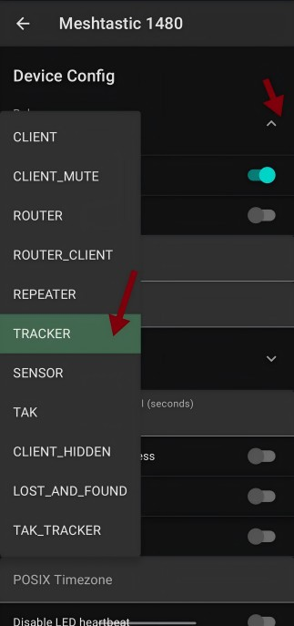
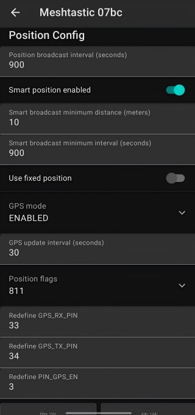
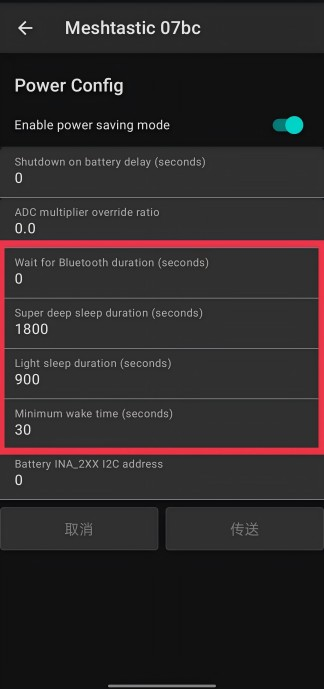
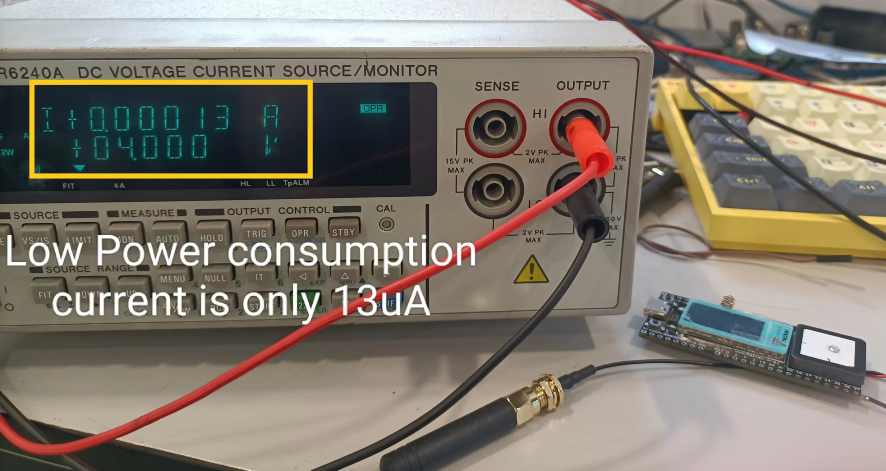

# Meshtastic Low Power Settings

## Purpose
By adjusting the position and power settings of the meshtastic, the wireless tracker can enter low-power mode to extend the power usage time.

``` {Tip} If you are not familiar with Meshtastic, you can refer to this link: [Introduction to Meshtastic](https://docs.heltec.org/en/node/esp32/meshtastick.html#).
```

## Configuration



### Device Config

- `Role` - TRACKER

``` {Tips} Only the tracker mode and sensor mode in meshtastic can enter the low power consumption mode.
```

### Position Configuration

- `Position broadcast interval` - 900
- `Smart broadcast min distance` - 10
- `smart broadcast min interval` - 900
- `GPS update interval`- 30
- `Redefine GPS_RX_PIN` - 33
- `Redefine GPS_TX_PIN` -34
- `Redefine PIN_GPS_EN`- 3


### Power Configuration

- `Wait for Bluetooth` - 0
- `Super deep sleep duration`  - 1800
- `Light sleep duration` - 900
- `Minimum wake time` - 30


## Result

After successfully entering low power consumption, the current is only **13uA**.



The device is connected to a fully charged 1000mA 3.7V lithium battery and operates normally according to the above settings. After the tracker recognizes the GPS, it can only consume **1%** of the power per hour.


Reference linking
-----------------
[https://meshtastic.discourse.group/t/heltec-tracker-v1-and-v1-1-power-config/12016](https://meshtastic.discourse.group/t/heltec-tracker-v1-and-v1-1-power-config/12016)