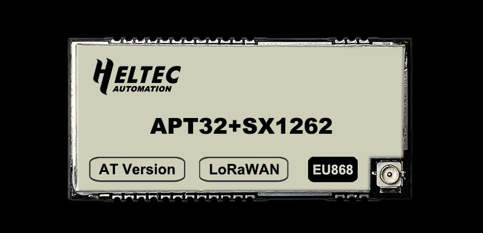
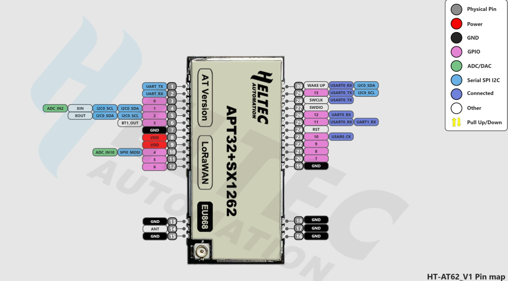

HT-AT62
=======
:ht_translation:`[简体中文]:[English]`

HT-AT62 is a module, must work with other PCB boards, it belongs to “Heltec LoRa“ series, with the following features:

+ APT32+SX1262;
+ LoRaWAN 1.0.2 protocol with AT command supports;
+ 32-bit high-performance and low-cost microcontroller and SX1262;
+ Low power design, 12uA in deep sleep mode;
+ 1.27 stamp edge design, friendly for batch SMT producing;
+ Good impendence matching and long communication distance;
+ GPIO HIGH/LOW control via AT commands;

1. HT-AT62 Pin Map 

2. `HT-AT62 Datasheet <https://resource.heltec.cn/download/HT-AT62/HT-AT62(Rev1.1).pdf>`_.

3. `HT-AT62 Command User Manual <https://resource.heltec.cn/download/HT-AT62/AT_Command>`_.

4. `HT-AT62 Reference Design <https://resource.heltec.cn/download/HT-AT62/HT-AT62_Reference_Design.pdf>`_.
   
5. `More LoRa Node <https://heltec.org/product-category/lora/lrnode/>`_.