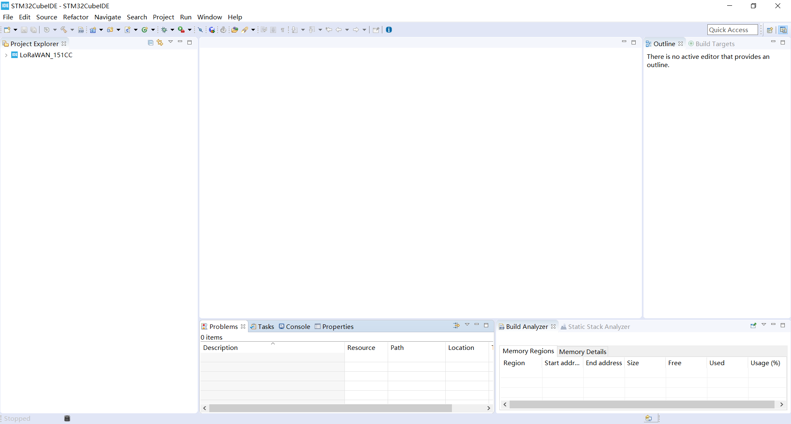
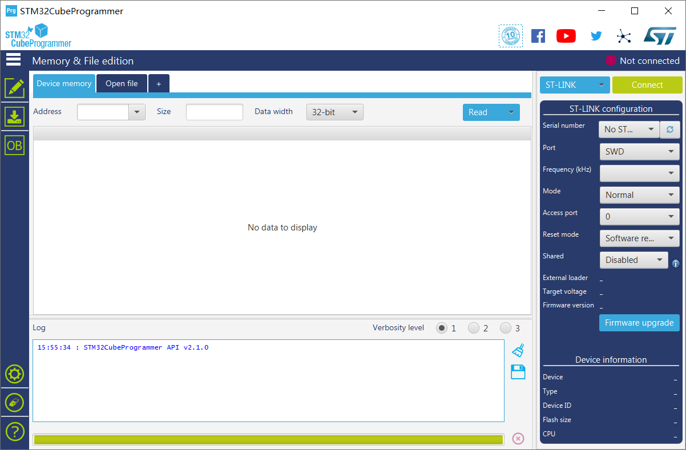

# Heltec STM32+LoRa Series Quick Start
{ht_translation}`[简体中文]:[English]`

We suggest you confirm whether the  `STM32CubeIDE` and `STM32CubeProgrammer` has installed first. If not install, please install [STM32CubeIDE](https://www.st.com/zh/development-tools/stm32cubeide.html#get-software) and [STM32CubeProgrammer](https://www.st.com/zh/development-tools/stm32cubeprog.html) .

## Install STM32CubeIDE

Please click this link to download the STM32CubeIDE.

[Download Link](https://www.st.com/zh/development-tools/stm32cubeide.html)

Install STM32CubeIDE correctly.

&nbsp;

## Install STM32CubeProgrammer

Please click this link to download the STM32CubeProgrammer.

[Download Link](https://www.st.com/zh/development-tools/stm32cubeprog.html)

Install STM32CubeProgrammer correctly.

