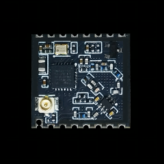
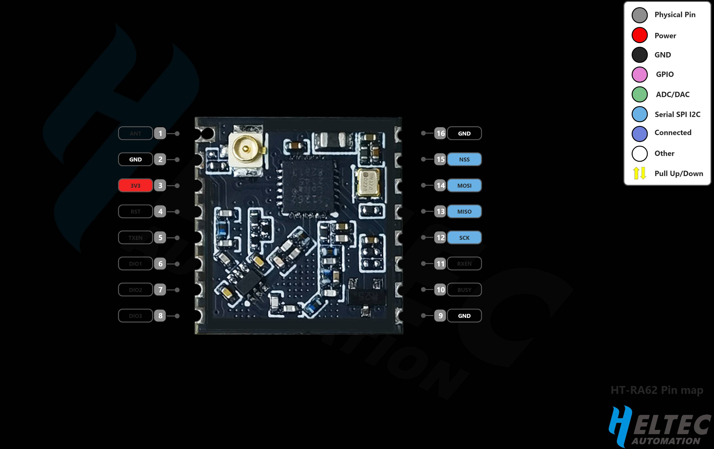

HT-RA62
=======
:ht_translation:`[简体中文]:[English]`

HT-RA62 is a module, must work with other PCB boards, it belongs to “Heltec LoRa“ series, with the following features:

+ SX1262;
+ Support frequency: 150 ~ 960 MHz;
+ Maximum output power 22dBm;
+ Supports FSK, GFSK, MSK, GMSK, LoRa™ and OOK modulation methods;
+ Stamp hole package;
+ High sensitivity: down to -139dBm
+ SPI interface

1. HT-RA62 Pin Map 

2. `HT-RA62 Datasheet <https://resource.heltec.cn/download/HT-RA62/HT-RA62(Rev1.1).pdf>`_.

3. `HT-RA62 Schematic Diagram <https://resource.heltec.cn/download/HT-RA62/HT-RA62_Schematic_diagram.pdf>`_.

4. `HT-RA62 Reference Design <https://resource.heltec.cn/download/HT-RA62/HT-RA62_Reference_design.pdf>`_.
   
5. `More LoRa Node <https://heltec.org/product-category/lora/lrnode/>`_.