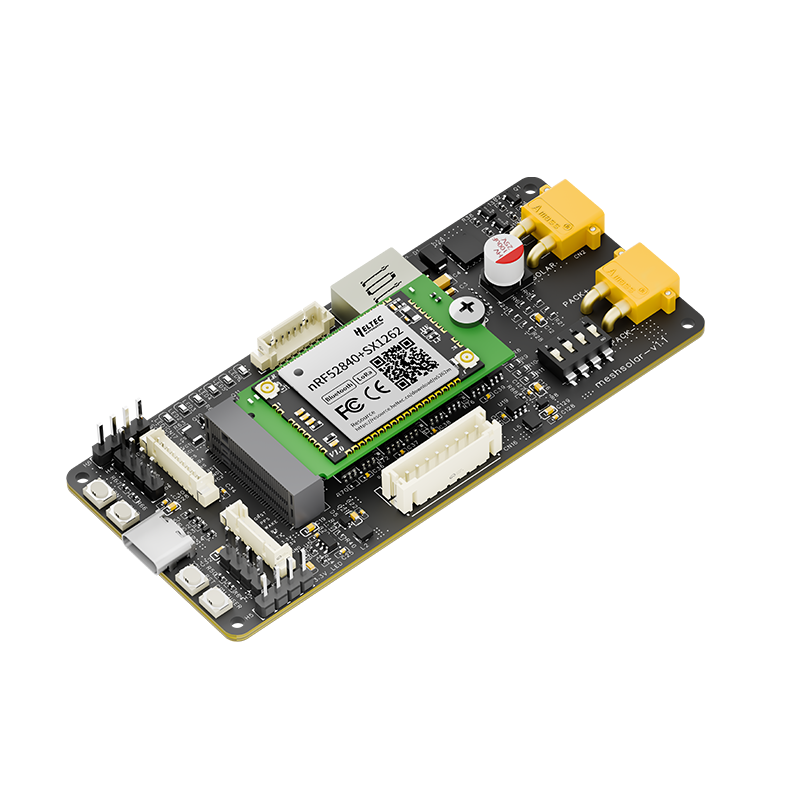
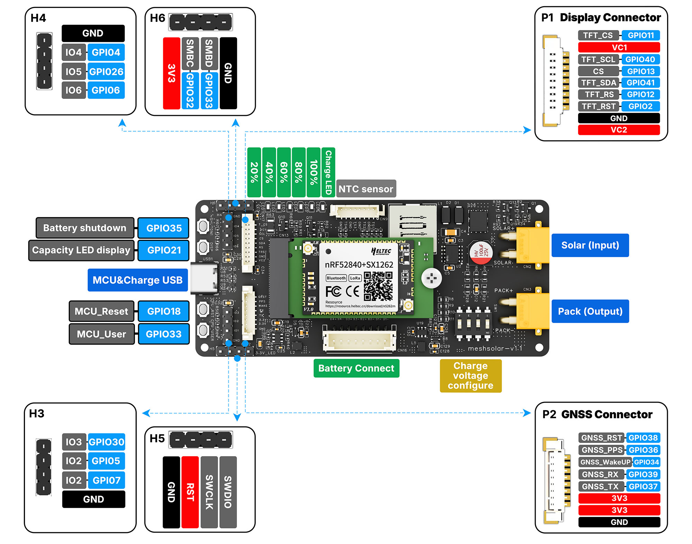

********************
MeshSolar User Guide
********************

:ht_translation:`[简体中文]:[English]`

**Documentation in progress**
--------------------------

Summary
=======

The outdoor solar communication solution based on MeshSolar supports Bluetooth + LoRa communication, integrates an 18V solar panel, 3*3000mAh, and a waterproof casing. It is perfectly suited for Meshtastic.\
    - BMS features.
    - Supports 18V Solar Panel & PD3.0 Input.
    - High-Capacity Lithium Battery
    - Dual Support for LoRa & Bluetooth

------------------------------------

Layout
======

------------------------------------

.. toctree::
   :maxdepth: 2
   :caption: Key Resources

   Datasheet <https://resource.heltec.cn/download/MeshSolar/datasheet>
   HT-N5262M Datasheet <https://resource.heltec.cn/download/HT-N5262M/Datasheet>
   BMS Setting Page<https://flash.nmiot.net:3333/>

.. toctree::
   :maxdepth: 2
   :caption: Quick Start
   
   MeshSolar Quick Start <quick_start>

.. toctree::
   :maxdepth: 2
   :caption: Demo & Expansion
   
   LoRaWAN<https://docs.heltec.org/en/node/nrf/mesh_node_t114/lorawan/index.html>

.. toctree::
   :maxdepth: 2
   :caption: Development
   
   Heltec nRF52840 Development Framework <https://github.com/HelTecAutomation/Heltec_nRF52>

.. toctree::
   :maxdepth: 2
   :caption: FAQ

   MeshSolar Frequently Asked Questions<frequently_asked_questions>

.. toctree::
   :maxdepth: 1
   :caption: General

   Heltec General Docs<https://docs.heltec.org/general/index.html>

