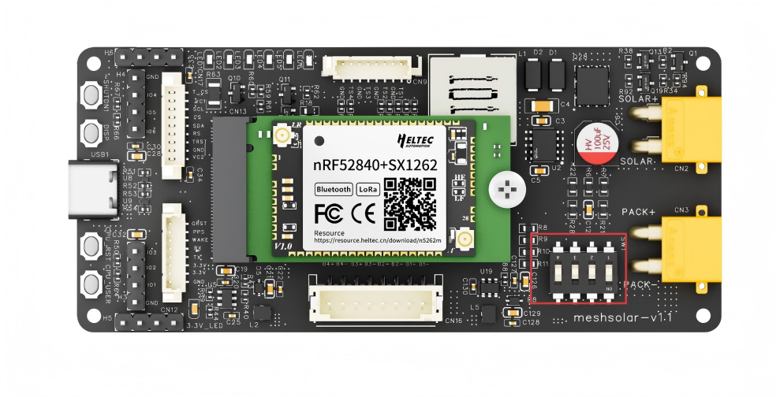

# MeshSolar Quick Start
{ht_translation}`[简体中文]:[English]`

***Documentation in progress***

*This document describes the Quick Start Guide for MeshSolar*.<br>
## Battery Specifications
MeshSolar is available in two hardware versions, designed for Li-ion and LiFePO4 batteries respectively. Ensure you select the correct variant.

**Follow these steps EXACTLY to prevent board damage:**
- [Configure Battery Quantity](quantity)
- [Connect Batteries](battery)
- [BMS Setup](bms)

--------------------------------

=(quantity)
## Configure Battery Quantity
By default, MeshSolar support a 4-battery configuration. If you are using 1 to 3 batteries, you must properly short-circuit the unused battery circuits.

 

And only turn on the corresponding jumper switch. 

``` {note} The switches labeled 1, 2, 3, and 4 on the switch correspond to 1, 2, 3, and 4 battery cells, respectively. <strong>This means the switches represent the quantity of batteries, not their serial numbers</strong>. For example, in the factory default setting, if the battery quantity is set to 4, switch No. 4 is turned ON, while switches No. 1, 2, and 3 remain OFF. When using 3 battery cells, turn OFF switches No. 1, 2, and 4, and turn ON switch No. 3.
```

 

--------------------------------

=(battery)

## Battery Connection
**The batteries will be connected in series inside the MeshSolar device. Do not perform external series/parallel connections. Simply connect each battery to its designated port. Ensure correct polarity alignment by referencing the polarity markings on the baseboard.**


--------------------------------

=(bms)

## BMS Setup

``` {warning} Before performing this step, ensure that the hardware settings for the battery quantity are correctly configured and connected.
```

1. Ensure the main control module is properly connected, ensure that the hardware settings for the battery quantity are correctly configured and connected.


2. Activation.<br>
    Once the device is powered off (due to battery removal or prolonged power loss), the BMS chip requires an 18V–25V power supply to reactivate before configuration can proceed.<br>
    The activation interface can be either:**PD input via USB-C port** or **18–25V DC input via the XT-30 connector**.

    

    Once successfully activated, the device's battery level indicator will illuminate.

3. After successful activation, **do not remove the batteries**. Connect the device to a computer using a USB-C cable.

4. Open the [configuration page](https://flash.nmiot.net:3333) in your browser, click the Connect to choose the port. Adjust the settings as needed.

    

--------------------------------------------------

## Solar Panel Wiring
- Voltage: 18-25V
- Connector: XT30 female socket (inner pin type)

## DC Input
- Voltage: DC 18-25V
- Connector: XT30 female socket (inner pin type)

## USB-C Input
1. When PD3.0 is detected:<br>
The USB-C port charges the battery and powers the main control module when PD3.0 protocol is identified.
2. No protocol detected:<br>
Without protocol recognition, the USB-C port only supplies power to the main control module

-----------------------------------

## NTC Connection


----------------------------------

## Antenna Connection
The LoRa and Bluetooth antennas are located on the central control module of the device, with **IPEX1.0 (UF.L)** connector specifications.


---------------------------------

## Display
Heltec offers an expansion board with display and GPS functionality, providing multiple screen options including: 0.96-inch OLED, 1.90-inch TFT, or 2.13-inch E-Ink.

----------------------------------

## GNSS Module
MeshSolar has opened an MX1.25-8Pin GNSS interface complete with connecting cables.
- This interface is fully compatible with the L76K module.
- Additionally, Heltec provides a display and GPS expansion board that integrates the L76K GPS module while offering multiple screen options.
----------------------------------

## Firmware Upload
To flash firmware via USB-C:

1. Connect the device to your computer using USB-C.
2. Double-press the RST button to enter DFU mode.
3. A removable drive named HT-N5262 will appear on your computer.
4. Paste your firmware file into this drive.

----------------------------------

**Technical Support Email: support@heltec.cn**