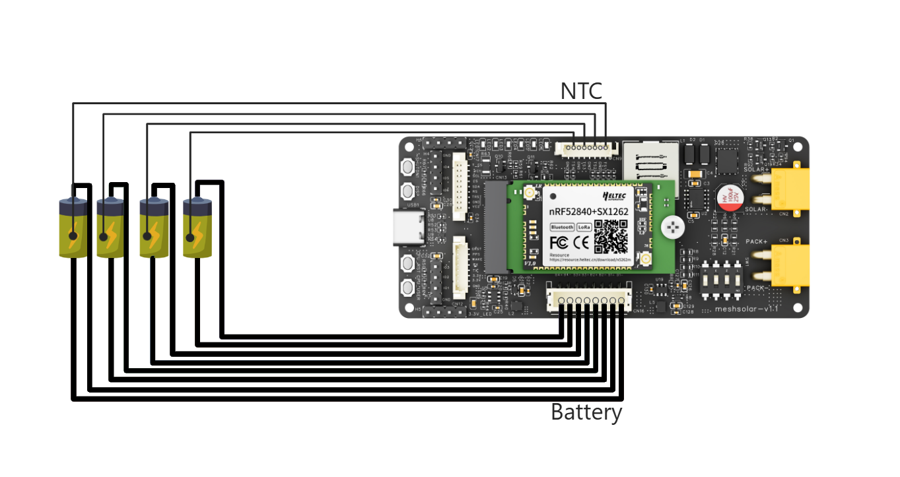
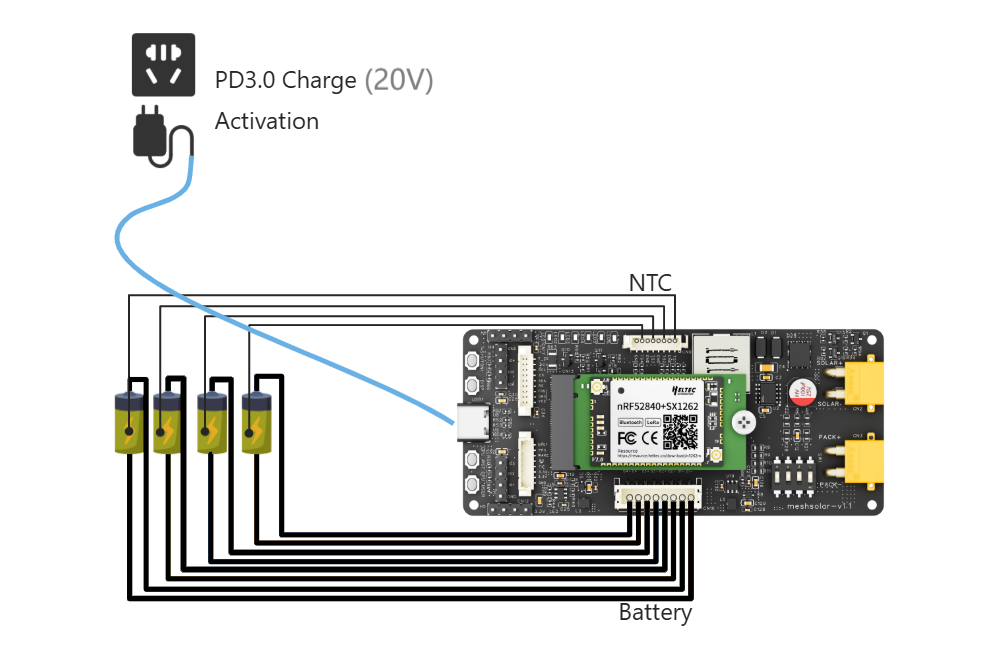

# MeshSolar Quick Start
{ht_translation}`[简体中文]:[English]`

*This document describes the Quick Start Guide for MeshSolar, You can refer to the instructional video for guidance:*<br>
[Instructional Video](https://www.youtube.com/watch?v=cDExK5QdVdU)

Follow these steps **EXACTLY** to prevent board damage:
- [Configure Battery Quantity](quantity)
- [Connect Batteries](battery)
- [BMS Activation](activation)
- [BMS Setup](bms)

## Battery Specifications
MeshSolar is available in two hardware versions, designed for Li-ion and LiFePO4 batteries respectively. Ensure you select the correct variant.<br>

| Module          | Frequency     | Battery   |
|-----------------|---------------|-----------|
| HT-n5262S-I-LF  | 470~510MHz    | Li-ion    |
| HT-n5262S-F-LF  | 470~510MHz    | Li-ion    |
| HT-n5262S-I-HF  | 863~928MHz    | LiFePO₄   |
| HT-n5262S-F-HF  | 863~928MHz    | LiFePO₄   |

``` {tip} If you purchase this [battery holder from Heltec](https://heltec.org/project/18650-battery-box/), you'll need to buy flat-top batteries; otherwise, installation will be difficult.
```

--------------------------------

(quantity)=

## Configure Battery Quantity

``` {warning} When configuring the battery quantity, disconnect both external power and batteries to prevent circuit board damage.
```

By default, MeshSolar support a 4-battery configuration. If you are using 1-3 batteries, you must properly short-circuit the unused battery circuits.

 

And only turn on the corresponding jumper switch. 

``` {tip} The switches labeled 1/2/3/4 on the switch correspond to one/two/three/four battery cells, respectively. <strong>This means the switches represent the quantity of batteries, not their serial numbers</strong>. For example, in the factory default setting, if the battery quantity is set to FOUR, switch No.4 is turned ON, while switches No.1/2/3 remain OFF. When using THREE battery cells, turn OFF switches No.1/2/4, and turn ON switch No.3.
```

 

--------------------------------

(battery)=

## Battery Connection
**The batteries will be connected in series inside the MeshSolar device. Do not perform external series/parallel connections. Simply connect each battery to its designated port. Ensure correct polarity alignment by referencing the polarity markings on the baseboard.**


--------------------------------

## NTC Connection
Connect the NTC resistor, otherwise the device will enter low-temperature protection during reconfiguration.



----------------------------------

(activation)=

## BMS Activation
When the device is used for the first time or shuts down due to battery removal/prolonged power failure, the BMS function must first be activated with an 18V-24V power supply before configuration can be performed or switched to battery power.<br>
The activation interface can be either:**PD3.0(20V) input via USB-C port**, or **18–24V Solar/DC input via the XT-30 connector**.<br>
After successfully activated, the device's battery level indicator will illuminate.



After successful activation, **Do Not Remove the Batteries**, or the BMS chip requires reactivate.

---------------------------------

(bms)=

## BMS Setup
**You can skip this step if using the default configuration, which is:**

| Parameter         | Default Value         |
|-------------------|-----------------------|
| Battery Type      | Hardware-dependent |
| Number of Cells   | 4 |
| Design Capacity   | 3000mAh |
| Discharge Cut-off | 2.5V |
| Discharge High Temp Protection | 60℃ |
| Discharge Low Temp Protection | 0℃ |
| Charge High Temp Protection | 45℃ |
| Charge Low Temp Protection | 0℃ |
| Temperature Protection | On |

``` {warning} <strong>Before performing this step, ensure that the hardware settings for the battery quantity are correctly configured and connected.</strong>
```

1. Ensure the following:
- The main control module is properly connected
- The battery soldering points and switch configuration are correct
- The BMS function has been activated

2. Connect devices and PC via USB-C cable, open the [**Configuration Page**](https://flash.nmiot.net:3333) in your browser, click the `Connect` to choose the port.


3. Configure based on your battery requirements (cell count, capacity, etc.), then click Save Configuration to apply.


4. If you forget the original settings during configuration, click Params Sync to synchronize current system parameters. Note: The system will automatically sync once when the serial port is connected.


5. After completing all configurations, click Reset Status to finalize.


--------------------------------------------------

## DC & Solar Panel Wiring
- Voltage: 18-25V
- Connector: XT30 female socket (inner pin type)

    

---------------------------

## USB-C Input
- When PD3.0 is detected: The USB-C port charges the battery and powers the main control module when PD3.0 protocol is identified.
- No protocol detected: Without protocol recognition, the USB-C port only supplies power to the main control module

    

-----------------------------

## Pack Output/Input
Connector: XT30 female socket (inner pin type)
### Output


Voltage: **Sum of battery voltages**
### Input(Not Recommended)


When the Pack interface is used as input:<br>
- A constant voltage/constant current (CV/CC) power supply must be used; ordinary chargers are not suitable.
- The power supply voltage depends on the battery type and quantity. Generally, it should be:
    - Lithium batteries: 4.2V × number of cells
    - LiFePO4 batteries: 3.6V × number of cells
- The current must not exceed the overcurrent protection limit.

-----------------------------------

## Antenna Connection
- The LoRa and Bluetooth antennas are located on the central control module of the device, with **IPEX1.0 (UF.L)** connector specifications.
- f using IO pins to connect the antenna, please bridge the solder pads in the red box area shown in the figure below.


----------------------------------

## Display
MeshSolar has opened an **MX1.25-9Pin** display interface complete with connecting cables.<br>
Heltec offers an expansion board with display and GPS functionality, providing multiple screen options including: 0.96-inch OLED, 1.90-inch TFT, or 2.13-inch E-Ink.<br>
[Meshsolar expansion board](https://heltec.org/project/gps-display-expansion-board/)


----------------------------------

## GNSS Module
MeshSolar has opened an **MX1.25-8Pin** GNSS interface complete with connecting cables.
- This interface is fully compatible with the [L76K GNSS module]().
- Additionally, Heltec provides a display and GPS expansion board that integrates the L76K GPS module while offering multiple screen options.


----------------------------------

## Firmware Upload
[Meshsolar related firmware](https://resource.heltec.cn/download/MeshSolar/firmware)<br>

### Via DFU Mode:
1. Connect the device to your computer using USB-C.
2. Double-press the RST button to enter DFU mode.
3. A removable drive named HT-N5262 will appear on your computer.
4. Paste your firmware file into this drive.

------------------------------------------

### Temporary Instructions Before Meshtastic Official Merge**
***We have prepared a temporary firmware (based on V2.7.4) that you can use for now. Regarding the official Meshtastic release, we have submitted our merge request. They will review and accept our changes, but due to the complex circuit design of this board, the process may take some time.***

#### Temporary Solution
[Firmware Download Link](https://resource.heltec.cn/download/MeshSolar/firmware)<br>
Before Meshtastic officially merges our code, if you need to adjust BMS-related settings, you must:
- Flash the dedicated BMS firmware, If the power was interrupted during this period, remember to reactivate it.
- Configure the settings via the web interface.
- Reflash the Meshtastic firmware afterward.
#### Final Implementation
Once Meshtastic officially integrates our changes, you will be able to configure BMS settings directly through the Meshtastic firmware.

----------------------------------

**Technical Support Email: support@heltec.cn**