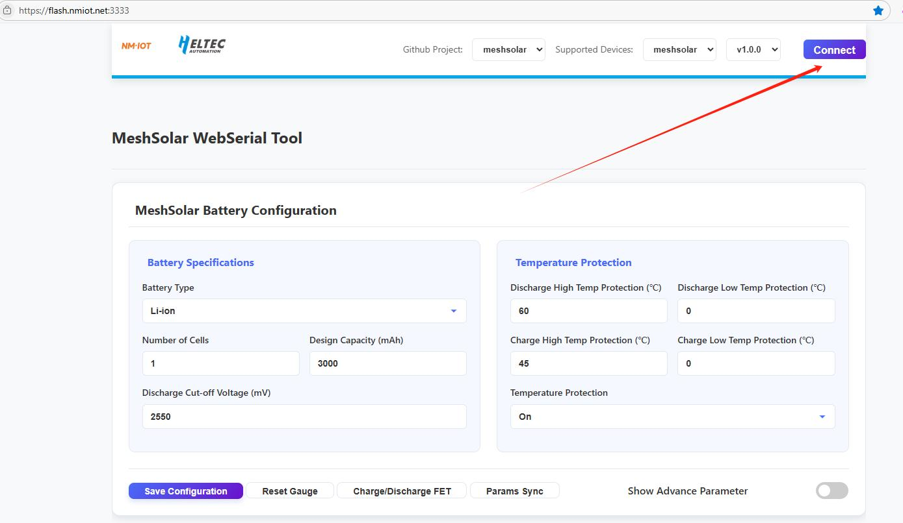
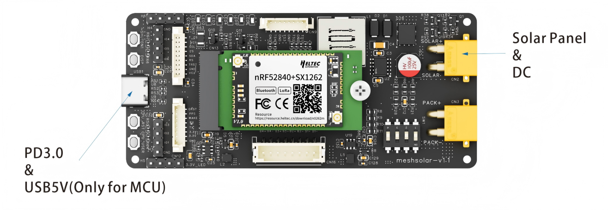

# MeshSolar Quick Start
{ht_translation}`[简体中文]:[English]`

***Documentation in progress***

This document describes the Quick Start Guide for MeshSolar.

--------------------------------

## Battery Number Setup
By default, MeshSolar does not support a 4-battery configuration. If you are using 1 to 3 batteries, you must properly short-circuit the unused battery circuits as shown in the figure below.

 

--------------------------------

## BMS Setup
The BMS parameters (marked 'Configurable') can be adjusted via [MeshSolar WebSerial Tool](https://flash.nmiot.net:3333/).<br>
1. Ensure the main control module is properly connected to the baseboard as shown in the figure below.


2. Connect the computer and MeshSolar using a USB-C cable.
3. Open the [configuration page](https://flash.nmiot.net:3333) in your browser, click the Connect to choose the port. Adjust the settings as needed.



--------------------------------

## Battery Connection

``` {warning} Always set the battery count and BMS settings before attaching batteries or power. Incorrect setup may lead to equipment burnout.
```

**The batteries will be connected in series inside the MeshSolar device. Do not perform external series/parallel connections. Simply connect each battery to its designated port. Ensure correct polarity alignment by referencing the polarity markings on the baseboard.**


-----------------------------------

## NTC Connection


-----------------------------------

## Power Supply

``` {warning} Always set the battery count and BMS settings before attaching batteries or power. Incorrect setup may lead to equipment burnout.
```



### Solar Panel Wiring
- Voltage: 18-25V
- Connector: XT30 female socket (inner pin type)

### DC Input
- Voltage: DC 18-25V
- Connector: XT30 female socket (inner pin type)

### USB-C Input
1. When PD3.0 is detected:<br>
The USB-C port charges the battery and powers the main control module when PD3.0 protocol is identified.
2. No protocol detected:<br>
Without protocol recognition, the USB-C port only supplies power to the main control module

----------------------------------

## Antenna Connection


---------------------------------


