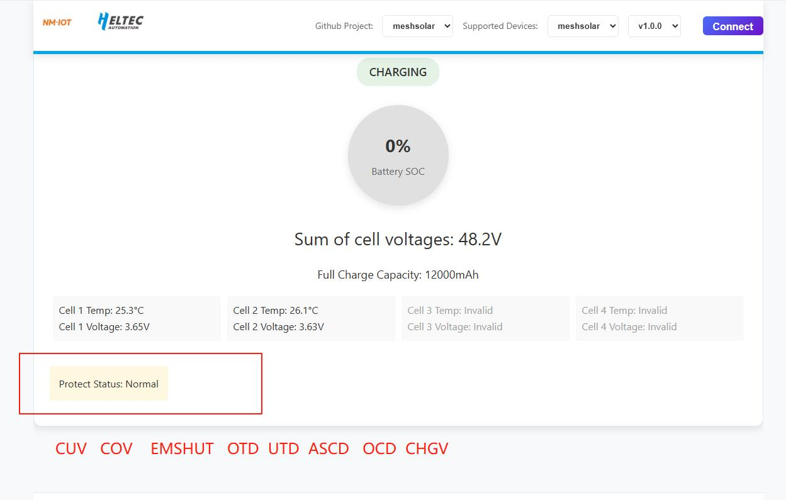

# MeshSolar BMS Troubleshooting

{ht_translation}`[简体中文]:[English]`

If your device's BMS (Battery Management System) malfunctions, you can connect it to the configuration web page to view the relevant fault prompts for troubleshooting. 
[MeshSolar WebSerial Tool](https://flash.nmiot.net:3333/) 
## Preparation
- Computer, USB cable, MeshSolar
- Ensure your firmware supports BMS functionality, Here is the initial BMS firmware download address and upload method:
    - [Meshsolar BMS Stock Firmware](https://resource.heltec.cn/download/MeshSolar/firmware/bms) 
    - [MeshSolar Firmware Upload Method](https://docs.heltec.org/en/node/meshsolar/quick_start.html#firmware-upload).  

## Specific Steps

1. Connect the device to the computer via USB.  
2. Log in to the MeshSolar configuration webpage on the computer.  
3. Click "Connect" in the upper right corner to connect to the device. If the serial port cannot be found, try pressing the RST button.  
4. Scroll to the bottom of the page to view the current diagnostics.

------------------------------------------
## Troubleshooting
The table below explains the protection status meanings and removal methods:

| Prompt | Reason | Description |
|--------|--------|-------------|
| CUV | Cell Under Voltage | Check if the battery is properly connected, and whether the cell count configuration matches the underlying solder point configuration. Reset the system after troubleshooting. |
| COV | Cell Over Voltage | Verify battery type matches MeshSolar type, check DIP switch/solder point configuration against web cell count settings. Reset after troubleshooting. |
| EMSHUT | Emergency Shutdown | Press and hold the SHUTDN1 button on the board to recover |
| OTD | Over Temperature (Discharge) | Check NTC connection, verify if battery/environment temperature is too high. Reset after troubleshooting. |
| UTD | Under Temperature (Discharge) | Check NTC connection, verify if battery/environment temperature is too low. Reset after troubleshooting. |
| OTC | Over Temperature (Charge) | Check NTC connection, verify if battery/environment temperature is too high. Reset after troubleshooting. |
| UTC | Under Temperature (Charge) | Check NTC connection, verify if battery/environment temperature is too low. Reset after troubleshooting. |
| ASCD | Short Circuit (Discharge) | Check for shorts between PACK+/PACK-. Remove short circuit and reset system. |
| OCD | Over Current (Discharge) | Check if PACK+/PACK- has load exceeding 1.75A. Remove overload and reset system. |
| CHGV | Charge Over Voltage | Verify DIP switch matches charging cell count. Remove overvoltage source and reset system. |