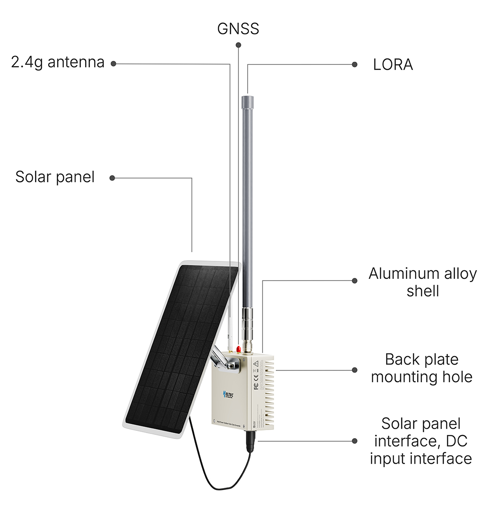

********************
MeshTower User Guide
********************

:ht_translation:`[简体中文]:[English]`

***Documentation in progress***

--------------------------

Summary
=======

MeshTower is a solar-powered outdoor communication system built on MeshSolar technology.
    - Professional BMS Performance.
    - 3X3000mAh high-capacity lithium batteries.
    - Supports 18~24V solar input, DC 18-24V input and USB-C PD3.0(20V) input.
    - Dual Support for LoRa & Bluetooth.
    - Excellent Low-Power Efficiency.
    - IP66-rated metal enclosure, waterproof & flame-retardant.

------------------------------------

Components
==========

-----------------------------------------

Battery Specifications
======================
The following table shows the default battery specifications. If you choose to replace the battery, the voltage must match the parameters in the table below, and it is recommended to select a wide-temperature battery (to suit specific environmental conditions).

+-------------------------+----------------+
| **Specification**       | **Value**      |
+=========================+================+
| Battery Type            | Lithium-ion    |
+-------------------------+----------------+
| Rated Voltage           | 3.7-3.8V       |
+-------------------------+----------------+
| Maximum Voltage         | 4.2V           |
+-------------------------+----------------+
| Battery Capacity        | 3000mAh        |
+-------------------------+----------------+
| Number of Batteries     | 3              |
+-------------------------+----------------+
| Operating Temperature   | -20 to 60°C    |
+-------------------------+----------------+

--------------------------------------------

.. toctree::
   :maxdepth: 2
   :caption: Key Resources
   
   Datasheet <https://resource.heltec.cn/download/MeshTower/Datasheet>
   HT-N5262M Datasheet <https://resource.heltec.cn/download/HT-N5262M/Datasheet>
   Heltec nRF52840 Development Framework <https://github.com/HelTecAutomation/Heltec_nRF52>

.. toctree::
   :maxdepth: 2
   :caption: User Guide
   
   MeshTower Quick Start <quick_start>

.. toctree::
   :maxdepth: 2
   :caption: Hardware Update Log
   
   MeshTower Hardware Update Log <hardware_update_log>

.. toctree::
   :maxdepth: 2
   :caption: FAQ

   MeshTower Frequently Asked Questions<frequently_asked_questions>

.. toctree::
   :maxdepth: 2
   :caption: Development Framework

   Heltec nRF52840 Development Framework <https://github.com/HelTecAutomation/Heltec_nRF52>

-----------------------------------

Heltec General Docs 
===================
https://docs.heltec.org/general/index.html