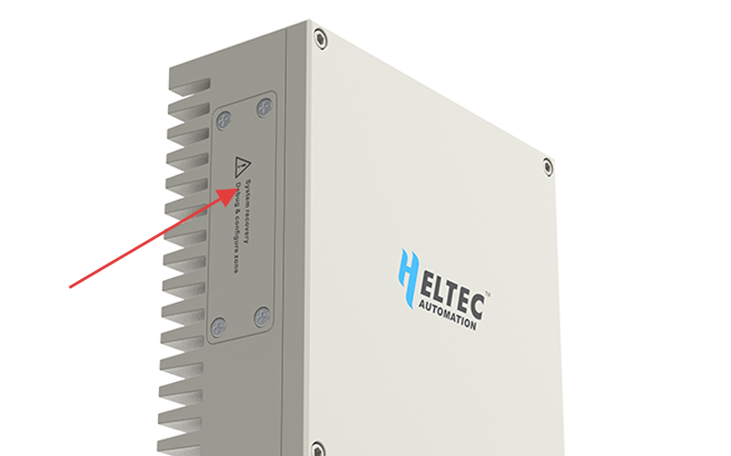
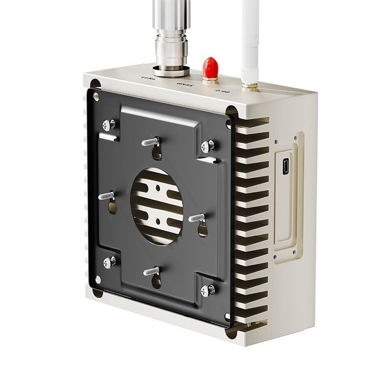

# MeshSolar Quick Start
{ht_translation}`[简体中文]:[English]`

***Documentation in progress***

This document outlines the MeshTower Quick Start Guide, covering:
- [Firmware Installation](firmware)
- [Hardware Installation](hardware)

## Firmware Pre-installed
The default firmware pre-installed on MeshTower is Meshtastic. For project introduction and user guide, please refer to their official documentation. 
[meshtastic.org](https://meshtastic.org/docs/introduction/)

----------------------------------------

(firmware)=
## Firmware Installation
If you need to upgrade the firmware or install alternative firmware, you can do so in the following two ways.

### UF2 File Upload Instructions
1. Open the side protective cover, Plug in the device via USB-C.

2. Open the device cover. Double-press the RST (Reset) button. A removable drive named **HT-n5262** will appear on your computer.

3. Drag and drop the `.UF2` file into the HT-N5262 drive. Wait for the transfer to complete (the drive will automatically disconnect).

### Firmware Upload via Programming Tools
1. Open the side protective cover, Connect the device via USB-C.

2. Compile and upload directly using Arduino IDE, PlatformIO, and other compatible development tools.

--------------------------------------

(hardware)=

## Hardware Installation
### Wall-Mount
**Document under construction...**

### Pole-Mount
**Document under construction...**

