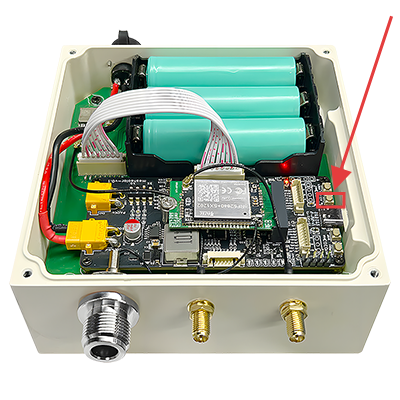

# MeshSolar Quick Start
{ht_translation}`[简体中文]:[English]`

## First Charge
The Meshtower comes pre-configured with battery management settings. It is ready to use once you connect the solar panel and antenna. 
However, before first use, it is recommended to activate the battery function and fully charge the battery via the USB-C port or DC interface.
### Via USB-C(recommended)
The USB-C port requires PS3.0 and a 20V voltage input.

### Via DC
The DC interface is the solar panel input port, which uses an XT30 connector and supports an input voltage of 18-24V.

## Checking Battery Level
- You can check the battery level via the Meshtastic app on your phone.

- Connect the device to a computer and check via the battery management web page: [MeshSolar WebSerial Tool](https://flash.nmiot.net:3333/).

## Firmware
### Pre-installed Firmware
The Meshtower comes pre-installed with Meshtastic firmware. 
The default password is: 123456. 
For instructions on how to use Meshtastic, please refer to [Meshtastic official documentation.](https://meshtastic.org/docs/introduction/)
### Firmware Installation and Update
You can install or update the firmware via the USB-C port. 
If your installation method requires entering DFU mode, you will need to open the device casing and double-press the RST button to enter DFU mode.

At this point, the computer will pop up a USB drive named HT-n5262. Copy your firmware to this drive.

--------------------------------------

(hardware)=

## Hardware Installation
### Wall-Mount

### Pole-Mount

