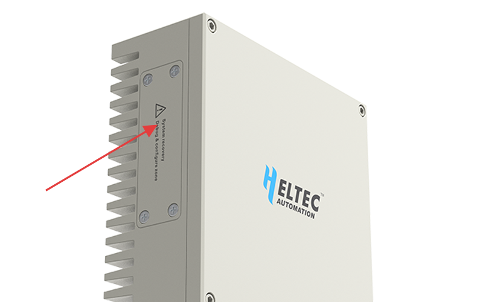

# MeshTower BMS Troubleshooting

{ht_translation}`[简体中文]:[English]`

1. Connect devices and PC via USB-C cable, 

2. Open the [**Configuration Page**](https://flash.nmiot.net:3333) in your browser, click the `Connect` to choose the port.

| Prompt | Reason | Description |
|--------|--------|-------------|
| CUV | Cell Under Voltage | Check if the battery is properly connected, and whether the cell count configuration matches the underlying solder point configuration. Reset the system after troubleshooting. |
| COV | Cell Over Voltage | Verify battery type matches MeshSolar type, check DIP switch/solder point configuration against web cell count settings. Reset after troubleshooting. |
| EMSHUT | Emergency Shutdown | Press and hold the SHUTDN1 button on the board to recover |
| OTD | Over Temperature (Discharge) | Check NTC connection, verify if battery/environment temperature is too high. Reset after troubleshooting. |
| UTD | Under Temperature (Discharge) | Check NTC connection, verify if battery/environment temperature is too low. Reset after troubleshooting. |
| OTC | Over Temperature (Charge) | Check NTC connection, verify if battery/environment temperature is too high. Reset after troubleshooting. |
| UTC | Under Temperature (Charge) | Check NTC connection, verify if battery/environment temperature is too low. Reset after troubleshooting. |
| ASCD | Short Circuit (Discharge) | Check for shorts between PACK+/PACK-. Remove short circuit and reset system. |
| OCD | Over Current (Discharge) | Check if PACK+/PACK- has load exceeding 1.75A. Remove overload and reset system. |
| CHGV | Charge Over Voltage | Verify DIP switch matches charging cell count. Remove overvoltage source and reset system. |