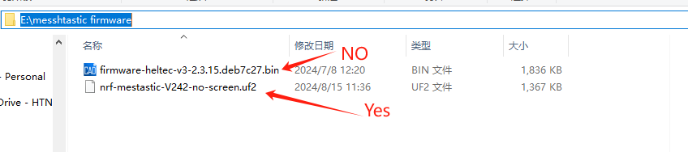
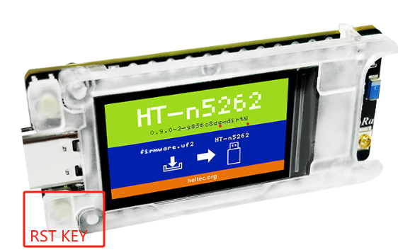
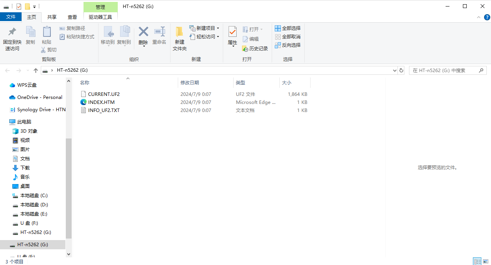
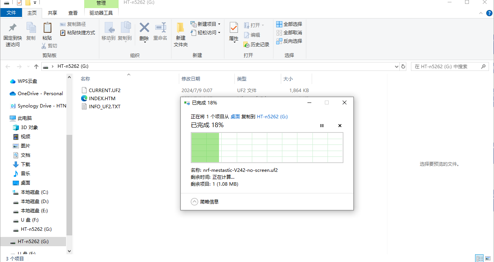

# Firmware Upload
{ht_translation}`[简体中文]:[English]`

***This document is being continuously updated......***

### Via USB-CDC (Easiest)
Firmware through USB-CDC is a particularly suitable way for beginners, even if you are a professional programmer, zhge method can also save you a lot of time.
1. Download the firmware you need to run to your PC.

``` {Tip} The format of the file should be "xxx.uf2".
```



2. Connect T114 and PC Via USB cable. Press the RST key twice in quick succession.



3. At this point, the PC desktop will pop up a device named "HT-n5262".



4. Copy and paste the prepared firmware into the device.



5. After the transfer is complete, the device will automatically restart and run the new firmware.

