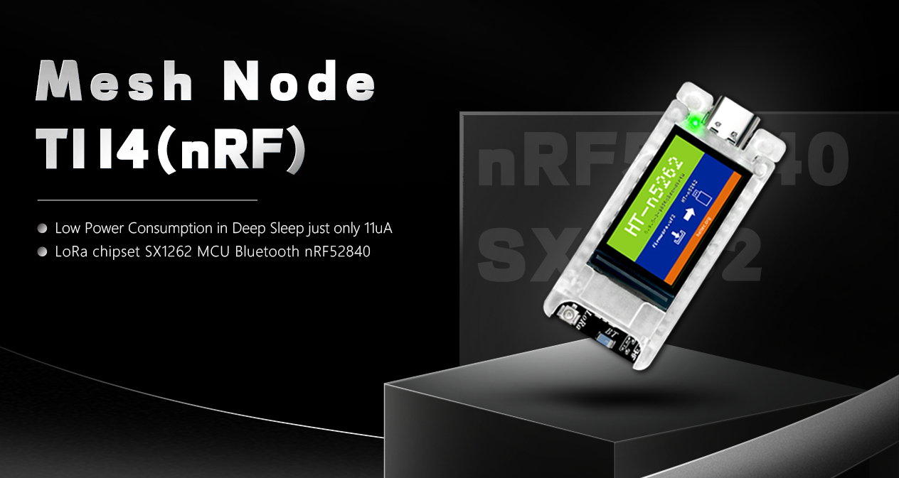
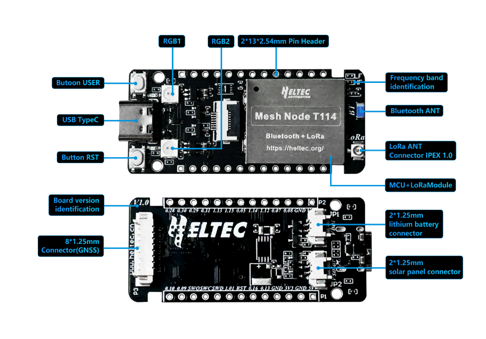
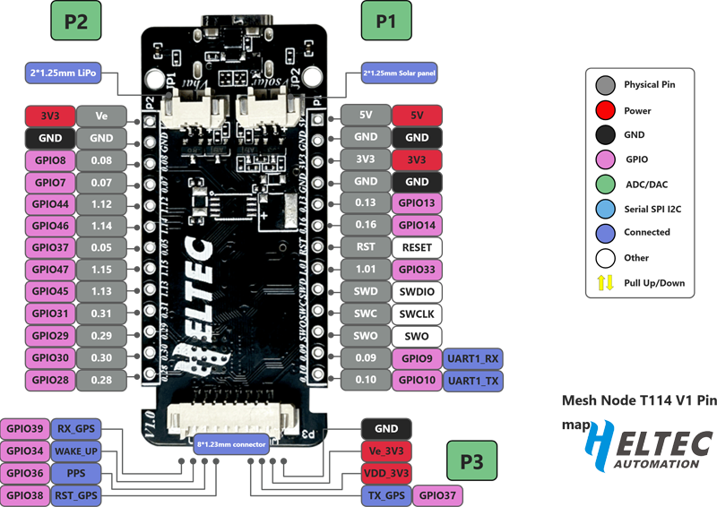

Mesh Node T114
==============
:ht_translation:`[简体中文]:[English]`

`Mesh Node T114 <https://heltec.org/>`_ is a development board based on nRF52840 and SX1262, supports LoRa communication and Bluetooth 5.0, and provides a variety of power interfaces (5V USB, lithium battery and solar panel), optional 1.14 inch TFT display and GPS module as accessories.

Introduction to Basic Information
=================================
Description of Components
-------------------------

   The key components of the board

Pin Map
--------

 For more details, Please refer to `Datasheet and Schematic <https://resource.heltec.cn/download/Mesh%20Node%20T114>`_.

Hardware Update Log
-------------------
Hardware Update Log <hardware_update_log>

Quick Start
===========

Upload firmware via USB-CDC(easiest)
------------------------------------
If you are new or not ready for further development, in this way, you can upload the firmware already made. Please refer to this link:

Quick Upload Firmwarequick_upload`

Framework and library installation
----------------------------------
This section describes how to install the development environment and start a sample code. Please refer to this link:

`HT-nRF52 Framework and library installation <https://docs.heltec.org/en/node/nrf/quick_start/index.html>`_.

LoRaWAN Sample Code
===================
This section describes how to get started with the LoRaWAN code from the Heltec nRF series.
- :doc:`../../lorawan/index`

Related Resource
================
- Mesh Node T114 Datasheet <https://resource.heltec.cn/download/Mesh%20Node%20T114/Datasheet.pdf>
- Mesh Node T114 Schematic Diagram <https://resource.heltec.cn/download/Mesh%20Node%20T114/schematic_diagram.pdf>
- Mesh Node T114 Pin Map <https://resource.heltec.cn/download/Mesh%20Node%20T114/schematic_diagram.pdf>
- Meshtastic Firmware for Mesh Node T114 <https://resource.heltec.cn/download/Mesh%20Node%20T114/nrf-mestastic-V242.uf2>
- More related downloads: `Resource <https://resource.heltec.cn/download/Mesh%20Node%20T114>`_
- Technical support: `support@heltec.cn <support@heltec.cn>`_

-->[General Docs]<-- <https://docs.heltec.org/general/index.html>
    
