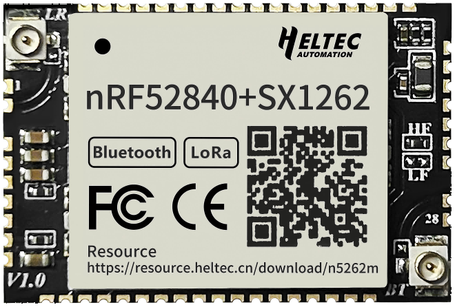
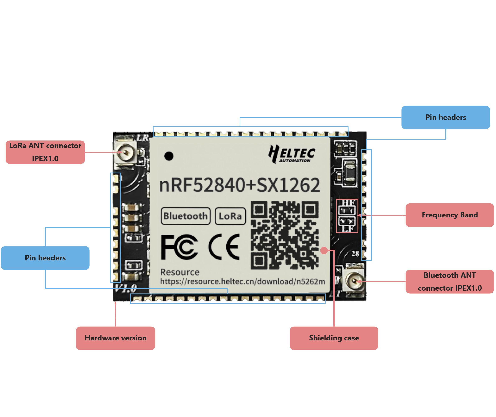
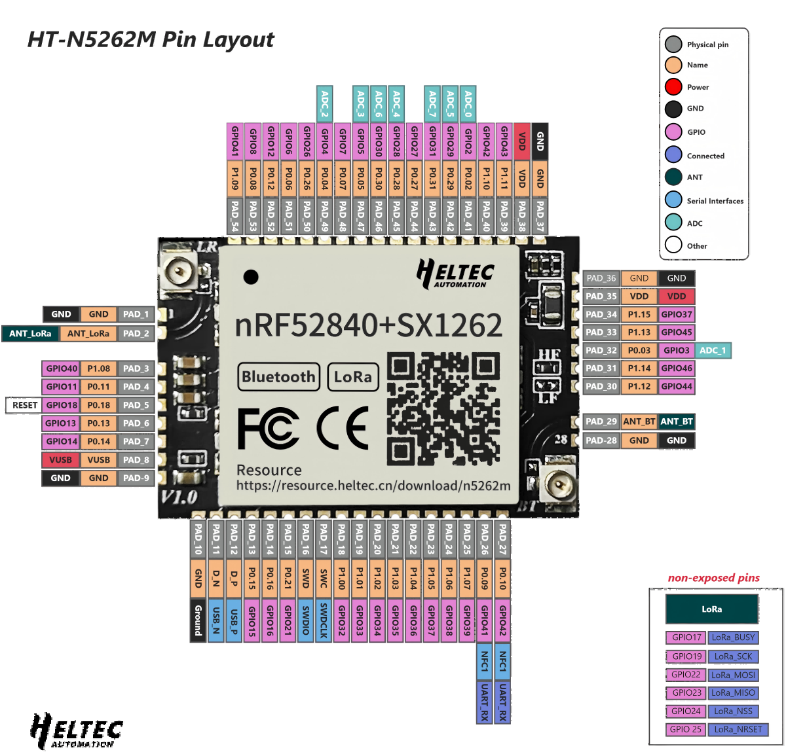

Mesh Node 5262M
===============
:ht_translation:`[简体中文]:[English]`

Summary
-------
Mesh Node 5262M is a module based on the nRF52840 and SX1262, supporting both Bluetooth and LoRa communication modes. It offers a rich set of pins and interfaces, featuring a 1.27mm pitch stamp hole design, making it compact and easy to integrate into your PCB. 

   
Features
--------
- nRF52840 (Bluetooth)+SX1262(LoRa).
- 1.27mm pitch stamp hole design, making it compact and easy to integrate.
- Offer a rich set of pins and interfaces.
- Long transmission range, up to 3~10km in open environments.
- The IPEX1.0 antenna connector provides a more flexible and efficient integration solution.
- Low power consumption, 9 uA in deep sleep.
- Operation condition: -40~85℃, 90%RH(No condensing).
- Compatible with Arduino-IDE/PlatformIO/MicroPython, and we provide Arduino development frameworks and libraries.

Components
----------

Basic Resources
-------------------
- `Mesh Node 5262M Datasheet <https://resource.heltec.cn/download/HT-N5262M/Datasheet.pdf>`_
- `Mesh Node 5262M Schematic Diagram <https://resource.heltec.cn/download/HT-N5262M/HT-N5262M_Schematic_Diagram.pdf>`_
- `Heltec nRF development framework on GitHub <https://github.com/HelTecAutomation/Heltec_nRF52>`_

Pin Layout
----------

For description of function names, please refer to `ESP-HaLowCamera Datasheet <https://resource.heltec.cn/download/HT-N5262M/Datasheet>`_.

Installing the development framework
------------------------------------
Heltec provides an Arduino-based development framework.

For installation, please refer to this link: `Heltec nRF Development Framework Installation Guide <https://docs.heltec.org/en/node/nrf/ht-n5262m/quick_start.html>`_.

FAQs
----
- `Frequently Asked Questions <https://docs.heltec.org/en/node/nrf/ht-n5262m/faq/index.html>`_

Hardware Upgrade Log
--------------------
- `Hardware Upgrade Log <https://docs.heltec.org/en/node/nrf/ht-n5262m/hardware_upgrade_log/index.html>`_

Heltec General Docs
-------------------
-->[General Docs]<-- <https://docs.heltec.org/general/index.html>
    
