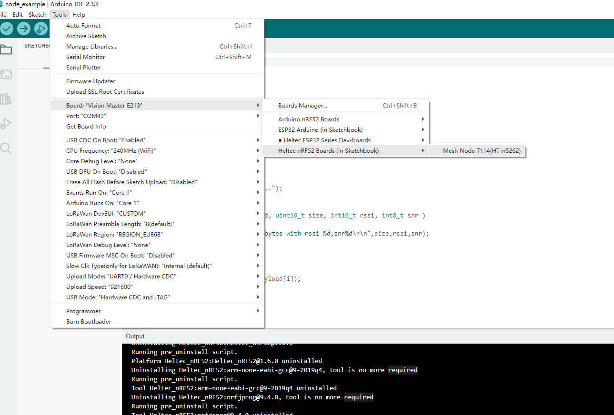
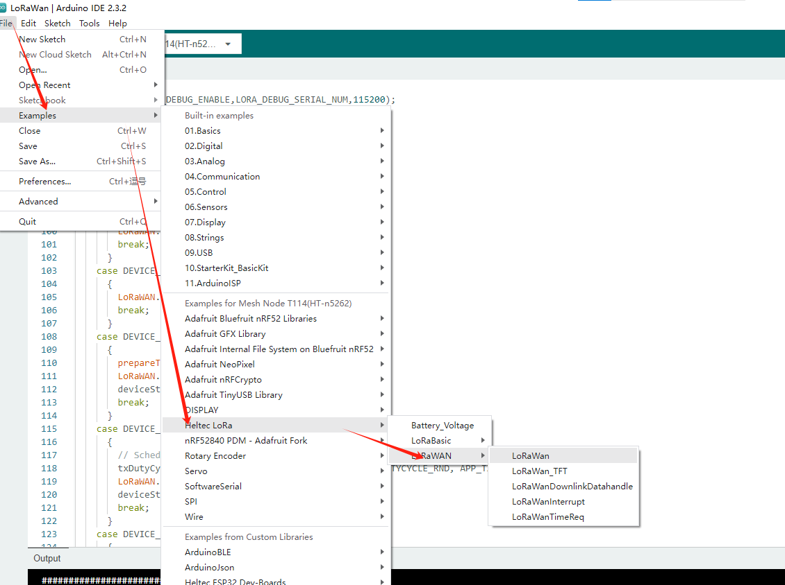
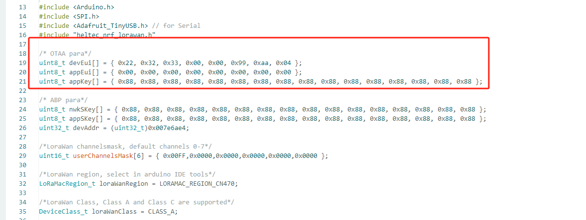
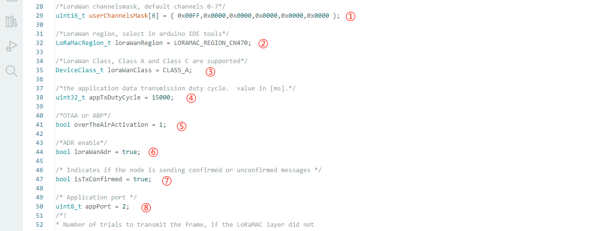
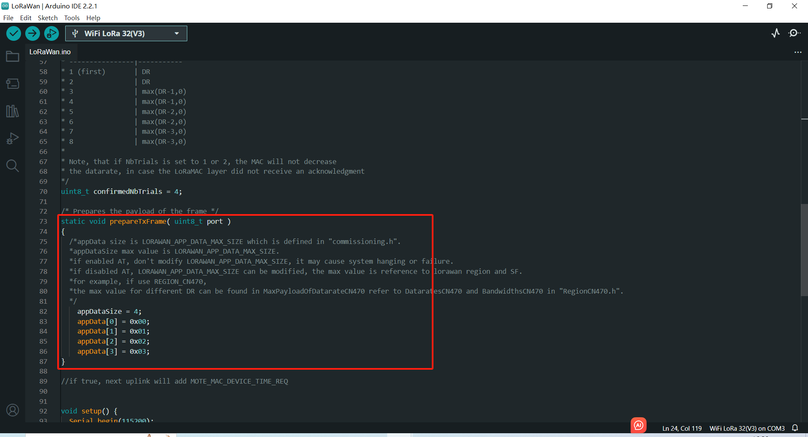
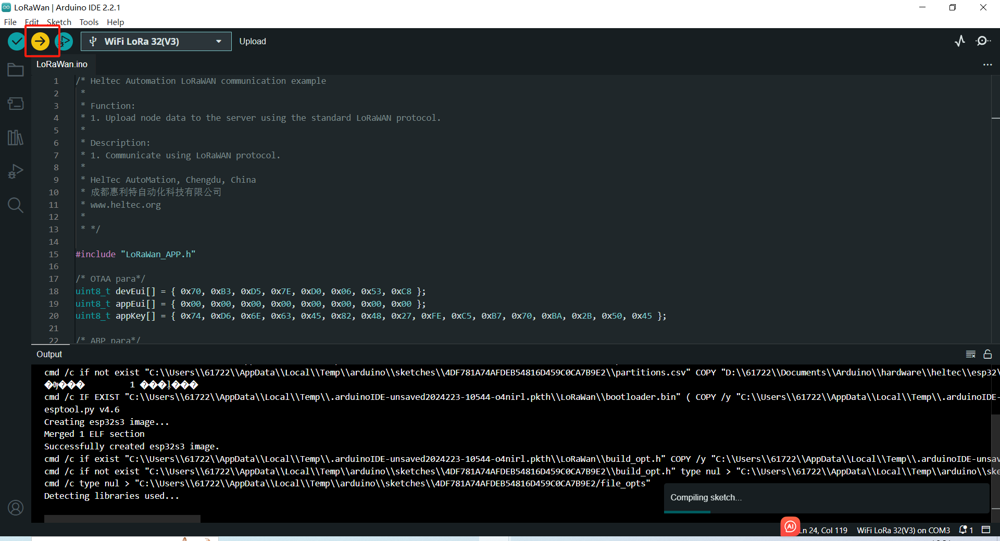

# Config LoRa Parameters
{ht_translation}`[简体中文]:[English]`

## Preparation
1. Install Arduino IDE. How to install please click [here](https://docs.heltec.org/general/how_to_install_git_and_arduino.html).
2. Install [Heltec nRF32 series Arduino development framework](https://github.com/HelTecAutomation/Heltec_nRF52).  Installation manual  please refer to [here](https://docs.heltec.org/en/node/nrf/quick_start.html).
3. An [Mesh Node](https://heltec.org/).
4. High quality USB cable. 

## Configure Parameters
1. Connect the development board to the computer through USB data cable.

2. Open the Arduino and in the `Tools` option, select the appropriate `Board`, `Port`.



3. Follow the path shown below to open the LoraWAN demo code.



4. Fill in **DevEu** **AppEui** **AppKey** in the following figure in the red box in the example format, which will be used in the website registration.



  - DevEui -- Mote device IEEE EUI (big endian), 8 bytes;
  - AppEui -- Application IEEE EUI (big endian), 8 bytes;
  - AppKey -- AES encryption/decryption cipher application key, 16 bytes;

```{Tip} This example uses the OTAA pattern as an example, and for the differences in the ABP pattern, please refer to this link: [ABP mode](https://docs.heltec.org/general/lorawan_abp/config_parameter.html)
```

5. Set LoRaWAN parameter:

   

   - ① Channel: It takes effect when you select CN470 or US915. The default is 0-7. Please refer to [Channel's calculation method]([LoRaWAN example Sub-Band usage (AU915) — main latest documentation (heltec.org)](https://docs.heltec.org/general/sub_band_usage.html)). 

   - ② LoRaMacRegion: LoRaWAN Frequency Plans [LoRaWAN Frequency Plans — main latest documentation (heltec.org)](https://docs.heltec.org/general/lorawan_frequency_plans.html).

   - ③ DeviceClass: LoRaWAN Operation Mode, you can type Class_A or Class_C.

   - ④ DutyCycle: LoRaWAN uplink transmission interval. 

   - ⑤ OTAA/ABP: LoRaWAN access mode, ‘1’ means OTAA, '0' means ABP.

   - ⑥ ADR/DR:  ‘true’ means ADR, 'false' means DR, how to set DR please refer to "[Set DR]()".

   - ⑦ TxConfirmed: 'ture' means confirmed, 'false' means unconfirmed.

   - ⑧ AppPort: LoRaWAN downlink port.

6. Effective load is here.



``` {Note} Print too much messages may cause the system unstable.

```

7. Click `Upload` to upload the code.



