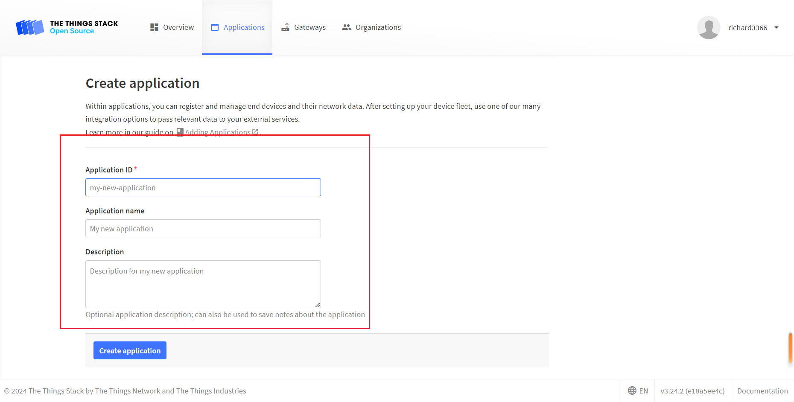
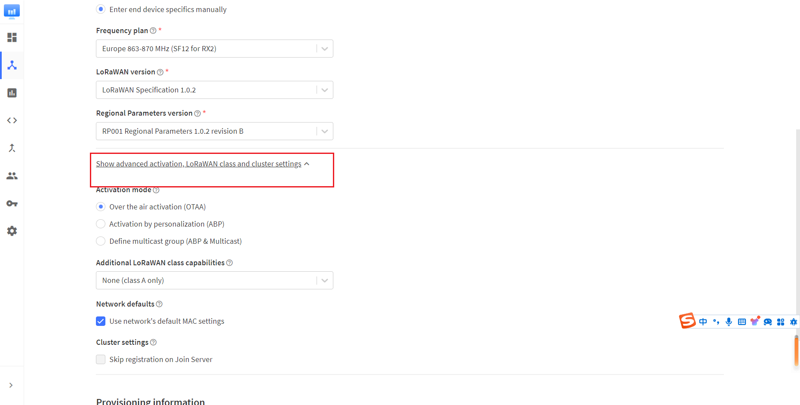
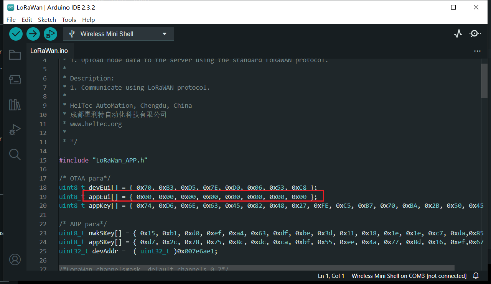
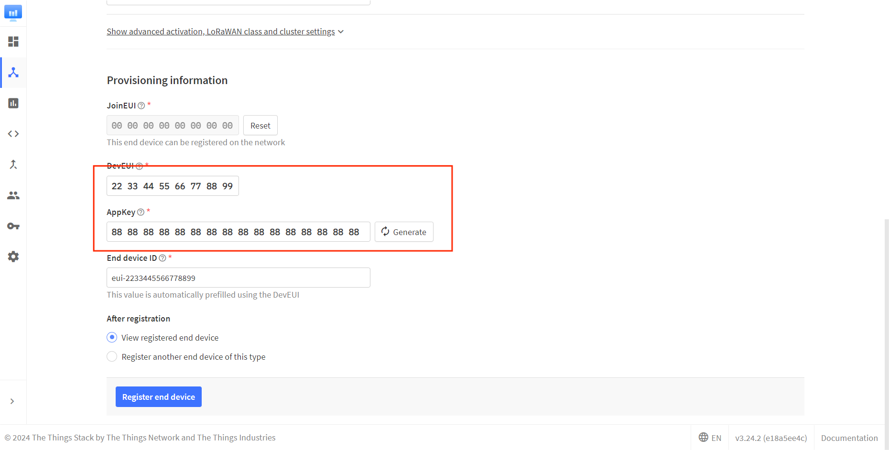
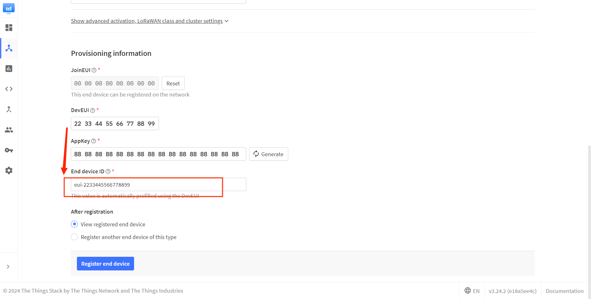
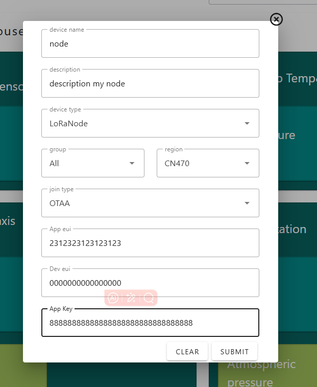
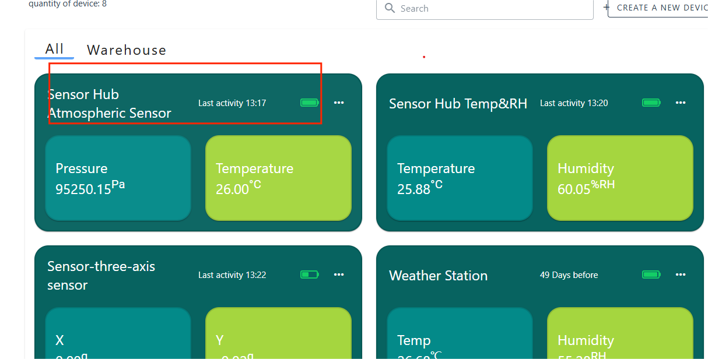

# Connect to LoRaWAN Server
{ht_translation}`[简体中文]:[English]`

## Preparation
1. A node that's configured and uploaded code, as described in the previous topic:: **[Config Parameters](https://docs.heltec.org/en/node/nrf/lorawan/config_parameter.html)**
2. A LoRa server, We recommend the following three:
    - [TTN/TTS](https://console.thethingsnetwork.org/)
    - [ChirpStack](https://www.chirpstack.io/)
    - [SnapEmu](https://platform.snapemu.com/) (Recommended)

3. A Gateway that matches the **LoRaWAN region** of the node, and already is connected to the lora server. If you are using Heltec Gateway, you can find out how to connect to the server in the [Heltec Gateway documentation](https://docs.heltec.org/)

------

## Connect to LoRaWAN Server

Before that, make sure there is a LoRa Gateway active in your server.

- [Connect to TTN/TTS](connect-to-ttn)
- [Connect to ChirpStack](connect-to-chirpstack)
- [Connect to SnapEmu](connect-to-snapemu)

------

(connect-to-ttn)=
### Connect to TTN/TTS

1. Log in to the [TTS server web page](lora.heltec.org), register a new “Applications” .

    

2. Create application


3. You can freely fill in the Application information in the red box, and click `Creat application` when you're done.

   

4. Register an end device.

   

5. Choose `Enter end device specifics manually`, Select the frequency band corresponding to the node, 

   

6. The LoRaWAN version is chosen to be 1.0.2 B

   

   The `Show advanced activation, LoRaWAN class and cluster settings` option has some other LoRaWAN parameter Settings such as OTAA/ABP.CLASS A/C, these parameters default to OTAA and CLASS A, in general need to be consistent with the node Settings.

   

7. Fill in JoinEUI and click confirm.

   

   ``` {Tip} In code or some application products, JoinEUI is represented as AppEUI.
   ```

   

8. Fill in DevEUI and AppKey.

   

   ``` {Tip} The End device ID is automatically generated when you fill in DevEUI.
   ```

   

9. Click to register.


After registration is complete, if all is well, you will see the device active.


------

(connect-to-chirpstack)=
### Connect to ChirpStack
Register a new device in ChirpStack’s “Applications” page. Enter the device name, description, DevEUI. Select Device-profile.


Enter the Application key of the device.


After registration is complete, if all is well, you will see the device active.


------

(connect-to-snapemu)=

### Manual registration on snapemu

Enter configuration mode to get device-related registration information.

Log into your account on ***\*platform.snapemu.com\****, click `device`, `CREATE A NEW DEVICE`.

 **If you're using an APP,click* *`+`* *,select* *`input`**.**


Fill in the device information.



After registration is complete, if all is well, you will see the device active.



## Important Hints

Please double check the following two things:

1. The LoRaWAN parameters is the same as server!
2. The listening frequency of your LoRa Gateway is the same as node's sending frequency. We strictly follow [LoRaWAN™ 1.0.2 Regional Parameters](https://resource.heltec.cn/download/LoRaWANRegionalParametersv1.0.2_final_1944_1.pdf);
