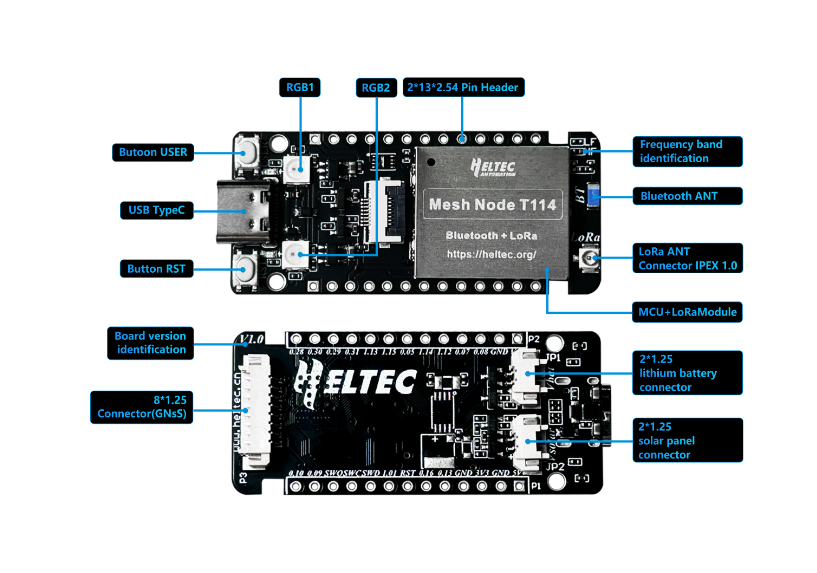

# Hardware Update Logs
{ht_translation}`[简体中文]:[English]`

## V1

- First release
- 2024-8-7 public sale

## V2

- The circuit board was changed from 4 layers to 6 layers so that both the RF part and the crystal oscillator part can obtain a more complete ground.
- The circuit was changed from lead-free to immersion gold process, which is more friendly to signal transmission.
- The position of some components was adjusted.
- The RF path was optimized according to the six-layer board structure.
- The direction of the 2.4GHz Bluetooth antenna and IPEX LoRa antenna interface was changed to make them farther away.
- Now the high-frequency Mesh node T114 can stably send long data packets in the "Long_Fast" channel of Meshtastic.
