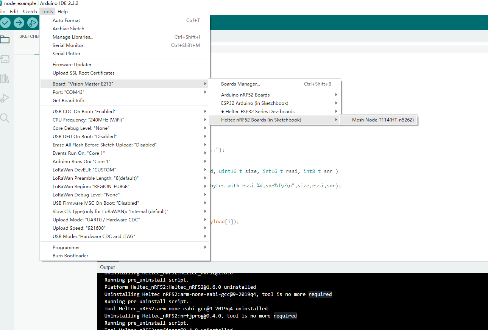

# Mesh Node Series Quick Start
{ht_translation}`[简体中文]:[English]`

This topic describes how to install the development environments and libraries for the Mesh Node family and how to use the sample code.
## Install Framework

**there are three methods to install the framework, choose one of them.**`

- [Via Arduino board manager](use-arduino-board-manager)
- [Via Git](via-git)
- [Via Local File](via-local-file)

(use-arduino-board-manager)=
### Via Arduino board manager

This section describes "How to install the Heltec-nRF52 development framework directly from the Arduino board manager".

1. Install Arduino IDE, you can refer to this link: [https://www.arduino.cc/en/software](https://docs.heltec.org/general/how_to_install_git_and_arduino.html).
2. Open Arduino IDE, and click `File`->`Peferences`->`Settings`


3. Input following json url to board manager URLs:

```
https://resource.heltec.cn/download/package_heltec_nrf_index.json

```


4. Click`OK` to return to the main Arduino interface.
4. Click `Boards Manager...`, search `Heltec-nRF52`in the new pop-up dialog, select the latest `releases` and  click `install`.


5. The installation was successful when a prompt appears.


``` {Tip} If you disconnect before the installation is complete, don't panic. Click **Install** to continue the download.
```

6. Click `tools` to confirm whether the development environment is installed successfully.



(via-git)=

### Via Git

1. 

"**Github**" describes how to install this framework via git. Just follow the steps in the relevant link:

``` {Tip} Please follow the suggested path as much as possible to avoid unnecessary trouble.
```

- [For Windows](https://github.com/HelTecAutomation/Heltec_nRF52/blob/main/InstallGuide/windows.md)
- [For MacOS](https://github.com/HelTecAutomation/Heltec_nRF52/blob/main/InstallGuide/mac.md)
- [For Linux(Ubuntu/Debian)](https://github.com/HelTecAutomation/Heltec_nRF52/blob/main/InstallGuide/debian_ubuntu.md)

&nbsp;

(via-local-file)=

### Via Local File

1. Download the development environment. []()

2. Open Arduino IDE, and click `File`->`Peferences`.


3. Go to the folder in the red box.


4. Create a new "**hardware**" folder in the Arduino folder. If there is already a "hardware" folder, you don't need to create a new one.


4. Go to the "hardware" folder and extract "heltec" into this folder.


```{Tip} This folder name is custom. If you have installed other heltec framework, you can use this folder directly.
```

5. Go to the "heltec" folder, refer to the figure below to confirm whether the path in the red box is correct. Unzip the compressed package you downloaded to this path.


6. Restart the Arduino IDE to confirm whether the development environment is installed successfully.


## Running an Example

Connect your Mesh Node series board to computer via a **high quality** Micro USB cable *(This is the most common reason we had encountered can't program software)*. 

1. Open the `tools` option and select the corresponding device and port.


2. Select an example


3. Compile and upload


## New a sketch

1. In Arduino IDE, click `File --> new` .

   

2. Copy the following code:

```arduino
  // the setup routine runs once when starts up
  void setup(){

    // Initialize the Heltec ASR650x object


  // the loop routine runs over and over again forever
  void loop() {

  }
```

## Upload firmware via USB-CDC

***building...***