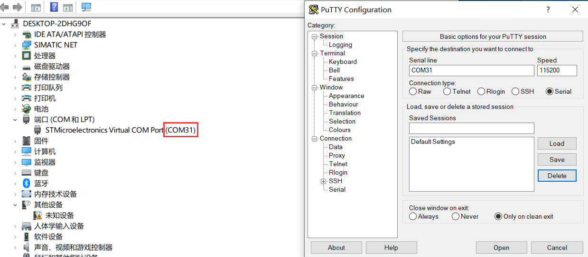
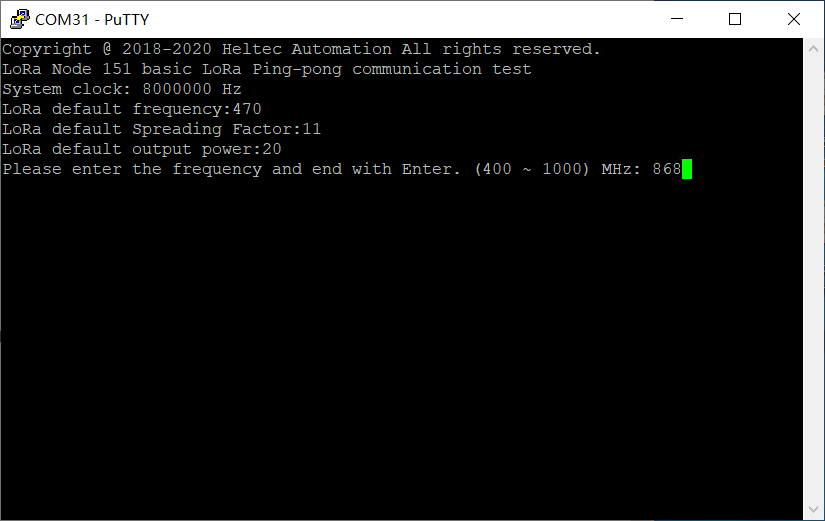
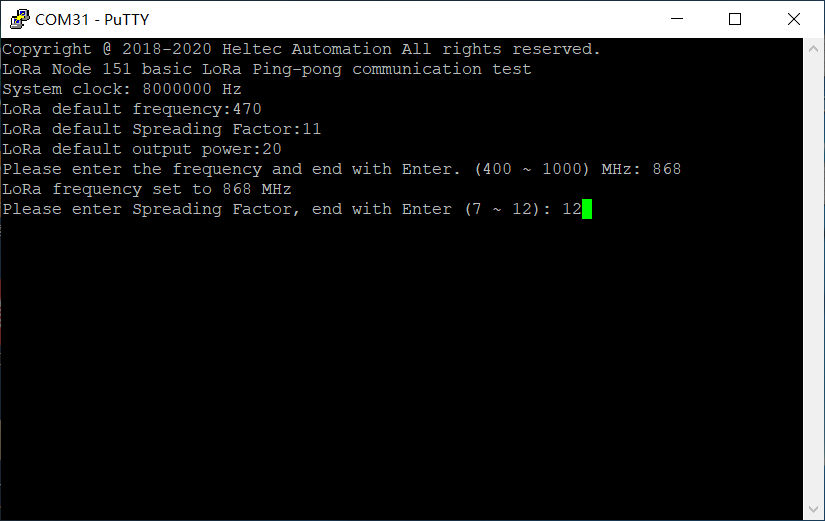
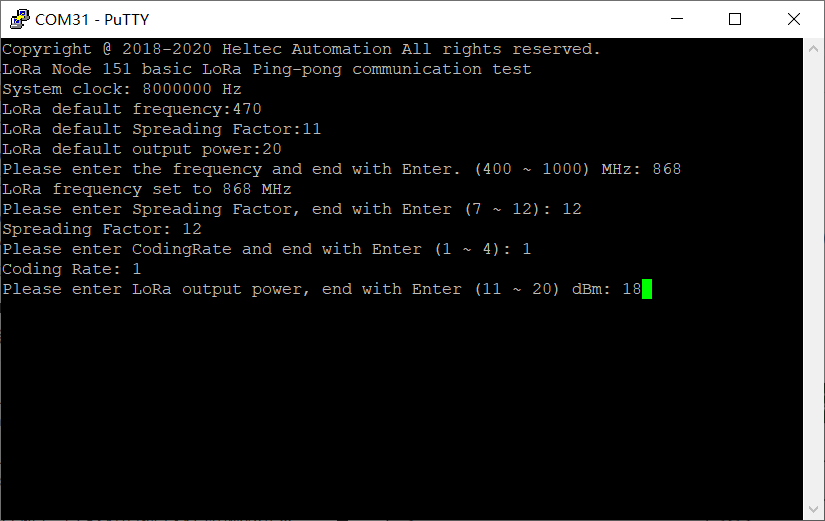
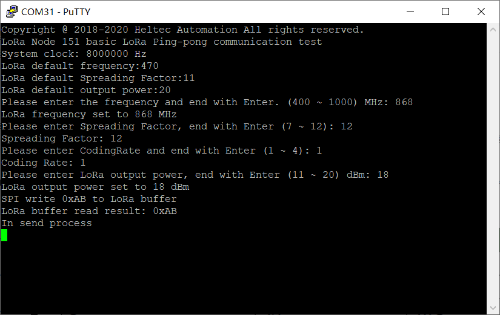
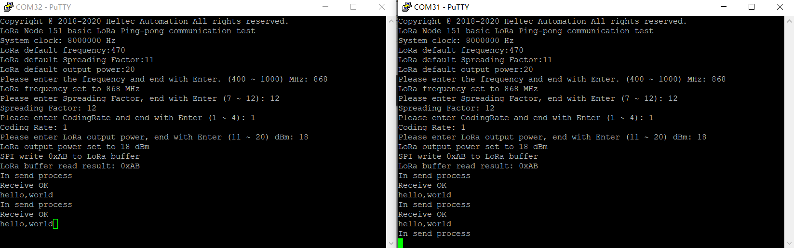

# LoRa Node 151 Pingpong test
{ht_translation}`[简体中文]:[English]`

## Prepare

- Download LoRa Node 151 pingpong example: [pingpong_CDC](http://resource.heltec.cn/download/LoRa_Node_151/Pingpong_CDC.zip).

- Download firmware to LoRa Node 151, Please refer to [Download firmware](https://heltec-automation.readthedocs.io/zh_CN/latest/stm32/lora_node_151/download_firmware.html).

## Start test

After downloading the firmware correctly, connect the development board to the computer and open the serial port.



After opening the serial port, some parameters will be configured. If you do not configure them, the default parameters will be selected.

- **Configure Frequency Band**

  

- **Configure Spreading Factor**

  

- **Configure Coding Rate**

  

- **Configure Output Power**

  

When the configuration is complete, the node will enter a wait state.



Then configure another Lora node 151 node in the same way. After configuration, the two nodes will enter the pingpong test.



```{Tip} The frequency band and the spreading factor need to be configured with the same parameters, otherwise they will not be able to communicate.

```