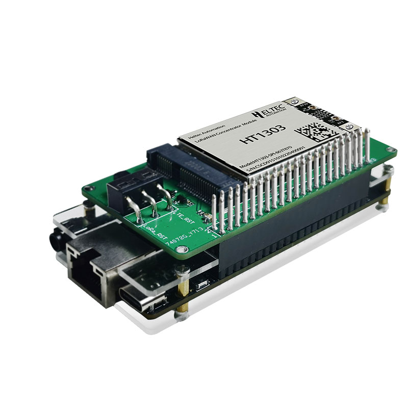

# SX1303 Startup Tutorial


## Hardware connection
1. Connect SX1303 to the development board as shown in the figure.


## Software operation steps
1. Connect Ethernet or WiFi, just connect one of them
```sh
udhcpc -i eth0 # Connecting Ethernet

cd /etc/
bash wlan-connect.sh ssid passwd 1 # Connect to WiFi
```

2. Recompile SX1303 firmware
```sh
cd /home/lora/sx130x_hal/
make clean && make
```

3. Choose the desired frequency band
```sh
#There are many frequency bands in this file. Choose the frequency band you want and copy it to global_conf.json
cd /home/lora/sx130x_hal/packet_forwarder 
cp -f global_conf_CN470_0-7.json global_conf.json
```
4. SX1303 server matching
```sh
vim global_conf.json
#These four options correspond to the information on your own server
#The port generally does not need to be modified, it is 1700
# "gateway_ID": "7C9EBDFFFF5B4BA9",
# /* change with default server address/ports */
# "server_address": "au1.cloud.thethings.network",
# "serv_port_up": 1700,
# "serv_port_down": 1700,
```

5. Start SX1303
```sh
cd /home/lora/sx130x_hal/packet_forwarder 
./lora_pkt_fwd 
```