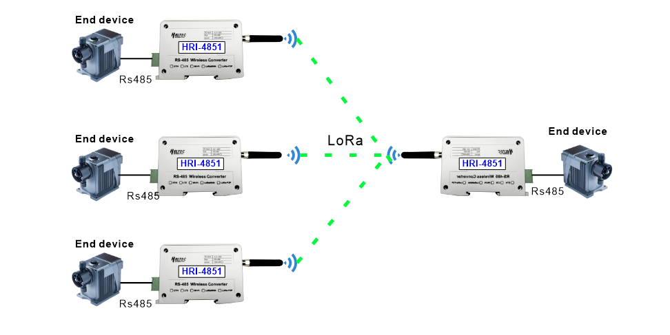
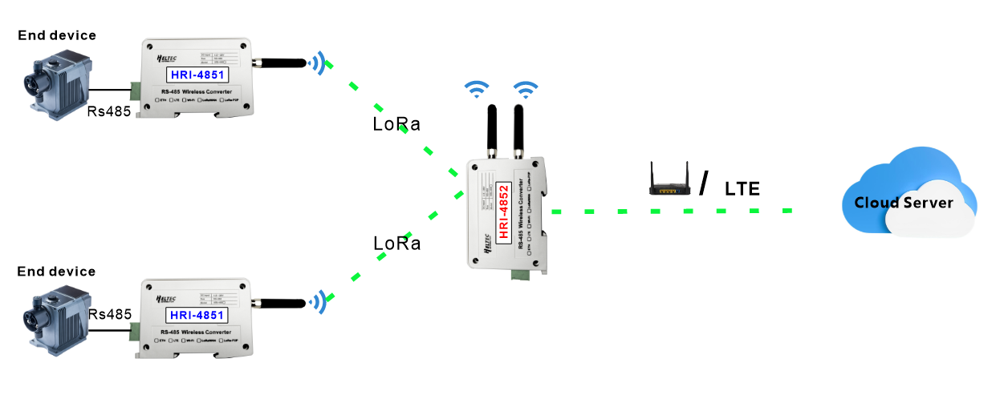
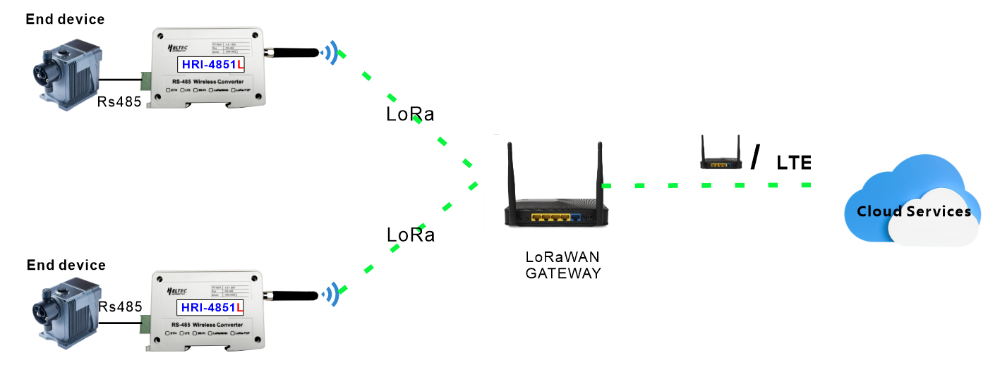
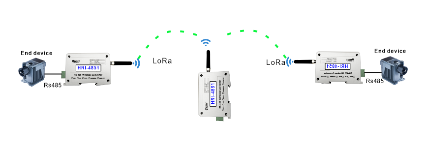

# Application Example

{ht_translation}`[简体中文]:[English]`

HRI-485X series has a variety of networking methods. For details of setting, please refer to the user manual.
This topic aims to describe some typical applications of some HRI-485X.

## HRI-4851+HRI-4851
HRI-4851 can be configured to achieve point-to-point and point-to-many SerialNet.

 

## HRI-4851+HRI-4852
The device is connected to the HRI-4851 through RS-485 and sends the data to the HRI-4852  through LoRa signal, and then sends the data to the cloud server through the ordinary gateway or LTE. 
Attention please , **HRI-4852 is usually only used as a tool for HRI-4851 to enter the network.**

 

## HRI-4851L + LoRaWAN Gateway
The device connect to the HRI-4851 via RS-485, HRI-4851 sends data via LoRaWAN to the gateway, gateway sends data to the LoRaWAN server.

## HRI-4853
HRI-4853 connects the device via RS-485 and uploads the data to the cloud server via LTE or Ethernet.

## HRI-4851 Relayer
In some special occasions, HRI-4851 can be used as a forwarding device of two HRI-4851 or HRI-4852.

