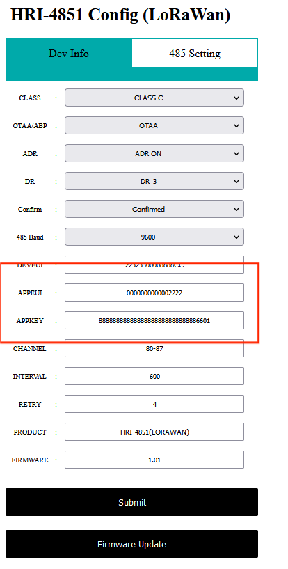
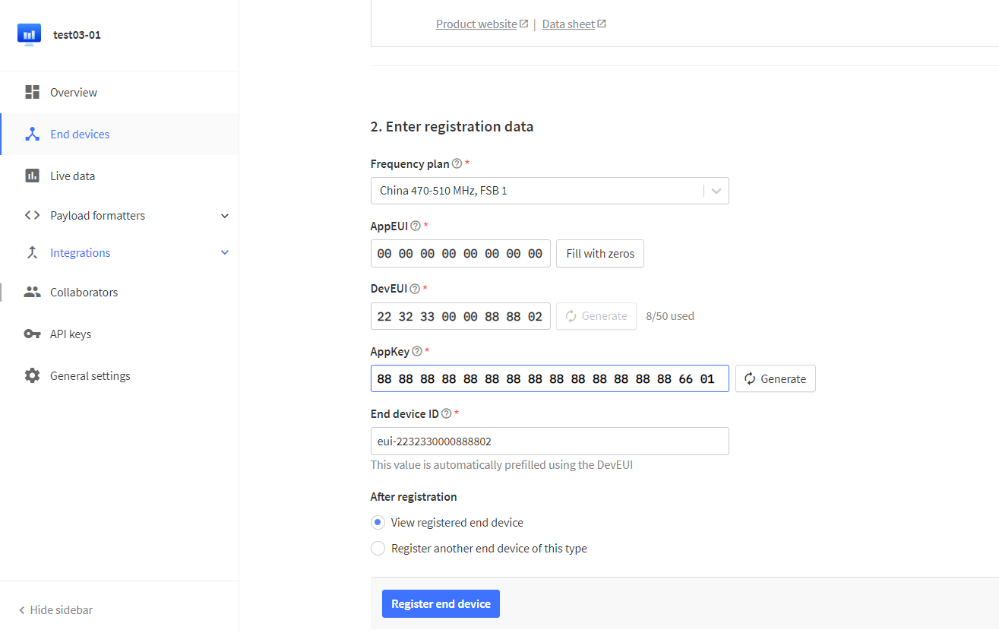
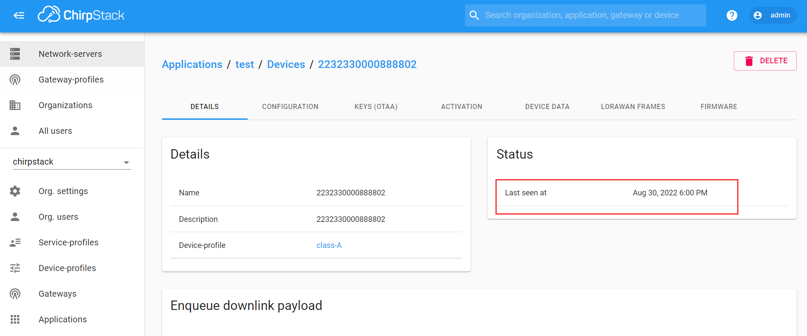

# LoRaWAN
HRI-4851L is a DTU device using LoRaWAN protocol, and its network access must also rely on LoRaWAN gateway and server.
## Connect to TTN/TTS
Before that, make sure there is a LoRa Gateway active in your [TTN](https://console.thethingsnetwork.org/)/[TTS](https://lora.heltec.org/console) account.

## Configure End Device
Go to the configuration page of HRI-4851L and configure the information of the device according to your requirements, pay attention to the red part, you will register the LoRaWAN server with this information.

### Register a device

Register a new device in TTN or TTS “Applications” page. Select the corresponding Brand, Model, Hardware Version, Firmware Version, Region.

Select the frequency plan, and fill in the corresponding AppEUI, DevEUi, AppKey, and register the device.

After registration is complete, if all is well, you will see the device active.

## Connect to ChirpStack

Register a new device in ChirpStack’s “Applications” page. Enter the device name, description, DevEUI. Select Device-profile.

Enter the Application key of the device.

After registration is complete, if all is well, you will see the device active.

## Important Hints

Please double check the following two things:

1. The LoRaWAN parameters is the same as server!
2. The listening frequency of your LoRa Gateway is the same as ESP32 LoRa node's sending frequency. We strictly follow [LoRaWAN™ 1.0.2 Regional Parameters rB](https://resource.heltec.cn/download/LoRaWANRegionalParametersv1.0.2_final_1944_1.pdf);

