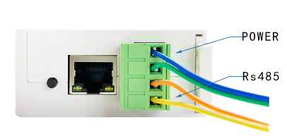
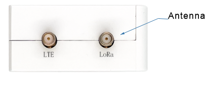
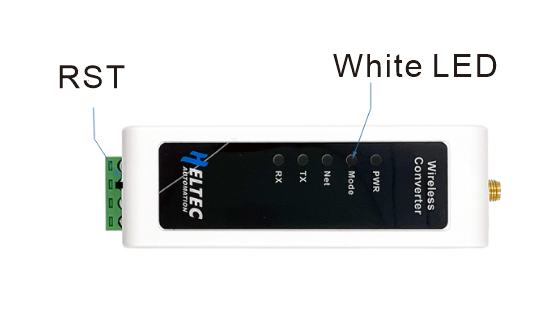
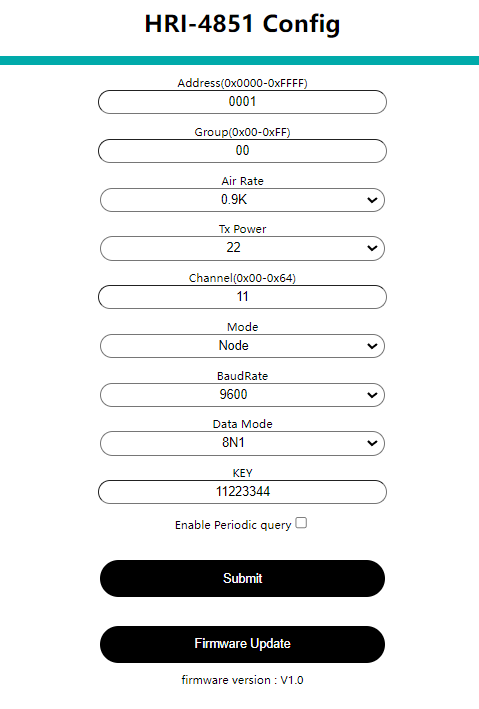

# Getting Started

{ht_translation}`[简体中文]:[English]`

## Summary
HRI-485x series based on ESP32C3-FN4 / ESP32DOWDQ6, LoRa part based on SX1262 mechanism, can support 4.5 ~ 28V voltage. The device can be widely used in various industrial scenarios to meet the data transmission requirements in different scenarios, and provide users with more convenient and efficient data transmission methods.

## Connect the wires
+ As shown in the figure,Connect the power wires and data bus of the device.

    

+ Install the antenna we provided.

    

+ If the device needs to use LTE capabilities,you will also need to insert a LTE card.

## Power ON device
Press the RST button to turn on the device
## Select activity mode
Select the mode by pressing the RST button, Judge by the state of LED lights:

  

+ Work mode

  Default mode, White LED light on.

+ Debug mode

  Press the RST button once, White LED slow blinking,You can print SNR and RSSI in this mode.

+ Sleep mode

  Press the RST button again, White LED light go out,device shutdown.

+ Configuration mode

  Press the RST button again in sleep mode, White LED flash quickly,enter configuration mode. 

## Enter configuration page
In configuration mode (White LED flash quickly), you can find HRI-485x's Wi-Fi, in general, it has    the format"HRI-485x-xxxx".

+ Connect to WiFi "HRI-485x-xxxx".
+ Enter "192.168.4.1" through the Web UI.
+ Write the parameters as needed, configure it, and click Submit.
  
  

## Common problems and solutions
+ The browser will not connect
If you type "192.168.4.1", the browser will not connect,please check if you are connected to the WiFi of the device you are configuring.
+ Device not working
After each configuration, you must press the switch to put the device into "work mode".