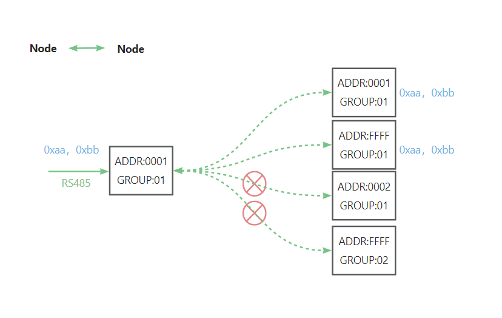

# Communication Conditions

{ht_translation}`[简体中文]:[English]`

The HRI-485x series has a variety of networking modes, but different versions have different functions.

  

``` {Tip} HRI-4852 is usually only used as a gateway for HRI-4851 to enter the network.

```
## Prerequisites
&nbsp;
**Preconditions for device communication : Air Rate, Tx Power, Baud Rate, Data Mode, Channel, KEY parameters are the same between devices.**
Under the premise,the configuration mode and specific functions of the device are as follows:

## HRI-4851
In the configuration Mode, enter the configuration page and select the working mode through the "Mode" option.

  

### HRI-4851: Node
In "Node" mode,by setting the same "Address" and "Group", point-to-point transmission can be achieved.If you set "Address" to "FFFF", this device can communicate with any "Address" device("Group" still has to be the same).

   

### HRI-4851: Gateway
In "Gateway" mode, does not need to set the "Address", just the "Group".The parameters of the"Node" device are the same as "Gateway" except for the address,It can communicate with the "Gateway".
The message uploaded by the end device contains the "Address" of the device.
The message delivered by the "Gateway" must indicate the "Address" of the object. If "Address" is "FFFF", then any Node-mode device at any address can receive the data.

   

### HRI-4851: Relayer
"Group" needs to be set in this mode, so that the "Relayer"  can receive data from one device and transmit it to another device. These devices can be either Gateway-mode or Node-mode, all devices and "Relayer "have the same "Group".

   
&nbsp;

``` {Tip} HRI-4852 is usually only used as a gateway for HRI-4851 to enter the network.

```
Enter the configuration page of HRI-4852, set it "Address"and"Group".
Use the "NET mode" option to set the connection method of your choice.
Use the "server address"and "server port" options to configure the server you want to connect to.
Use the "Data protocol" option to set the protocol for your transport.

   

Some HRI-4851 devices and HRI-4852 of the same "Group" can communicate.
HRI-4852 uploads the collected data to the server, and this data contains the address of the HRI-4851 terminal device and HRI-4852.
When the server sends data to the terminal, it must also indicate the address of HRI-4852 and HRI-4851.

   
&nbsp;

## HRI-4853
Enter the configuration page of HRI-4853, Configure your server and protocol with the "server address" "server port" and "Data proto" options.

  

HRI-4853 can realize the connection between the terminal and the server through extremely simple operations.

   


&nbsp;

## Common problems and solutions
+ the browser will not connect
If you type "192.168.4.1", the browser will not connect,please check if you are connected to the WiFi of the device you are configuring.
+ Device not working
After each configuration,you must press the switch to put the device into "work mode".

