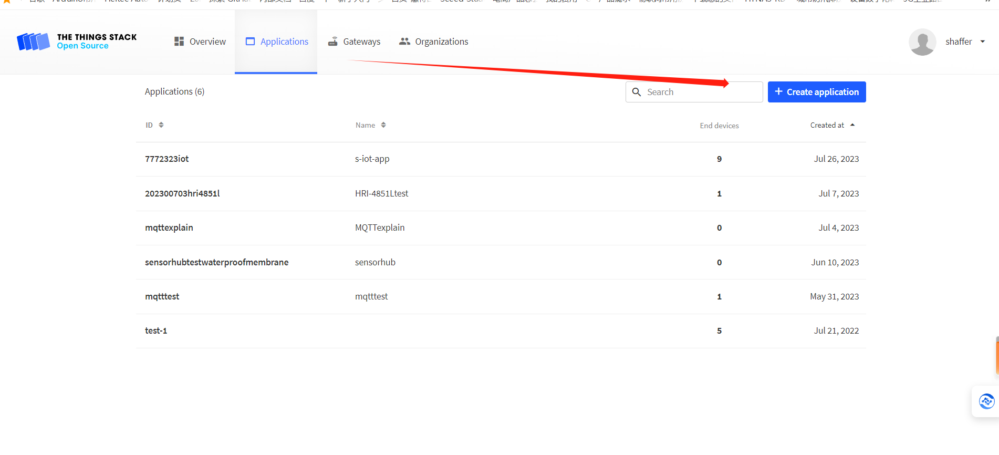
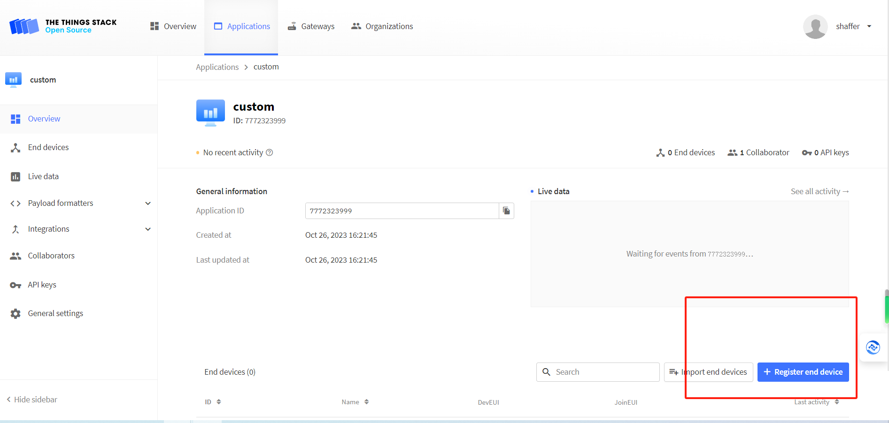
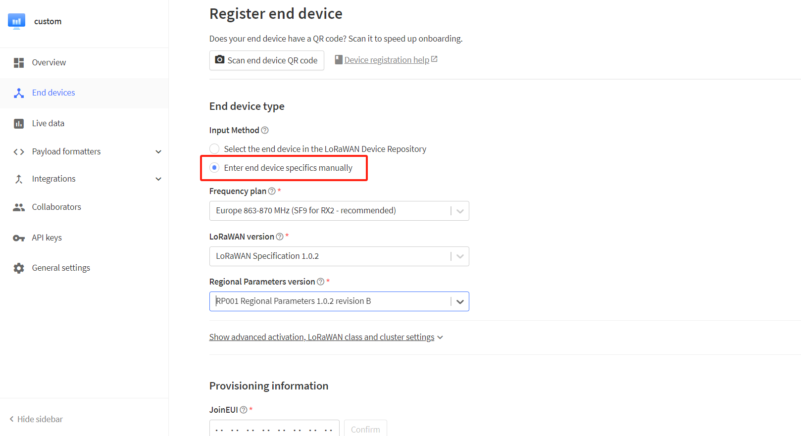
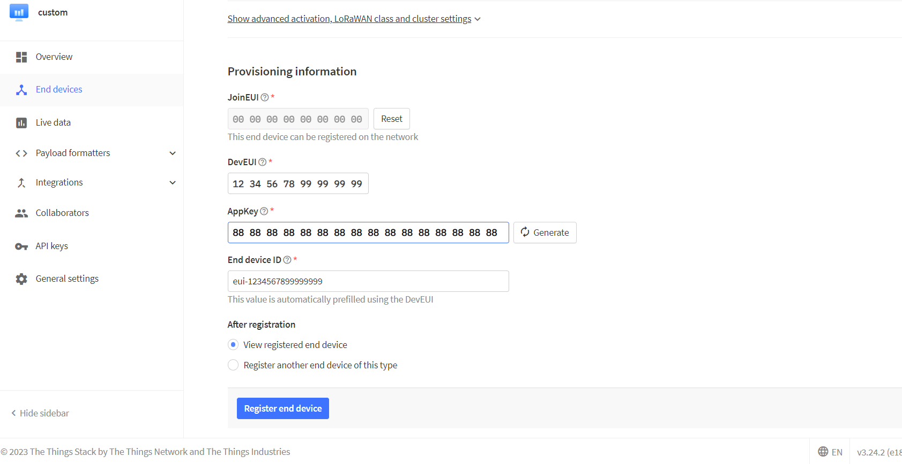
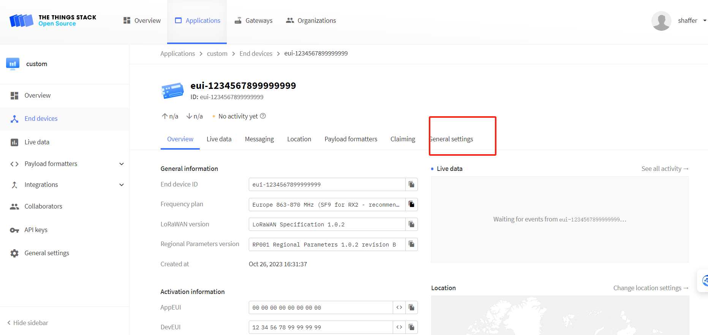
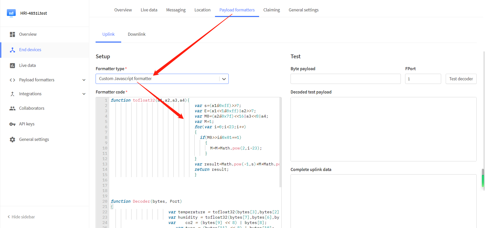
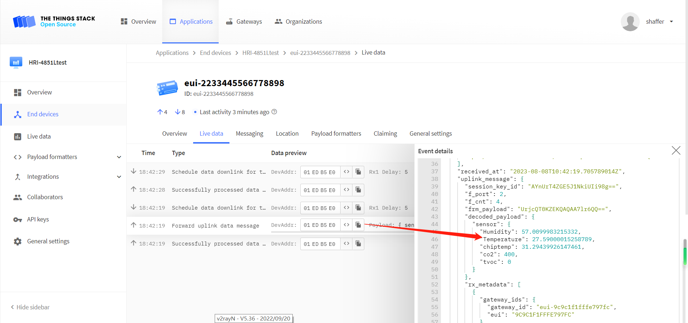

# Connect to LoRaWAN Server

{ht_translation}`[简体中文]:[English]`

This topic describes how to connect the Sensor Hub for Industry to the LoRaWAN server.
## Configure End Device
Quickstart and entry into configuration mode for the HRI-362X is available here: [Quickstar](https://docs.heltec.org/en/ready_to_use/3621/quick_start.html).

``` {Tip} The parameters need to be reconfigured after firmware upgrade.

```
## Configure LoRa Gateway
You can find our recommended gateway on the [Heltec official website](https://heltec.org/) or shopping website, and find the gateway configuration method in [Documents page](https://docs.heltec.org/).

We highly recommend the following three gateways:

[HT-M02](https://heltec.org/project/ht-m02-v2/): Suitable for industry or field, with edge computing capabilities.

[HT-M01s](https://heltec.org/project/ht-m01s-v2/): Standard indoor LoRa gateway with built-in screen.

[HT-M7603](https://heltec.org/project/ht-m7603/): Indoor high cost performance gateway.

### Register a LoRa Gateway
For registering the gateway, please refer to the **Connect to LoRaWAN Server** section of the corresponding gateway's manual on the [Documents page](https://docs.heltec.org/).
## Connect to TTN/TTS
### Register End Device
+ Create a new **Application**, All the options are free to fill in.


+ Click the `register end device`.



+ Choose the way to register the node, it is recommended to `Enter end device specifics manually`, Select the frequency plan, LoRaWAN version, and fill in the corresponding joinEUI, click `confirmed`.

``` {Tip} joinEUI corresponds to AppEUI on the device.

```

``` {Tip} As of November 2023, Heltec's products use LoRaWAN1.0.2 revision B.

```


+ Fill in the `DevEUI` and `AppKey` of the device; The `End device ID` is automatically generated by the server. Click on `Register end divece`.



+ Click `General Setting` to check whether the configuration is correct, drop down to the `Network layer` option, click `Expand`, and continue to check.

``` {Tip} The General Setting option is On the upper right corner. Be careful not to choose the wrong one. The General Setting option on the left is used to change the parameters of the Application.

```

``` {Tip} The default is Class_A after registration, and if the node is Class_C or Class_B, it needs to be selected and saved here.

```



After registration is complete, if all is well, you will see the device active.


### Parsing
+ Click `payload formatters`, select `Custom Javascript formatter`, and enter decoding at the position in the figure. Download the decoder here: [https://resource.heltec.cn/download/Sensor%20Hub%20for%20industry](https://resource.heltec.cn/download/Sensor%20Hub%20for%20industry).



+ Click `Save change` and move the mouse to the uplink data output to view the data uploaded by HRU-3601.



## Connect to ChirpStack

Register a new device in ChirpStack’s “Applications” page. Enter the device name, description, DevEUI. Select Device-profile.


Enter the Application key of the device.


After registration is complete, if all is well, you will see the device active.


## Important Hints

Please double check the following two things:

1. The LoRaWAN parameters is the same as server!
2. The listening frequency of your LoRa Gateway is the same as ESP32 LoRa node's sending frequency. We strictly follow [LoRaWAN™ 1.0.2 Regional Parameters rB](https://resource.heltec.cn/download/LoRaWANRegionalParametersv1.0.2_final_1944_1.pdf);

