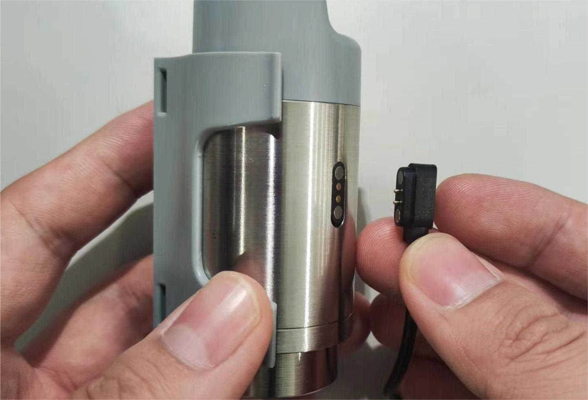
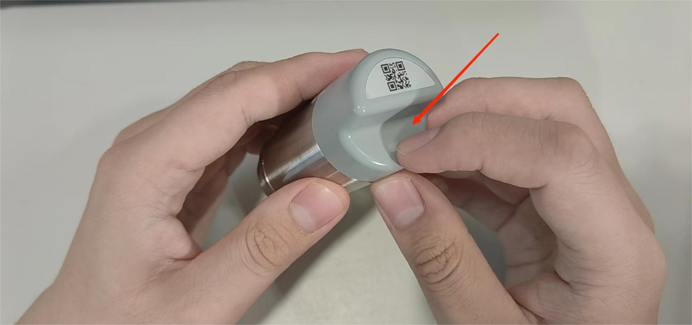
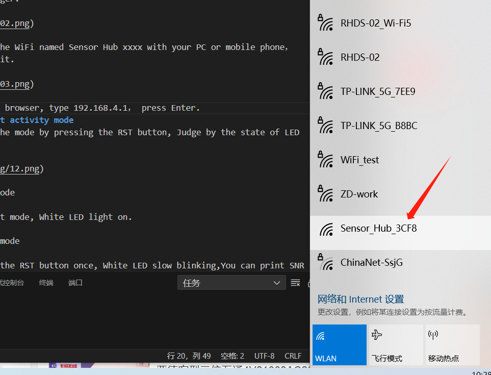
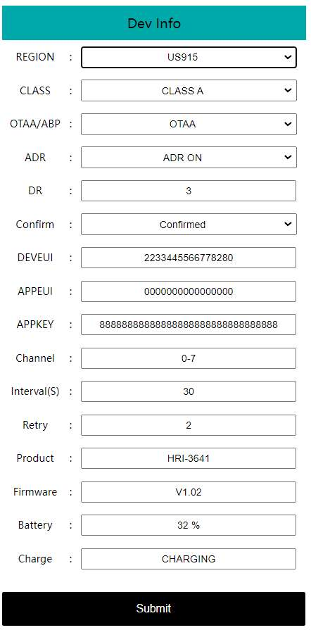

# Getting Started

{ht_translation}`[简体中文]:[English]`

**The default firmware of HRI-3621 is LoRaWAN.**

--------------------------------------------
## Power supply
HRI-3621 integrates a 1100aMh rechargeable lithium battery, charging voltage is 5V and its charging interface is magnetic-2P, a single filling time is about 3~4 hours.

 

(power_on)=

## Power on
Press and hold the button until the device's blue light turns on, then release the button to enter working mode.

---------------------------------------------

## Configuration
When registering on the standard LoRaWAN server, you need to review or modify the device configuration information. 
If you are using one-click registration, you can skip this step.

1. In the normal operating state of the device, quickly press the button three times in succession (with the blue LED flashing each time). When the red LED remains on, it indicates that the device has entered LoRaWAN configuration mode.

 

2. Find the WiFi named **Sensor_Hub_xxxx** with your PC or mobile phone, connect it.

 

3. In the browser, type **192.168.4.1**, enter the configuration page.

 

4. Modify the parameters according to your requirements and submit them. You can take a screenshot to save this information, as it will be needed when connecting to the server.

5. Click the button to exit configuration mode.

----------------------------------------

### Connect to LoRaWAN Server
Please refer to the link: [Connect HRI-3621 to LoRaWAN Server](https://docs.heltec.org/en/ready_to_use/hri-3621/lorawan.html#configure-end-device).

--------------------------------------

## Power off
Press and hold the button until the light turns off, indicating that the device is powered off.

--------------------------------------

## Secondary development
Please refer to the link: [ HRI-3621 Development Guide](https://docs.heltec.org/en/ready_to_use/hri-3621/development.html)