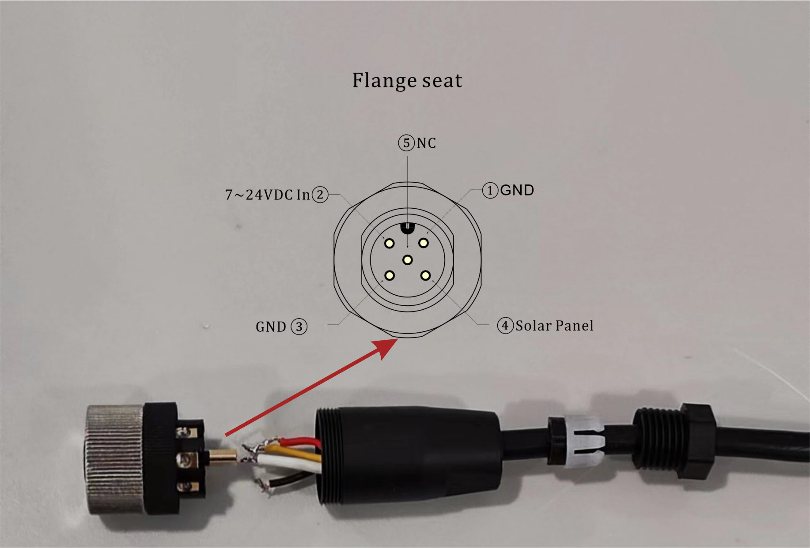

# External power supply and charging
====================================

{ht_translation}`[简体中文]:[English]`

The HRI-3631 supports both the built-in battery and the external power supply, while the external power supply can also charge the built-in battery.

External power supply (charging) is also divided into two ways: **7~24V DC input** and direct connection to the **solar panel**. Just follow the flange seat definition below to connect the cable.

``` {Tip} Please connect the cable with the adapter first and check it carefully.  Then connect the adapter to the flange seat of the equipment to avoid damage to the equipment.
```



## Resources
[Download Related Resources](https://resource.heltec.cn/download/Sensor%20Hub%20for%20industry)
[Wireless Aggregator series product application description](https://heltec.org/wireless-aggregator/)