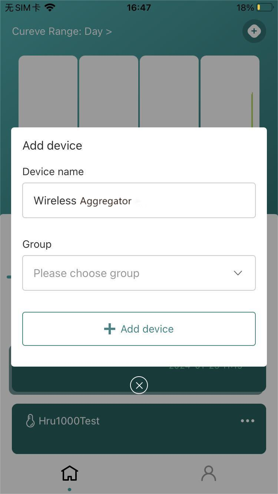

# Connect to SnapEmu (Scan QR code to register)

{ht_translation}`[简体中文]:[English]`. 

Scanning the device QR code directly through the SnapEmu APP is the easiest and fastest way to use Wireless Aggregator.

***For manual registration, please refer to: [Connnect to SnapEmu (Manual registration)]().***

## Install SnapEmu APP

Search the **App Store** for `SnapEmu`, download and install it.

 

## Register a LoRa gateway

To register a LoRa gateway on SnapEmu, please refer to the following link:

[HT-M02](https://docs.heltec.cn/en/gateway/ht-m02_v2/connect_to_server.html#connect-to-snapemu)
[HT-M01S](https://docs.heltec.cn/en/gateway/ht-m01s_v2/connect_to_server.html#connect-to-snapemu)
[HT-M7603](https://docs.heltec.cn/en/gateway/ht-m7603/connect_to_server.html#connect-to-snapemu)

## Register Device

Click the `+` in the upper right corner of SnapEmu, select `SCAN`, and directly scan the device QR code.

  

Fill in the device name and group.

Registration is complete and the device is activated.

