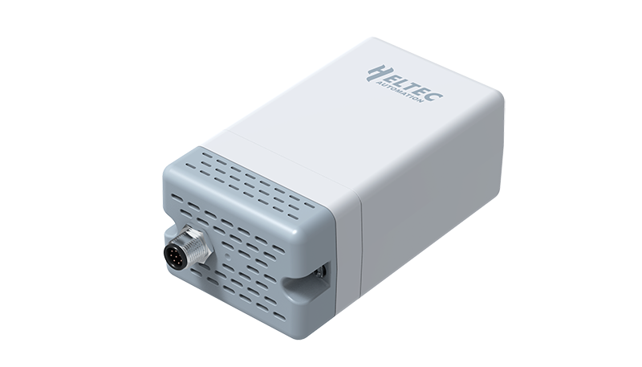

Wireless Aggregator — Sensor Docker
===================================
:ht_translation:`[简体中文]:[English]`

Wireless Aggregator — Sensor Docker (HRI-3631) is a LoRa/LoRaWAN device for outdoor applications, It has a standard interface that can integrate most of the Heltec Fast Link series of sensors. Built-in 4 x 2000 mAh batteries and battery management system, allow it to be charged directly via a solar panel.
HRI-3631 has the characteristics of ultra-low power consumption and long-distance transmission. Benefits from its high-strength plastic and large-capacity rechargeable battery, it can perform well in a variety of complex outdoor environments for a long time.

**Wireless Aggregator have following main features:**

- Industrial grade protection structure, IP66 protection grade, Lightning protection design, ESD protection and isolatio.
- Ultra-low power consumption design, built-in 1900 mAh rechargeable lithium battery x 4, can be connected to a solar charging panel.
- Wireless data transmission communication radius up to 5km (noocclusion).
- Working condition: -40~80°C,Working humidity: ≤90% (non-condensing).
- One-key registration, or easy configure via Wi-Fi.
- Supports OTA update.

.. toctree::
    :maxdepth: 2

    Quick Start <quick_start>
    Connect to SnapEmu App (One-click registration) <connect_to_snapemu>
    Connect to LoRaWAN Server <connect_to_lora_server>
    OTA Upgrade <ota_upgrade>
    Subscribe MQTT Messages from LoRa Server <https://docs.heltec.org/general/subscribe_mqtt_messages.html>
    Subscribe MQTT Messages from SnapEmu <https://docs.heltec.org/general/subscribe_mqtt_messages_form_snapemu.html> 
    
    -->[General Docs]<-- <https://docs.heltec.org/general/index.html>