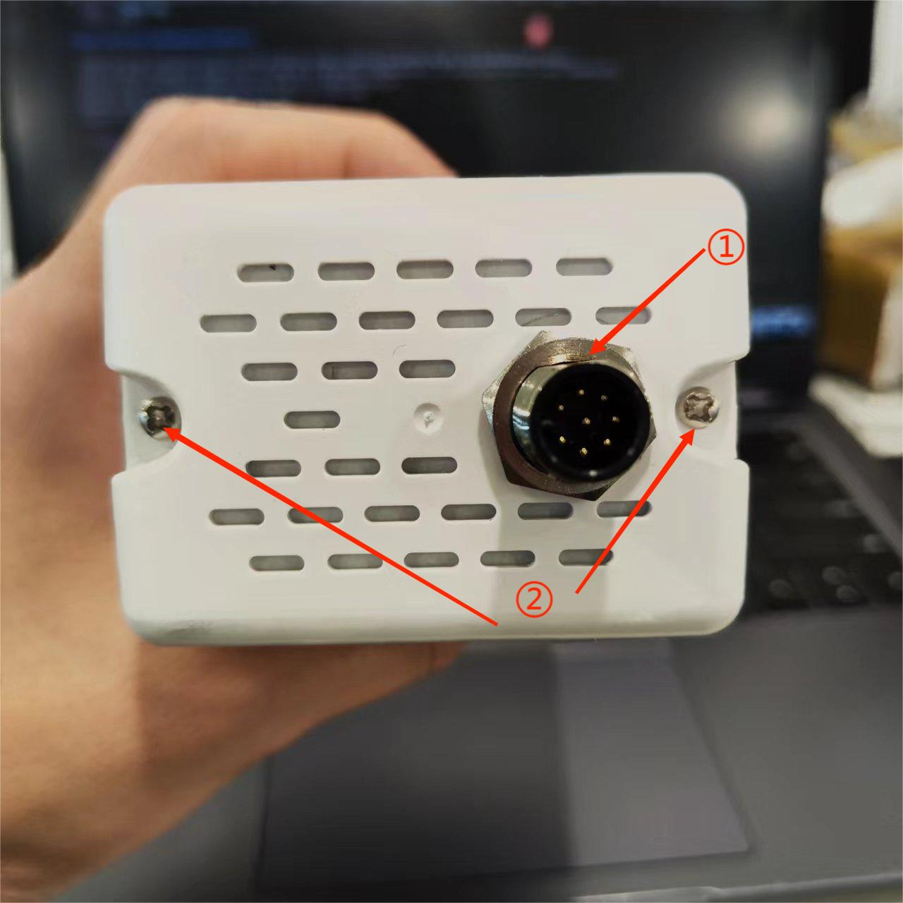
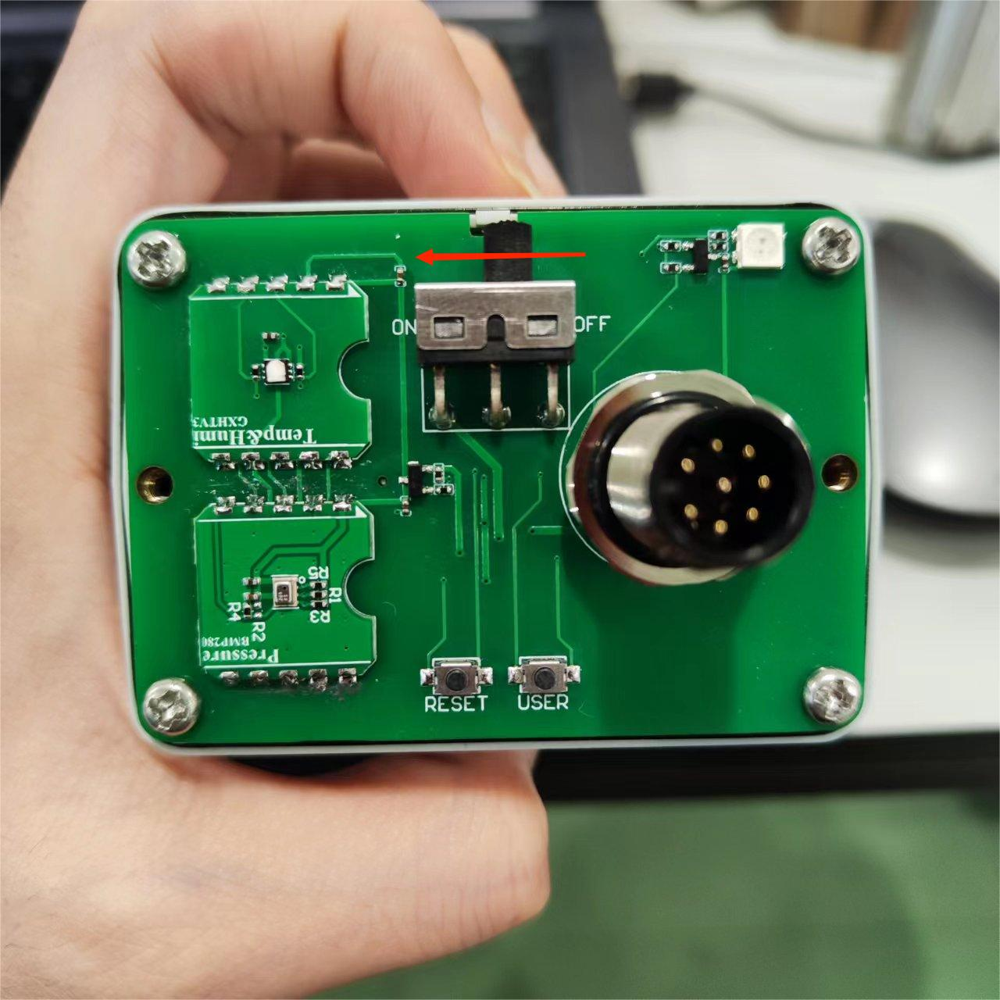
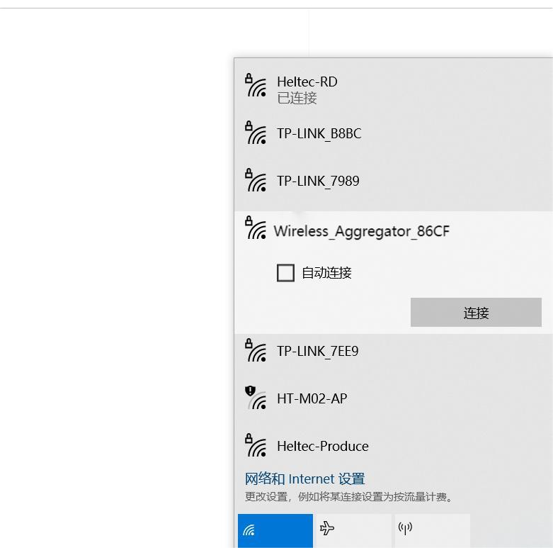
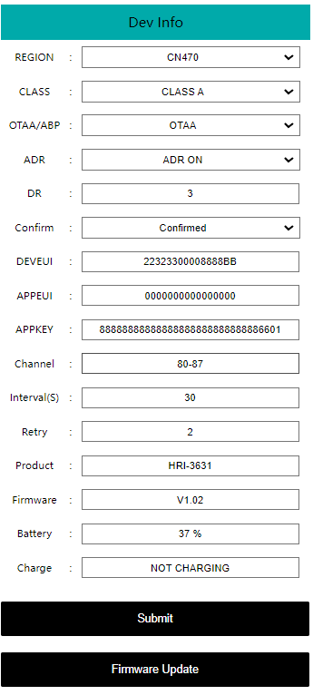

# Getting Started

{ht_translation}`[简体中文]:[English]`

[Wireless Aggregator - Sensor Docker (HRI-3631)](https://heltec.org/project/hri-3631/) is a LoRa/LoRaWAN device for outdoor applications, It has a standard interface that can integrate most of the Heltec Fast Link series of sensors. Built-in 4 x 2000 mAh batteries and battery management system, allow it to be charged directly via a solar panel.

## Power on
Unscrew the nuts on the flange seat and the screws on both sides of the cover in turn as shown in the figure.

``` { Tip} Be sure to unscrew the limit screw on the flange seat first.

```

 

Turn the switch to `ON`, and the green light flashes once, At this point, the device enters the working state.

  

**If you directly scan the QR code to register, at this point directly back to the shell.**

**If you need to modify or obtain the device information and register it on the lora server, refer to the following section to configure the device.**

## Configuration
Turn the switch to `ON`, and the green light flashes once. At this time, the device enters the working mode. Long press the User key, the red light is always on, then enter the configuration mode.

  

``` {Tip} The device will automatically restart after 10 minutes in configuration mode.

```

In configuration mode, the mobile phone or PC is used to find the WiFi of the device and connect it.



Type **192.168.4.1** in your browser, and press Enter to take you to the configuration page.



The configuration parameters are defined as follows 

**OTAA Mode**:

  - `REGION` LoRaWAN frequency band
  - `CLASS` LoRaWAN operation mode, Class A or Class C
  - `OTAA/ABP` LoRaWAN communication mode
  - `ADR` Data rate adaptation
  - `DR` Data rate, can be adjusted when the ADR option is turned off
  - `CONFIRM` Uplink receipt confirmed
  - `DEVEUI` `APPEUI` `APPKEY` OTAA node parameters, must be consistent across the server
  - `Channel` LoRaWAN channel, different channels should be separated by Spaces, such as "0-7 13 16-23"
  - `Interval(S)` Period of transition
  - `Retry`LoRaWAN Class A, Class C
  - `Product` Product model
  - `Firmware` Firmware version
  - `Battery` Battery level (percentage)
  - `Charge` Charging state
  - `Submit` Click Submit after the configuration is complete
  - `Firmware Update` Used for OTA firmware upgrade

``` {Tip} The uplink port is fixed as port 2.

```

**ABP mode** -- Most are the same as above, but the differences are listed below:

  - `NWKSKEY` `APPSKEY` `DEVADDR` ABP node parameters, must be consistent across the server
  - `RX1 DELAY(S)` Set the time for RX1 to be delayed on
  - `RX2 DR type` Data rate, you can choose the default or set your own
  - `RX2 DR` Can be set when the DR type is custom
  - `RX2 Freq type` RX2 Frequency band, you can choose the default or set your own
  - `RX2 Freq` Can be set when the Freq type is custom

After the configuration is completed, press the button `Reset`, The green light flashes once, indicating that the device enters the working mode. Cover the device.

## Resources
[Download Related Resources](https://resource.heltec.cn/download/Sensor%20Hub%20for%20industry)
[Wireless Aggregator series product application description](https://heltec.org/wireless-aggregator/)