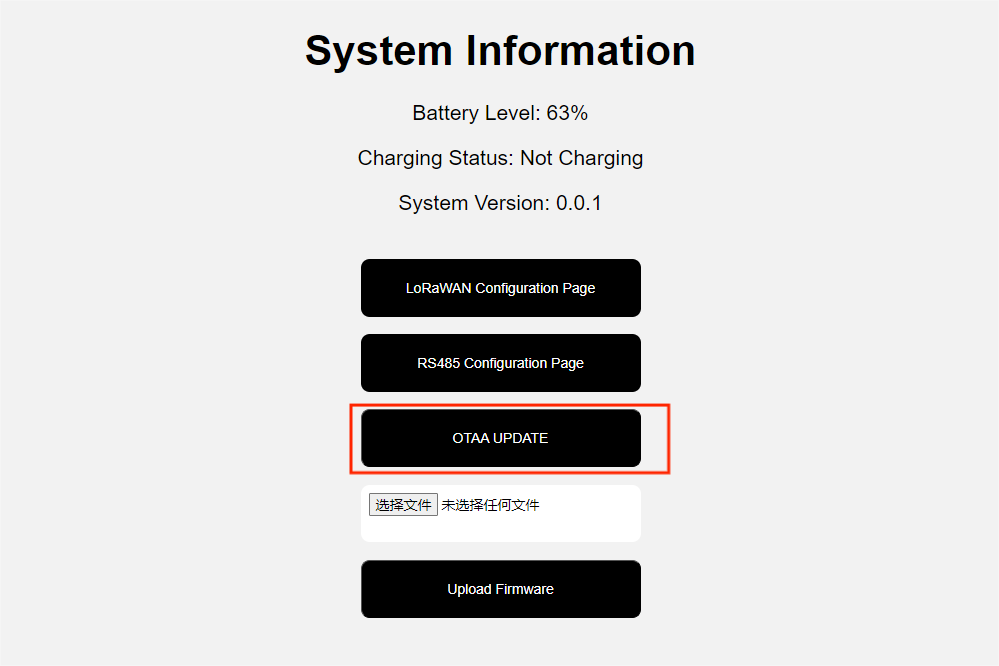

# OTA Upgrade

{ht_translation}`[简体中文]:[English]`

+ Download firmware
Search this link for the firmware version you want to download:
[https://resource.heltec.cn/download/HRI-363x/](https://resource.heltec.cn/download/)

+ Enter configuration mode
Please refer this link: [HRI-363x configuration]().

+ Update Firmware
Click `OTA Update`, select the firmware version you downloaded at first from the options that pop UP, and click `Upload Firmware`.

## Relocation information
After the upgrade is complete, all configurations will be reset. You need to go back to the configuration page to complete the configuration
