# Getting Started

{ht_translation}`[简体中文]:[English]`

This article describes how to deploy HRI-3632 quickly.

``` {Tip} Before you enter the configuration mode, please do all operations without power.
```

## Connect to RS-485 Device
1. Unscrew the connector as shown below. 

.jpg) 

2. Put it on the cable of the RS-485 sensor.

.jpg)

3. Unscrew and connect the sensor cable, whose interface is defined as follows.

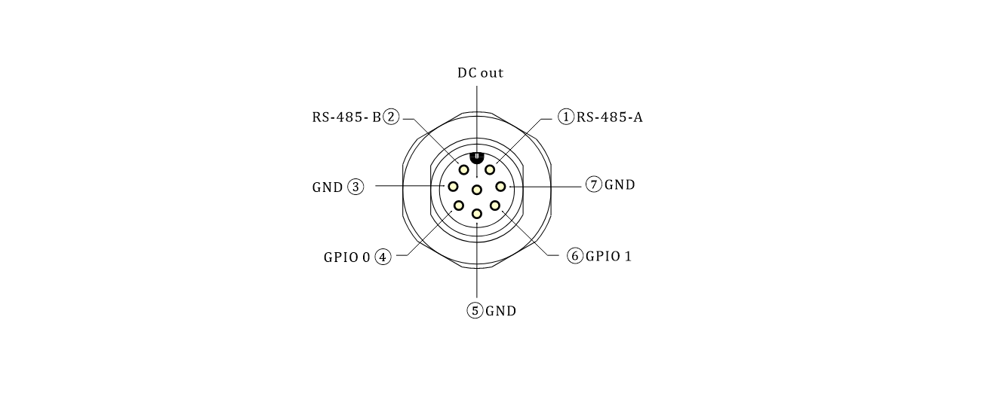

``` {Note} that the counterclockwise direction of each interface has the number corresponding to its pins.
```

## Connect the external power connector
1. Unscrew the connector as shown below. 

.jpg)

2. Put it on the cable of the DC power supply or solar panel.

.jpg)

3. Unscrew and connect the sensor cable, whose interface is defined as follows. Choose according to your use case.

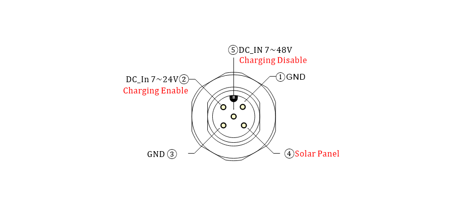

4. There is a pin number next to each interface.

``` {Tip} DC-IN 7~24V can power the device while charging the built-in battery; DC-IN 7~48V can accommodate some higher voltage scenarios, but it cannot charge the built-in battery.
```

## Power ON
1. Unscrew the nuts on the flange seat and the screws on both sides of the cover in turn as shown in the figure.

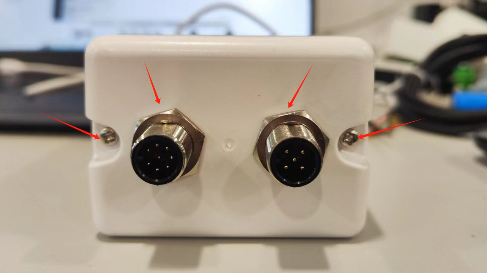  

2. Turn the switch to `ON`, and the green light flashes once, At this point, the device enters the working state.

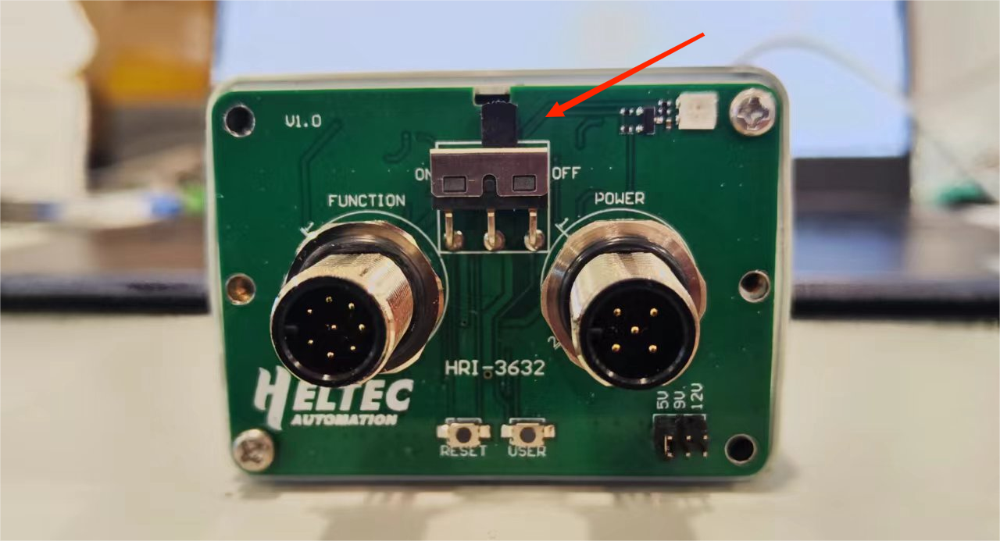  

## Configuration
1. Turn the switch to `ON`,  Long press the `User` key, the red light is always on, then enter the configuration mode.

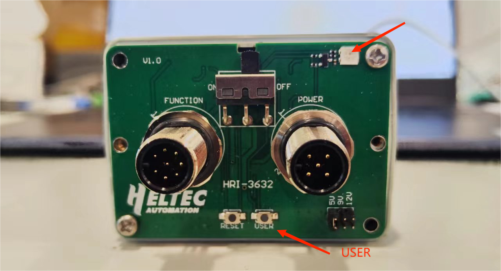  

``` {Tip} The device will automatically restart after 10 minutes in configuration mode.
```

2. Use your phone or computer to find a Wi-Fi hotspot named **HRI-3632-XXXX** and connect it.

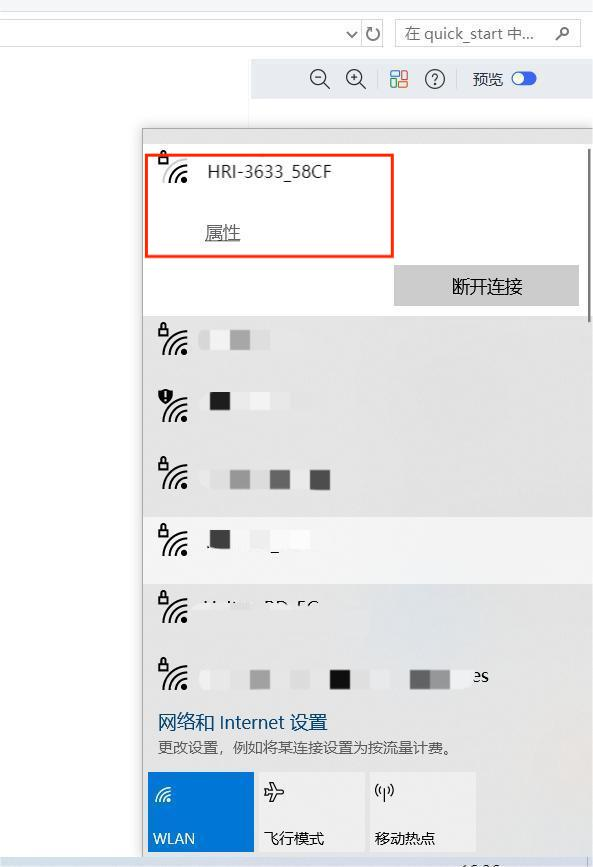

3. Type **192.168.4.1** in your browser, and press Enter to take you to the configuration page.

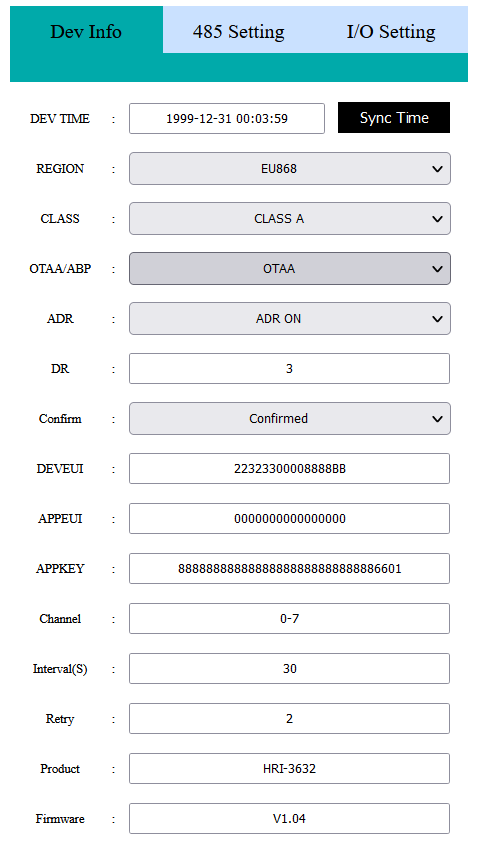

## Description of Configuration Parameters
The configuration parameters are defined as follows:
### LoRaWAN Parameters
#### OTAA Mode:

  - `Dev-Time` Equipment time setting and calibration
  - `REGION` LoRaWAN frequency band
  - `CLASS` LoRaWAN operation mode, Class A or Class C
  - `OTAA/ABP` LoRaWAN communication mode
  - `ADR` Data rate adaptation
  - `DR` Data rate, can be adjusted when the ADR option is turned off
  - `CONFIRM` Uplink receipt confirmed
  - `DEVEUI` `APPEUI` `APPKEY` OTAA node parameters, must be consistent across the server. 
  - `Channel` LoRaWAN channel, different channels should be separated by Spaces, such as "0-7 13 16-23"
  - `Interval(S)` Period of transition
  - `Retry`The number of retransmission attempts after a failure
  - `Product` Product model
  - `Firmware` Firmware version
  - `Battery` Battery level (percentage)
  - `Submit` Click Submit after the configuration is complete
  - `Firmware Update` Used for OTA firmware upgrade

#### ABP mode

*Most are the same as above, but the differences are listed below:*

  - `NWKSKEY` `APPSKEY` `DEVADDR` ABP node parameters, must be consistent across the server
  - `RX1 DELAY(S)` Set the time for RX1 to be delayed on
  - `RX2 DR type` Data rate, you can choose the default or set your own
  - `RX2 DR` Can be set when the DR type is custom
  - `RX2 Freq type` RX2 Frequency band, you can choose the default or set your own
  - `RX2 Freq` Can be set when the Freq type is custom

``` {Tip} The uplink port is fixed as port 2.
```

### 485-Setting Parameters
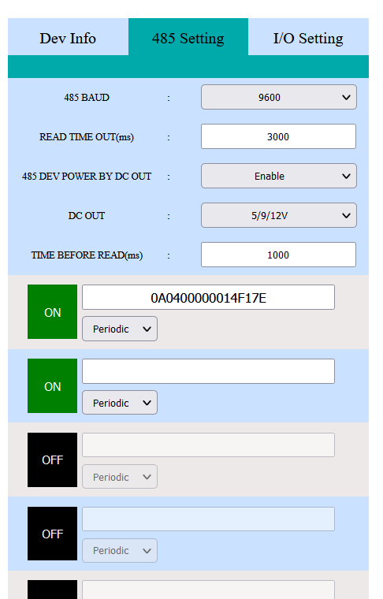

  - `485 BAUD` 485 baud rate, please be consistent with the terminal.
  - `READ TIME OUT` .
  - `485 DEV POWER BY DC OUT`  Choosing **Enable** means powering the device and **Disable** means not.
  - `DC OUT` Power supply mode selection:
    - `3.3V`  Output 3.3V,
    - `5/9/12V`  Out 5/9/12V, select on the device,
    - `DC IN (MAX 48V)`  Power supply access pin **DC IN 7-48V**, how much is the access voltage, how much is the output,
    - `5-24 IN`  Power supply access pin **7~24V**, how much is the access voltage, how much is the output.
  - `Time BEFORE READ` How much time to power the terminal before it starts reading.
  - `ON/OFF` Turn on/off an RS-485 instruction.
#### I/O Setting
The `Repeat` option sets the time (weeks) the GPIO command executes. 

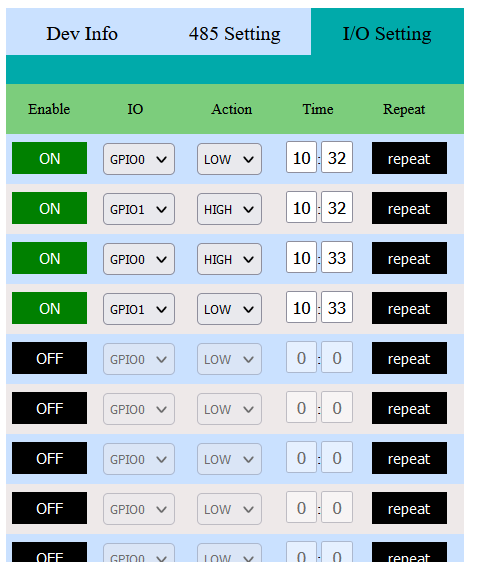

After the configuration is completed, Click `Submit`. 

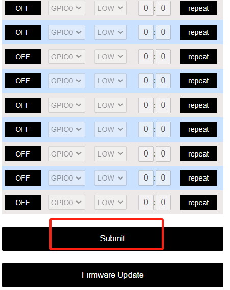

Press the button `RESET`, The green light flashes once, indicating that the device enters the working mode. 

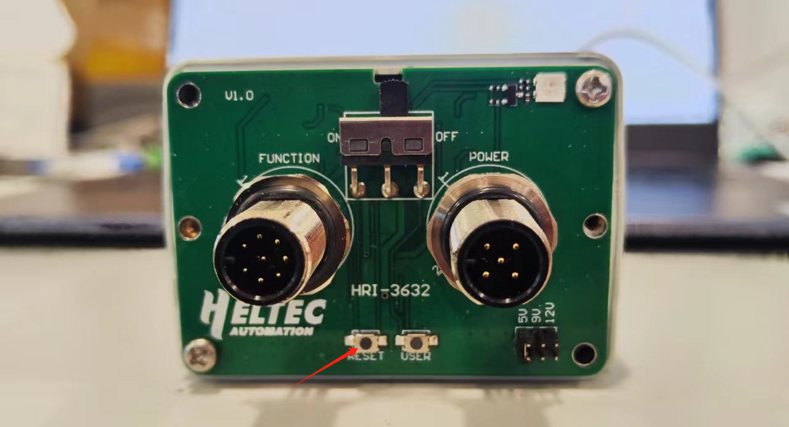

**Cover the device, and install the power supply and sensor connector.**

## Resources
[Download Related Resources](https://resource.heltec.cn/download/Sensor%20Hub%20for%20industry)
[Wireless Aggregator series product application description](https://heltec.org/wireless-aggregator/)