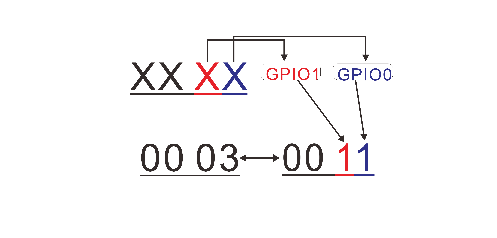

# HRI-3622 Remote Commands
{ht_translation}`[简体中文]:[English]`

This article describes some common remote commands that you can issue through the LoRaWAN server to achieve remote control of the device.

**The port number is 3.**

## Query device parameters

| Description | Command type | ADR | Confirm | Interval | DR | Power | Timezone | Battery Voltage | Firm version | Battery level |
|-|:-:|:-:|:-:|:-:|:-:|:-:|:-:|:-:|:-:|:-:|
| Length | 1byte | 1byte | 1byte | 2byte | 1byte | 1byte | 2byte | 2byte | 2byte | 1byte |
| Query | 00 |   |   |   |   |   |   |   |   |   |
| Feedback | 00 | 00 | 01 | 00 64 | 01 | 16 | 00 08 |   |   |   |
| Error Feedback | 00 | FF |   |   |   |   |   |   |   |   |

- **ADR**: `01` represents ADR, and `00` represents fixed DR.
- **Confirm**: `01` represents confirm, and `00` represents no confirm.
- **Interval**: LoRaWAN reporting interval, HRI-3633 will send the valve status to the server according to the Interval. In hexadecimal, in seconds. In this sample, `64` means 100 seconds.
- **DR**: When fixed DR is enable. In this sample, `01` means DR 1.
- **Power**: RF power, unit'dbm'. In hexadecimal, in seconds. In this sample , `16` means 22dbm.
- **Timezone**: `00` represents East, `01` represents West. Example `00 08` means East 8.

## Set device parameters

| Description | Command type | ADR | Confirm | Interval | DR | Power | Timezone |
|-|:-:|:-:|:-:|:-:|:-:|:-:|:-:|
| Length | 1byte | 1byte | 1byte | 2byte | 1byte | 1byte | 2byte |
| Query | 01 | 00 | 01 | 00 64 | 01 | 16 | 00 08  |
| Feedback | 01 | 00 | 01 | 00 64 | 01 | 16 | 00 08 |
| Error Feedback | 01 | FF |   |   |   |   |   |

- **ADR**: `01` represents ADR, and `00` represents fixed DR.
- **Confirm**: `01` represents confirm, and `00` represents no confirm.
- **Interval**: LoRaWAN reporting interval, HRI-3633 will send the valve status to the server according to the Interval. In hexadecimal, in seconds. In this sample, `64` means 100 seconds.
- **DR**: When fixed DR is enable. In this sample, `01` means DR 1.
- **Power**: RF power, unit'dbm'. In hexadecimal, in seconds. In this sample , `16` means 22dbm.
- **Timezone**: `00` represents East, `01` represents West. Example `00 08` means East 8.

## Query GPIO status

| Description | Command type | Quantity| Mode Change | Mode | Status|
|-|:-:|:-:|:-:|:-:|:-:|
| Length | 1byte | 1byte | 2byte | 2byte | 2byte |
| Query | 02 |   |   |   |   |
| Feedback | 02 | 02 | 00 03 | 00 03 | 00 03 |
| Error | 02 | FF |   |   |   |

- **Quantity**: Quantity of GPIO.
- **Mode Change**: Each bit representing the state of a GPIO. `0` means "Mode change enable", `1` means "mode change disable". In this sample, hexadecimal value `03` converted to binary value "11", means 2 GPIO are "change enable".
- **Mode 2byte**: Each bit representing the state of a GPIO. `0` means "input", `1` means "output". In this sample, hexadecimal value `03` converted to binary value "11", means 2 GPIO are "output".
- **Status**: Use 4 bits represent the state of a GPIO, and each representing the state of a GPIO. `0` means "low", `1` means "high". In this sample, hexadecimal value `03` converted to binary value "11", means 2 GPIO are "high".

## Set a single GPIO state

| Description | Command type | Quantity | Number | Mode | State |
|-|:-:|:-:|:-:|:-:|:-:|
| Length | 1byte | 1byte | 1byte | 1byte | 1byte |
| Set | 03 | 00  | 01 | 00 | 00 |
| Feedback | 03 | 00 | 01 | 00 | 00 |
| Error | 03 | 00 | FF |   |   |

- **Quantity**: `00` means set a single GPIO.
- **Mode**: `0` means 'input', `1` means 'output'.
- **State**: `00` means 'low', `01` means 'high'.

## Set multiple GPIO states

|Description| Command type | Quantity | Number | Mode | State |
|-|:-:|:-:|:-:|:-:|:-:|
| Length | 1byte | 1byte | 2byte | 2byte | 1byte |
| Set | 03 | 01  | 00 03 | 00 03 | 00 01 |
| Feedback | 03 | 01 | 01 | 00 | 00 |
| Error | 03 | 01 | FF |   |   |

- **Quantity**: `01` means set multiple GPIO.
- **Number**: Each bit representing a GPIO. In this sample, hexadecimal value `03` converted to binary value "11", means 2 GPIO will be set.
- **Mode**: Each bit representing a GPIO. In this sample, hexadecimal value `03` converted to binary value "11", means GPIO0 is 'high' and GPIO1 is 'high'.

##  Query RS485 commands

|Description| Command type | Number | State | Operation type | Time(Hour) | Time(minute) | Repeat |
|-|:-:|:-:|:-:|:-:|:-:|:-:|:-:|
| Length | 1byte | 1byte | 1byte | 1byte | 1byte | 1byte | 1byte |
| Query | 06 | 01 | | | | | |
| Feedback | 06 | 01 | 01 | 00 | 13 | 10 | 7F |
| Error | 06 | FF |

- **Number**: Command number on the configuration page, 0~15.
- **State**: Command state, `01` means enable, `00` means disable.
- **Operation type**: `00` means periodic command, `01` means timed task.
- **Time(hour)**: Which hour in a timed task, in this sample, `13` means 1 p.m. When **"Operation type"** is `00` (periodic), this section is invalid.
- **Time(minute)**: Which minute in one hour in a timed task, in this sample, `10` means 13:10. When **"Operation type"** is `00` (periodic), this section is invalid.
- **Repeat**: The way of repeat about timed task. We use 8 bits from low to high, representing Sunday to Saturday. For each bit, `0` means don't operation, `1` means operation, then converted to hexadecimal. In this sample, `7F` == '0111 1111', means this command operation everyday.

| Day | N.A | SAT | FRI | THU | WED | TUE | MON | SUN |
|-|:-:|:-:|:-:|:-:|:-:|:-:|:-:|:-:|
| Binary | 0 | 1 | 1 | 1 | 1 | 1 | 1 | 1 |
| Hex | 7F |

##  Set RS485 commands

| Description | Command type | Number | State | Operation type | Time(Hour) | Time(minute) | Repeat |
|-|:-:|:-:|:-:|:-:|:-:|:-:|:-:|
| Length | 1byte | 1byte | 1byte | 1byte | 1byte | 1byte | 1byte |
| Setting | 07 | 01 | 01 | 00 | 13 | 10 | 7F |
| Feedback | 07 | 01 | 01 |13 | 10 | 7F |
| Error | 07 | FF | | | | | |

- **Number**: Command number on the configuration page, 0~15.
- **State**: Command state, `01` means enable, `00` means disable.
- **Operation type**: `00` means periodic command, `01` means timed task.
- **Time(hour)**: Which hour in a timed task, in this sample, `13` means 1 p.m. When **"Operation type"** is `00` (periodic), this section is invalid.
- **Time(minute)**: Which minute in one hour in a timed task, in this sample, `10` means 13:10. When **"Operation type"** is `00` (periodic), this section is invalid.
- **Repeat**: The way of repeat about timed task. We use 8 bits from low to high, representing Sunday to Saturday. For each bit, `0` means don't operation, `1` means operation, then converted to hexadecimal. In this sample, `7F` == '0111 1111', means this command operation everyday.

| Day | N.A | SAT | FRI | TH | WED | TUE | MON | SUN |
|-|:-:|:-:|:-:|:-:|:-:|:-:|:-:|:-:|
| Binary | 0 | 1 | 1 | 1 | 1 | 1 | 1 | 1 |
| Hex | 7F |