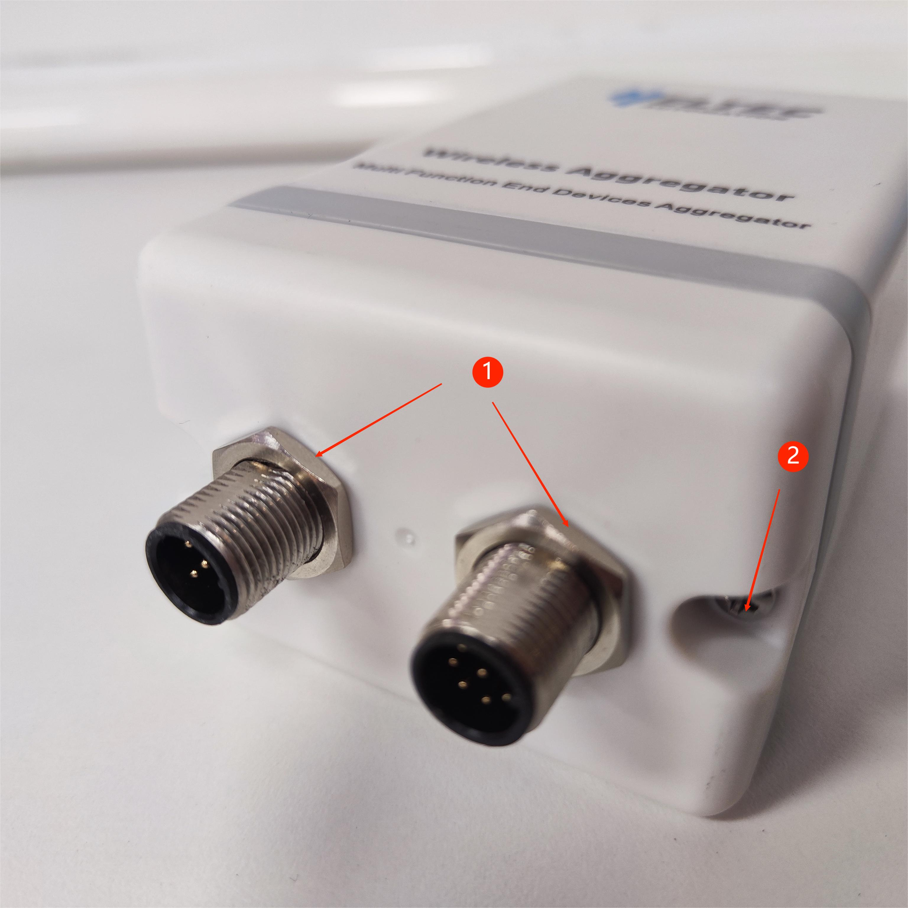
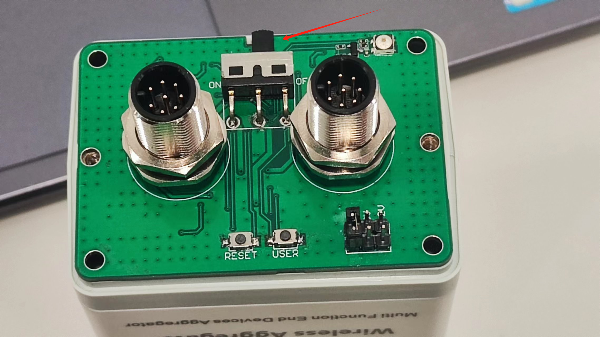
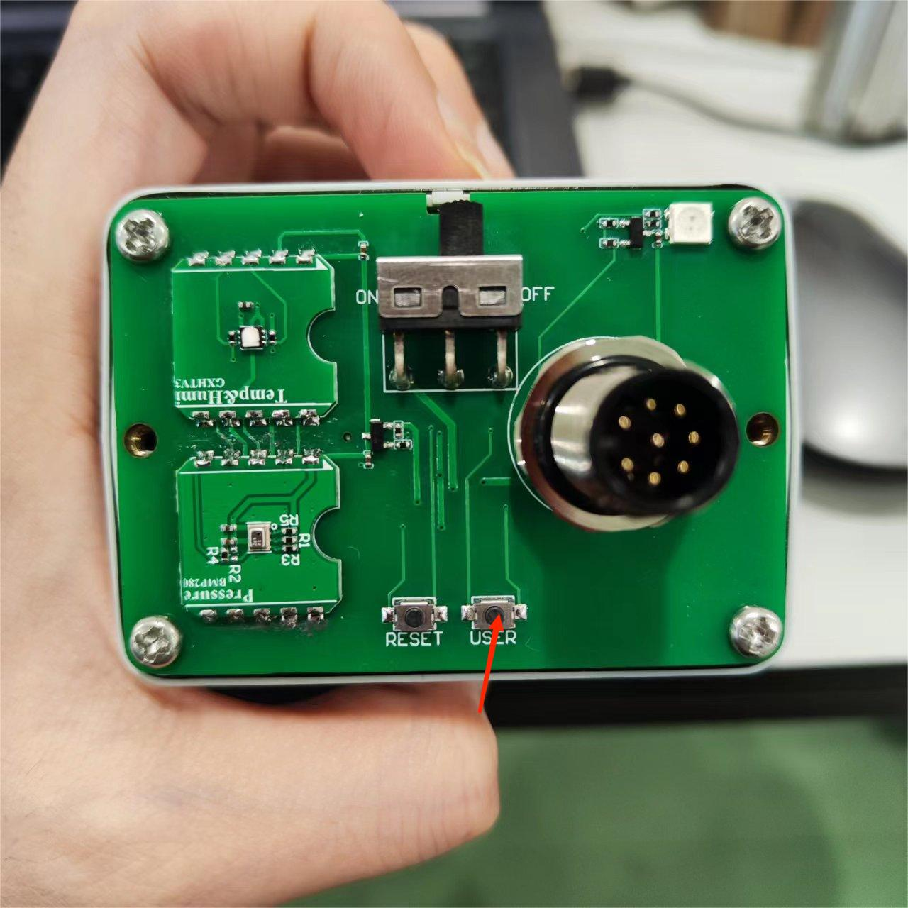
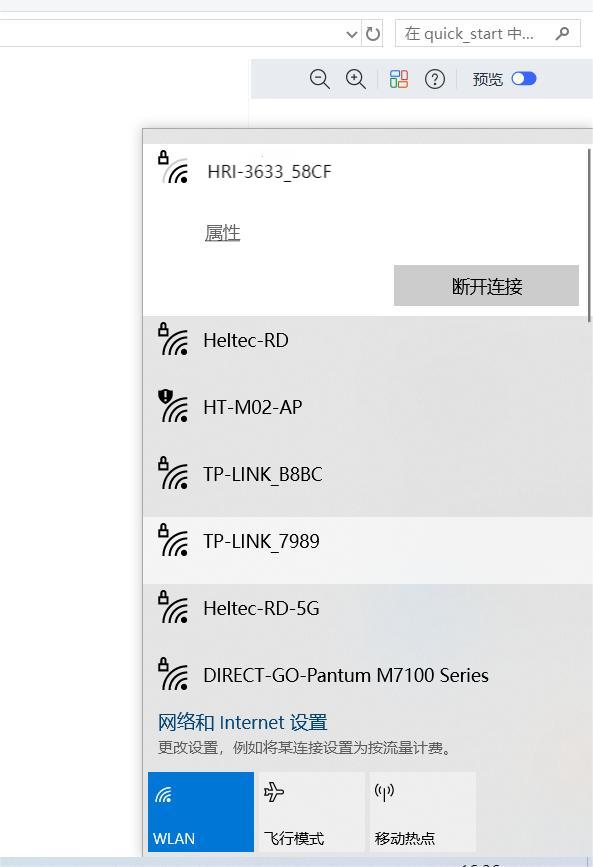
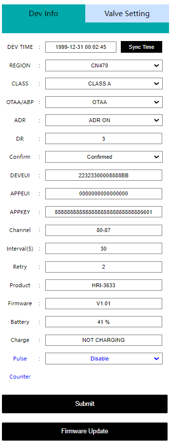
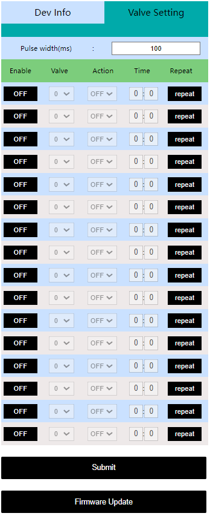
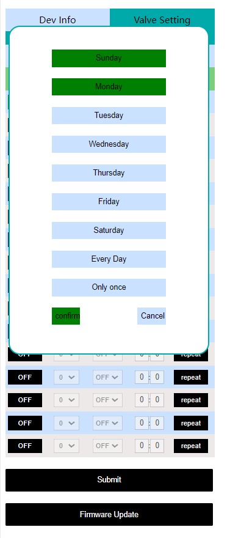
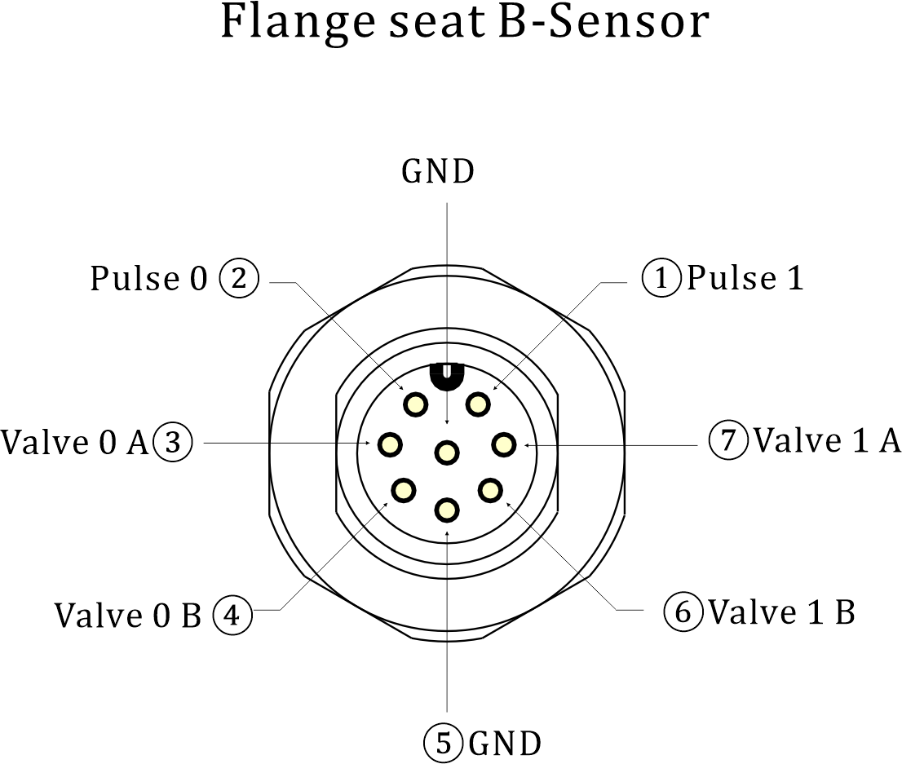
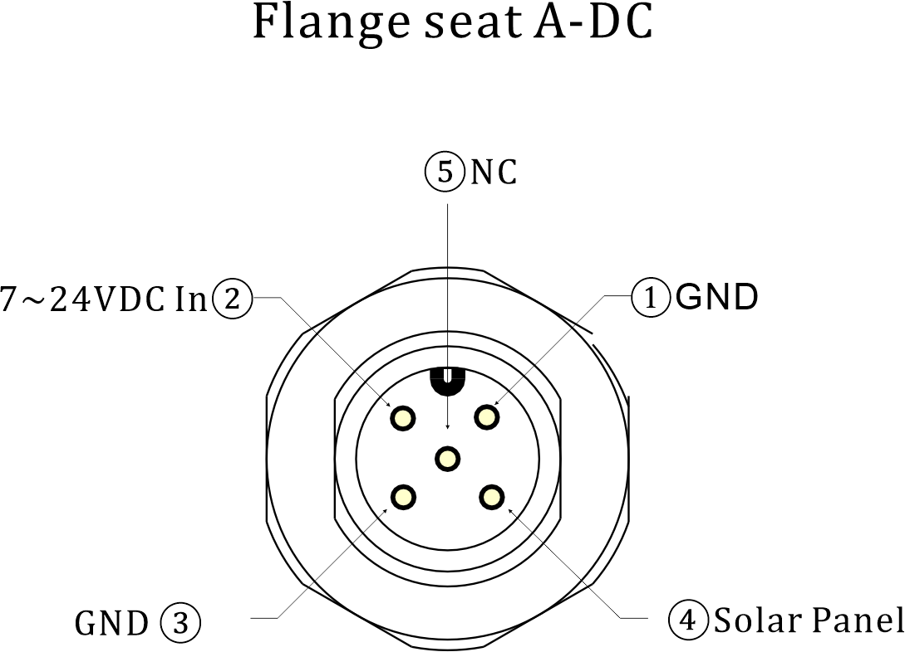

# Getting Started

{ht_translation}`[简体中文]:[English]`

This article describes how to deploy HRI-3633 quickly.
- [Power on](power-on)
- [Configuration](configuration)
- [Connecting Valves](connecting-valves)
- [External power supply and Charging](external-power-supply-and-charging)

(power-on)=
## Power on
Unscrew the nuts on the flange seat and the screws on both sides of the cover in turn as shown in the figure.

``` { Tip} Be sure to unscrew the limit screw on the flange seat first.

```

 

Turn the switch to `ON`, and the green light flashes once, At this point, the device enters the working state.

  

(configuration)=
## Configuration
Turn the switch to `ON`, and the green light flashes once. At this time, the device enters the working mode. Long press the `User` key, the red light is always on, then enter the configuration mode.

  

``` {Tip} The device will automatically restart after 10 minutes in configuration mode.
```

In configuration mode, the mobile phone or PC is used to find the WiFi of the device and connect it.



Type **192.168.4.1** in your browser, and press Enter to take you to the configuration page.



The configuration parameters are defined as follows.

### *LoRaWAN Parameters*

***OTAA Mode***:

  - `Dev-Time` Equipment time setting and calibration
  - `REGION` LoRaWAN frequency band
  - `CLASS` LoRaWAN operation mode, Class A or Class C
  - `OTAA/ABP` LoRaWAN communication mode
  - `ADR` Data rate adaptation
  - `DR` Data rate, can be adjusted when the ADR option is turned off
  - `CONFIRM` Uplink receipt confirmed
  - `DEVEUI` `APPEUI` `APPKEY` OTAA node parameters, must be consistent across the server
  - `Channel` LoRaWAN channel, different channels should be separated by Spaces, such as "0-7 13 16-23"
  - `Interval(S)` Period of transition
  - `Retry`LoRaWAN Class A, Class C
  - `Product` Product model
  - `Firmware` Firmware version
  - `Battery` Battery level (percentage)
  - `Charge` Charging state
  - `Pulse` Pulse count on or off
  - `Counter` Pulse count
  - `Submit` Click Submit after the configuration is complete
  - `Firmware Update` Used for OTA firmware upgrade

***ABP mode -- Most are the same as above, but the differences are listed below:***

  - `NWKSKEY` `APPSKEY` `DEVADDR` ABP node parameters, must be consistent across the server
  - `RX1 DELAY(S)` Set the time for RX1 to be delayed on
  - `RX2 DR type` Data rate, you can choose the default or set your own
  - `RX2 DR` Can be set when the DR type is custom
  - `RX2 Freq type` RX2 Frequency band, you can choose the default or set your own
  - `RX2 Freq` Can be set when the Freq type is custom

``` {Tip} The uplink port is fixed as port 2.
```

### *Valve Control Parameters*


  - `Pulse width` The pulse time required to activate the controller
  - `Enable` Run a control option
  - `Valve` Valve number, one or two can be selected
  - `Action` The valve controller performs the operation, opening or closing
  - `Time` Set the time to execute the control
  - `Repeat` Execute the control loop, which you can choose to do some few days or everyday a week or just once



After the configuration is completed, press the button `Reset`, The green light flashes once, indicating that the device enters the working mode. Cover the device.

(connecting-valves)=
## Connecting Valves
After the configuration is complete, connect the device with the valve. Connect the positive end of the valve to pin `A` and the negative end to pin `B`, there are two sets of pins '0' and '1' for use here.

To read an electrical Pulse, connect the positive electrode of the reading object to the `Pulse` pin and the negative electrode to the `GND`.

``` {Tip} Note, please connect the adapter and valve cable first to avoid damage to the equipment.
```



(external-power-supply-and-charging)=
## External Power Supply and Charging
HRI-3633 has integrated 4X2000mAh battery, and you can also use external DC power (7~24V), or solar panels to power the device, both of which can charge the device.

``` {Tip} Note, please connect the adapter and valve cable first to avoid damage to the equipment.
```

You can refer to the pin definition below to connect the device.




## Resources
[Download Related Resources](https://resource.heltec.cn/download/Sensor%20Hub%20for%20industry)
[Wireless Aggregator series product application description](https://heltec.org/wireless-aggregator/)