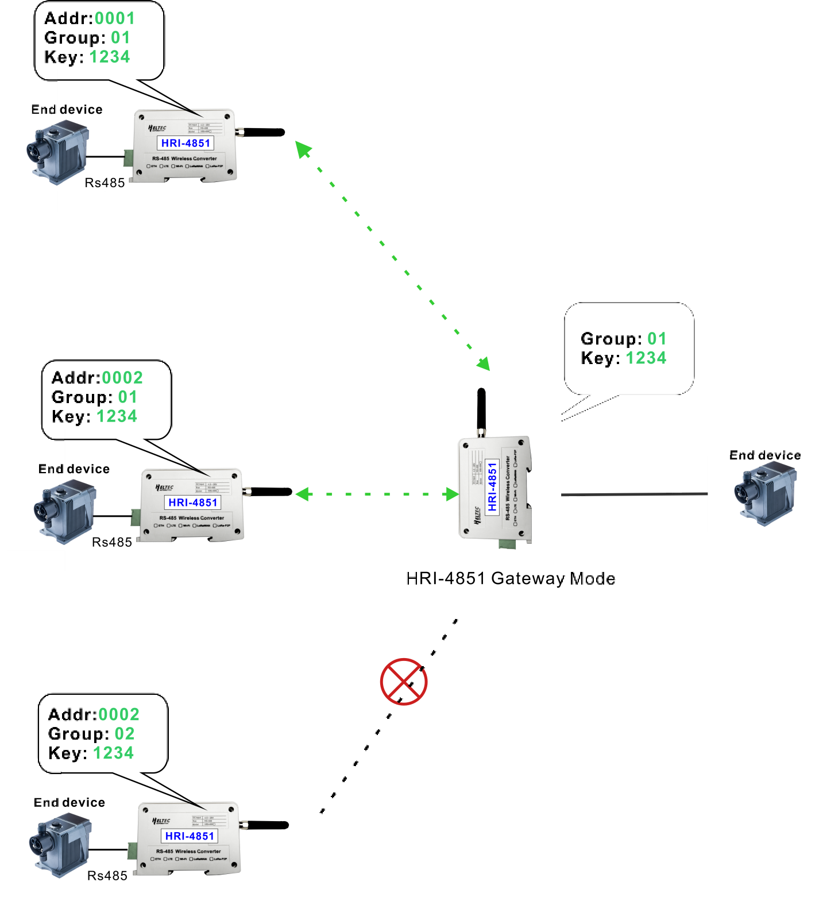

# Application Example

{ht_translation}`[简体中文]:[English]`

HRI-485X series has a variety of networking methods. This topic introduces some common scenarios of the HRI-485X series to help you choose the right product model for your needs.

## HRI-4851+HRI-4851 P2P/P2MP

HRI-4851 is connected to the RS-485 terminal, and the received RS-485 signal is forwarded with LoRa signal to realize point-to-point or point-to-many communication of different devices.


## HRI-4851+HRI-4852 Connect to Server
On top of P2P/P2MP, if you also need to send incoming messages to the server, you need to use a combination of HRI-4852 + HRI-4851.

``` {Note}  HRI-4852 is usually only used as a tool for HRI-4851 to enter the network. HRI-4852 cannot connect directly to the RS-485 device.
```


## HRI-4851L + LoRa Gateway
The device connect to the HRI-4851 via RS-485, HRI-4851 sends data via LoRaWAN to the gateway, gateway sends data to the LoRaWAN server. 


## HRI-4853  Node to Server
For occasions where LoRa is not needed, HRI-4853 directly forwards the data from the RS-485 terminal to the server.


## HRI-4851 Relayer
hrough the relay function of HRI-4851, the communication range of HRI-4852 or HRI-4851 can be greatly extended.


## HRI-4851 Gateway

LAN Gateway functions, for example, if one of your terminals needs to receive HRI-4851 data from a different address, you can run the gateway function of HRI-4851.

