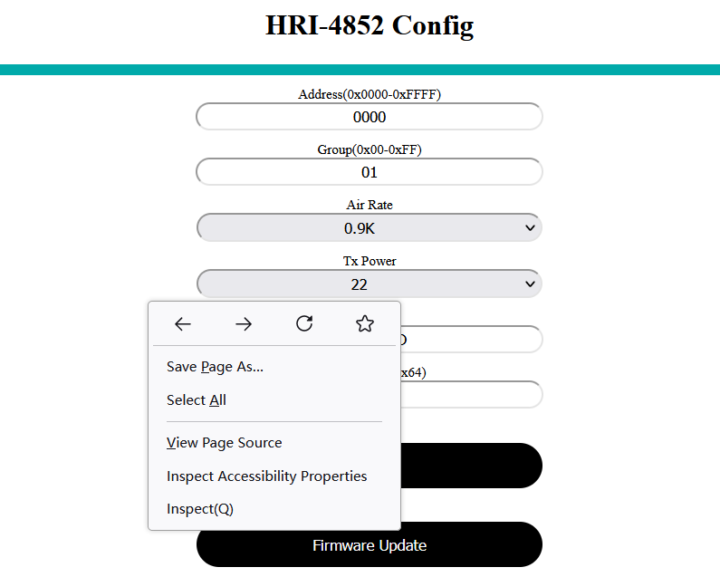
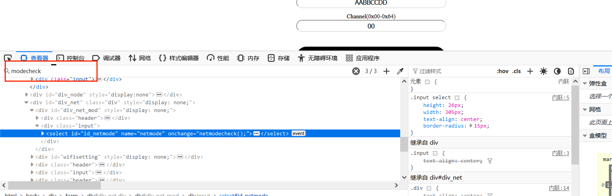
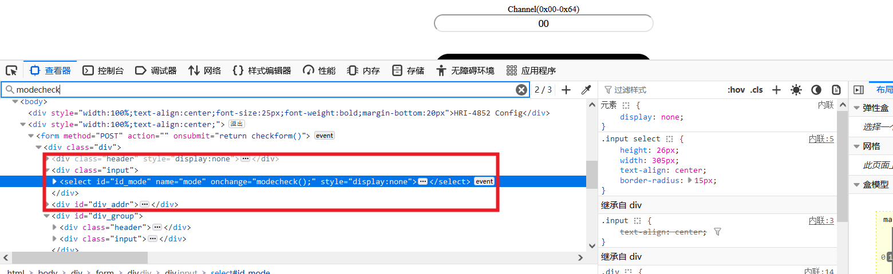
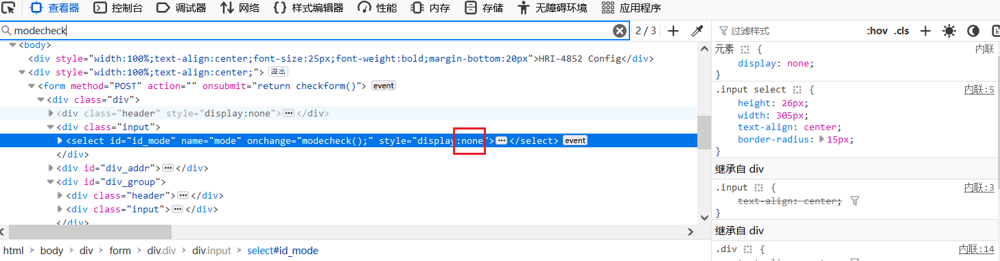

# Frequently Asked Question

{ht_translation}`[简体中文]:[English]`

## Question：HRI-4852 configuration page BUG

This is a BUG caused by web caching during configuration. If this has already happened, follow these steps. 

1. Enter the device configuration page.

2. Right-click the page and select `inspect` in the window .

   

3. Press 'Ctrl' and 'F' key on the keyboard. Fill in "modecheck".

   

4. Press Enter on your keyboard until you find the code below.

   

5. Delete ": none".

   

6. At this point, an option appears at the top of the page.

   

7. Click that option, select `Net Gateway`, and click `Submit`.

